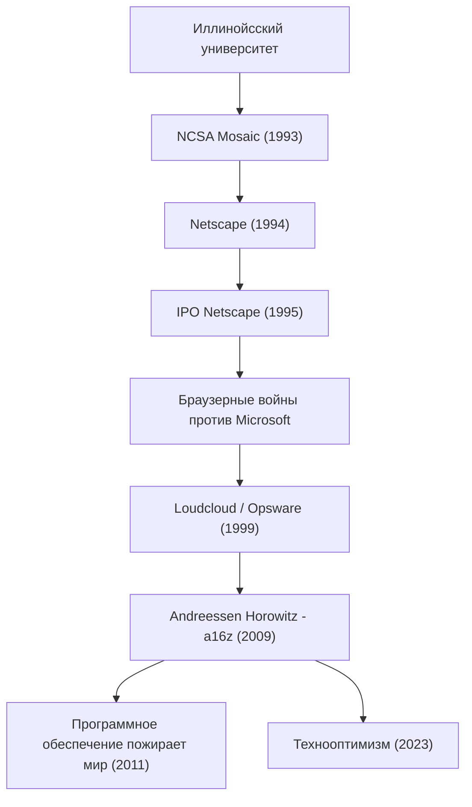

Человек, который сделал современный интернет чем-то само собой разумеющимся, и продолжает формировать мир, вкладывая огромные средства в будущее технологий. Это Марк Андриссен (Marc Andreessen). Он является одним из создателей веб-браузера и соучредителем репрезентативной венчурной фирмы Кремниевой долины «Andreessen Horowitz (a16z)», и его путь в точности совпадает с историей развития интернета.

В этой статье мы подробно рассмотрим, как он открыл двери в веб, и с какой философией он, как предприниматель и инвестор, продолжает оказывать влияние на будущие поколения.

## Путь и достижения Марка Андриссена

## Молодой гений, который «визуализировал» интернет

Родившийся в 1971 году в штате Айова, США, Андриссен с юных лет был очарован компьютерами. Он выходит на главную сцену истории во время учебы в Иллинойсском университете в Урбане-Шампейне (UIUC). В то время интернет (World Wide Web) был сухим и скучным текстовым пространством, уделом лишь некоторых академических исследователей и гиков.

Однако в 1993 году Андриссен вместе с Эриком Биной и другими разработчиками создает графический веб-браузер NCSA Mosaic, способный красиво отображать изображения и текст на одной странице. Этот интуитивно понятный интерфейс стал историческим прорывом, открывшим веб для широкой публики. Концепция Mosaic «каждый может легко находить информацию» мгновенно завоевала мир и заложила основы современного цифрового общества.

## Триумф и падение Netscape, а также вклад в открытый исходный код (Open Source)

После ошеломляющего успеха Mosaic Андриссен вместе с опытным предпринимателем Кремниевой долины Джимом Кларком в 1994 году основывает компанию Netscape Communications. Выпущенный ими Netscape Navigator монополизировал рынок браузеров того времени, а их первичное публичное размещение акций (IPO) в 1995 году увенчалось огромным успехом. Этот момент, получивший название «Момент Netscape», стал началом бума доткомов, а также событием, доказавшим миру, что интернет может быть гигантским бизнесом.

Однако дальнейший путь не был гладким. Гигантская корпорация Microsoft включила Internet Explorer в стандартную комплектацию Windows, что спровоцировало жестокие «Браузерные войны» (Browser Wars). Столкнувшись с Microsoft, вооруженной подавляющей финансовой мощью и долей рынка ОС, Netscape постепенно теряла свои позиции. В конечном итоге компания была куплена AOL, но решение Андриссена и его команды оставило огромное наследие для будущего. Они открыли исходный код своего браузера и запустили проект Mozilla. Впоследствии это воплотилось в Firefox и стало движущей силой движения за открытый исходный код.

## От предпринимателя к инвестору: рождение a16z

После Netscape Андриссен вместе с Беном Горовицем основал компанию Loudcloud (позже преобразованную в Opsware), которая стала пионером в области облачных вычислений. Преодолев беспрецедентный кризис краха пузыря доткомов, он продемонстрировал великолепное мастерство, продав компанию Hewlett-Packard (HP) за 1,6 миллиарда долларов.

А в 2009 году они снова объединили усилия и основали венчурный фонд Andreessen Horowitz (a16z). В отличие от традиционных венчурных капиталов, a16z строго придерживался «дружественного к основателям» подхода, при котором сами основатели поддерживают предпринимателей. Создав внутри компании специализированные команды по связям с общественностью (PR), найму персонала и нетворкингу, и предоставив предпринимателям среду, в которой они могли сосредоточиться на разработке продуктов, фонд на ранних стадиях инвестировал в такие знаковые технологические компании современности, как Facebook, Twitter, Airbnb, GitHub и Stripe, получив колоссальную прибыль и влияние.

## Программное обеспечение пожирает мир: философия Андриссена

Говоря о Марке Андриссене, нельзя не упомянуть его острую проницательность и способность формулировать мысли. В 2011 году он опубликовал в The Wall Street Journal историческое эссе под названием «Программное обеспечение пожирает мир» (Software is eating the world). Его пророчество о том, что каждая отрасль будет переопределена программным обеспечением, и что традиционные компании будут вынуждены превратиться в софтверные, полностью подтвердилось последующим распространением смартфонов и расцветом SaaS.

В основе его философии лежит сильный «технологический оптимизм». В недавно опубликованном «Манифесте технооптимиста» (The Techno-Optimist Manifesto) он громко заявляет, что «технологии — это единственный способ решить проблемы человечества и принести рост и изобилие». Даже в современную эпоху, когда наступает волна искусственного интеллекта и ужесточения регулирования, он никогда не впадает в пессимизм и продолжает верить в силу инженерии и инноваций.

## Влияние на будущие поколения и взгляд в будущее

Марк Андриссен как инженер создал то, как «выглядит» интернет, как предприниматель показал, как «сражаться» в интернет-бизнесе, а как инвестор спроектировал «будущее», в котором технологии охватывают всё общество.

Его жизнь — это не просто история успеха. Это история настойчивости «созидателя» (билдера), который одним из первых видит ценность неизвестных технологий, популяризирует их и продолжает обновлять всё общество. Посеянные им семена до сих пор прорастают в офисах стартапов по всему миру и в сообществах разработчиков открытого исходного кода. Его позиция, воплощающая слова «лучший способ предсказать будущее — это изобрести его», будет и впредь вдохновлять новые поколения предпринимателей.
