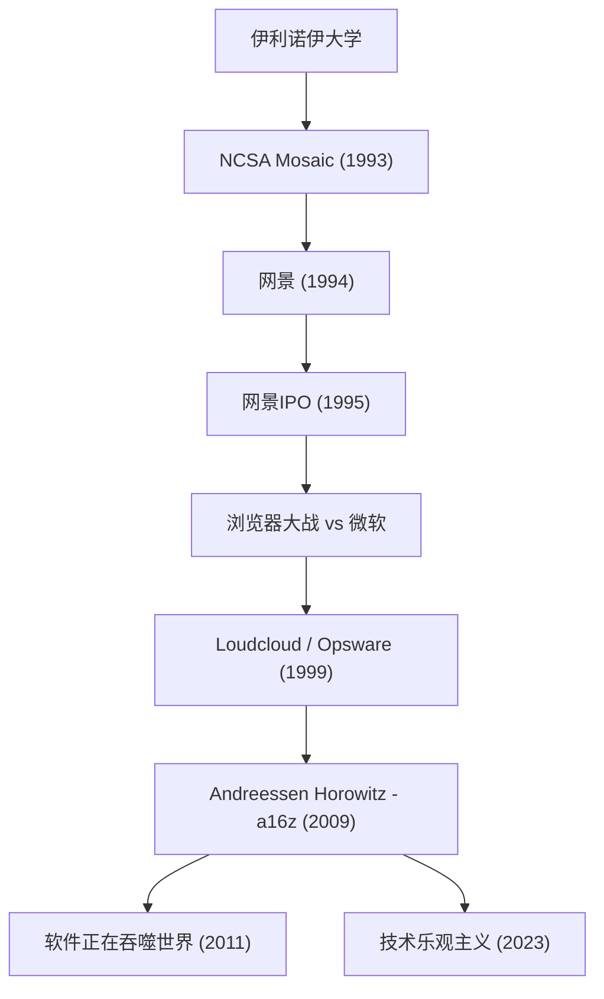

将现代互联网变成理所当然的存在，并通过向科技未来投入巨额资金持续重塑世界的人，这就是马克·安德森（Marc Andreessen）。作为网页浏览器的联合创始人之一，也是硅谷顶尖风险投资公司“Andreessen Horowitz (a16z)”的联合创始人，他的足迹与互联网的发展史高度重合。

在本文中，我们将深入探讨他是如何推开网络大门的，以及他作为一名企业家和投资者，是以怎样的哲学持续影响后世的。

## 马克·安德森的足迹与功绩流程

## 将互联网“可视化”的年轻天才

1971年出生于美国爱荷华州的安德森，从小就对计算机着迷。他正式登上历史舞台是在就读于伊利诺伊大学厄巴纳-香槟分校（UIUC）期间。当时的互联网（World Wide Web）还是枯燥乏味的纯文本，仅仅是少数学术研究人员和极客的专属领域。

然而，在1993年，安德森与埃里克·比纳（Eric Bina）等人共同开发了“NCSA Mosaic”——一款能在同一页面内精美显示图像和文本的图形网页浏览器。这种直观的交互界面成为了将网络推向大众的历史性突破。“任何人都能轻松浏览信息”，Mosaic的这一理念瞬间席卷全球，奠定了现代数字社会的基础。

## 网景的辉煌与挫折，以及对开源的贡献

在Mosaic大获成功之后，安德森与硅谷资深企业家吉姆·克拉克（Jim Clark）于1994年共同创立了“网景通信公司”（Netscape Communications）。他们发布的“网景导航者”（Netscape Navigator）垄断了当时的浏览器市场，并在1995年的首次公开募股（IPO）中取得了巨大成功。这个被称为“网景时刻”的瞬间，既是互联网泡沫时代开启的标志，也是向世界证明互联网能成为巨大商业生态的历史性事件。

然而，接下来的道路并不平坦。科技巨头微软将“Internet Explorer”作为Windows的标准配置，引发了激烈的“浏览器大战”（Browser Wars）。在微软压倒性的资金实力和操作系统市场份额面前，网景的市场份额逐渐被蚕食。最终，公司被AOL收购。但是，安德森等人的决定为未来留下了宝贵的遗产。他们公开了浏览器的源代码，并启动了“Mozilla”项目。这最终孕育了“Firefox”，成为了推动开源运动的强大动力。

## 从企业家到投资者：a16z的诞生

网景之后，安德森与本·霍洛维茨（Ben Horowitz）共同创立了云计算的先驱“Loudcloud”（后转型为Opsware）。他们成功度过了IT泡沫破裂的空前危机，并展示了出色的商业手腕，最终以16亿美元的价格将公司出售给惠普（HP）。

随后在2009年，两人再次联手，成立了风险投资公司“Andreessen Horowitz (a16z)”。与传统的VC不同，a16z彻底贯彻了由创始人亲自支持企业家的“创始人友好型”（Founder-friendly）理念。他们将公关、招聘、社交网络等专业团队内部化，为企业家提供可以专注于产品开发的环境。得益于此，他们能在早期阶段投资Facebook、Twitter、Airbnb、GitHub、Stripe等代表现代科技的巨头企业，并获得了巨额的回报与影响力。

## 软件正在吞噬世界：安德森的哲学

谈及马克·安德森，就不得不提他敏锐的洞察力和强大的语言表达能力。2011年，他在《华尔街日报》上发表了具有历史意义的文章《软件正在吞噬世界》（Software is eating the world）。他预言所有产业都将被软件重新定义，传统企业也不得不转型为软件公司。这一预言随后被智能手机的普及和SaaS的繁荣彻底证实。

他哲学的根基在于强烈的“技术乐观主义”（Techno-Optimism）。在近年来发表的《技术乐观主义者宣言》（The Techno-Optimist Manifesto）中，他高声主张“技术是解决人类挑战、带来增长与富裕的唯一手段”。即使在AI崛起和监管收紧浪潮袭来的今天，他也从不悲观，始终坚信工程与创新的力量。

## 对后世的影响与面向未来的视野

马克·安德森作为技术人员创造了互联网的“外观”，作为企业家展示了互联网商业的“战法”，作为投资者设计了技术全面覆盖社会的“未来”。

他的一生绝不仅仅是一个简单的成功故事。这更是一个“建设者”（Builder）执着于及早发现未知技术的价值、将其大众化并不断升级整个社会的传奇。他播下的种子，如今仍在世界各地的初创企业办公室或开源社区中不断发芽。“预测未来的最好方法就是去发明它”，他践行这一理念的姿态，必将继续鼓舞着一代又一代的创业者们。
