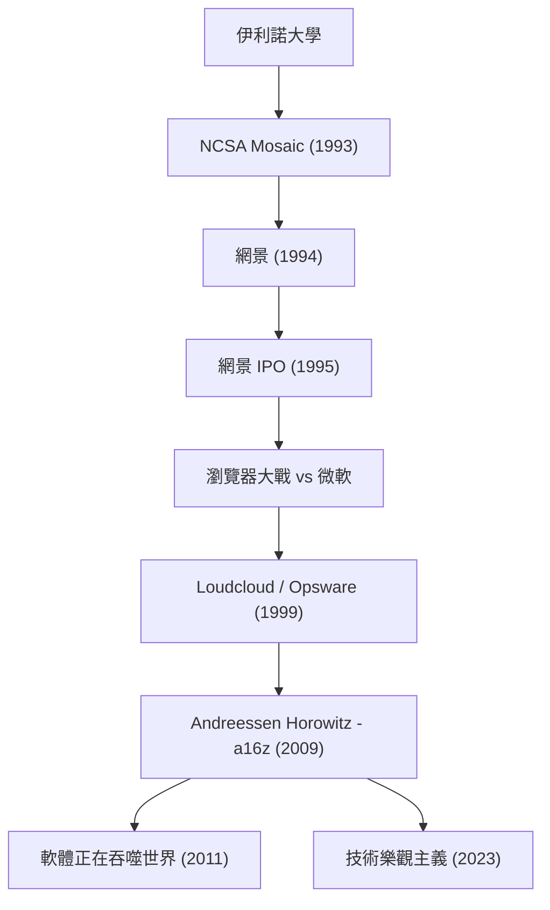

現代的網際網路已經成為理所當然的存在，更透過投入鉅額資金於科技的未來來持續塑造這個世界的人物，這就是馬克·安德森（Marc Andreessen）。身為網頁瀏覽器的創始人之一，同時也是代表矽谷的創業投資公司「Andreessen Horowitz (a16z)」的共同創辦人，他的軌跡與網際網路的發展史可說是完全重疊。

本文將深入探討他如何開啟網路的大門，以及作為創業家、投資家，他抱持著怎樣的哲學並持續對後世產生影響。

## 馬克·安德森的軌跡與功績流程

## 將網際網路「視覺化」的年輕天才

1971 年出生於美國愛荷華州的安德森，從小就對電腦深深著迷。他正式登上歷史舞台，是在就讀伊利諾大學厄巴納-香檳分校（UIUC）的時候。當時的網際網路（World Wide Web）是枯燥乏味的純文字，只是少數學術研究者或極客（geek）的領域。

然而在 1993 年，安德森與艾瑞克·比納（Eric Bina）等人共同開發了能在同一頁面內優美地顯示圖片與文字的圖形化網頁瀏覽器「NCSA Mosaic」。這個直觀的介面成為了將網路解放給普羅大眾的歷史性突破。「任何人都能輕鬆追蹤資訊」這個 Mosaic 的概念瞬間席捲全球，奠定了現代數位社會的基礎。

## 網景的榮光與挫折，以及對開源的貢獻

挾著 Mosaic 的巨大成功，安德森與矽谷資深創業家吉姆·克拉克（Jim Clark）於 1994 年共同創立了「Netscape Communications」。他們發布的「Netscape Navigator」壟斷了當時的瀏覽器市場，並在 1995 年的首次公開募股（IPO）中獲得了巨大的成功。這個被稱為「網景時刻（Netscape Moment）」的瞬間，不僅是達康（.com）泡沫的開端，更是向世界證明網際網路能成為巨大商業的歷史事件。

然而，之後的道路並不平坦。隨著科技巨頭微軟將「Internet Explorer」內建於 Windows 作業系統，爆發了激烈的「瀏覽器大戰（Browser Wars）」。在擁有壓倒性資金實力與 OS 市占率的微軟面前，網景的市占率逐漸被吞噬。最終公司被 AOL 收購，但安德森等人的決定為未來留下了巨大的遺產。他們公開了瀏覽器的原始碼，並啟動了「Mozilla」專案。這隨後孕育出了「Firefox」，成為引領開源運動的原動力。

## 從創業家到投資家：a16z 的誕生

網景之後，安德森與本·霍羅維茲（Ben Horowitz）共同創立了雲端運算的先驅「Loudcloud（後轉型為 Opsware）」。他們克服了 IT 泡沫破裂這個史無前例的危機，並展現了將公司以 16 億美元出售給惠普（HP）的卓越手腕。

到了 2009 年，兩人再次攜手，創立了創業投資公司「Andreessen Horowitz (a16z)」。a16z 與傳統的 VC 不同，徹底實徹了由創辦人親自支援創業家的「對創辦人友善（Founder-Friendly）」方針。透過將公關、人才招募、人脈網絡等專業團隊內部化，為創業家提供能專注於產品開發的環境。這讓他們能在 Facebook、Twitter、Airbnb、GitHub、Stripe 等代表現代的科技企業初期階段就進行投資，從而獲得了龐大的回報與影響力。

## 軟體正在吞噬世界：安德森的哲學

談到馬克·安德森，絕對不能不提他敏銳的洞察力與文字表達能力。2011 年，他在《華爾街日報》發表了一篇具有歷史意義的文章《軟體正在吞噬世界（Software is eating the world）》。他預言所有產業都將被軟體重新定義，傳統企業也不得不轉型為軟體企業。這個預言後來被智慧型手機的普及與 SaaS 的繁榮完全證實。

他的哲學根基在於強烈的「技術樂觀主義（Techno-Optimism）」。在近年發表的《技術樂觀主義宣言（The Techno-Optimist Manifesto）》中，他大聲疾呼：「技術是解決人類問題、帶來成長與富裕的唯一手段」。即使在 AI 崛起與監管浪潮席捲而來的現代，他也從不悲觀，始終相信工程與創新的力量。

## 對後世的影響與未來展望

馬克·安德森作為技術人員，打造了網際網路的「視覺呈現」；作為創業家，展示了網路商業的「戰鬥方式」；作為投資家，則設計了科技席捲社會的「未來」。

他的生涯不僅僅是一段成功的故事，更是一個「建設者（Builder）」的執著物語——敏銳地發掘未知技術的價值，將其大眾化，並持續升級整個社會。他播下的種子，至今仍在世界各地的初創企業辦公室或開源社群中持續發芽。「預測未來的最好方式就是去發明它」，體現這句話的態度，未來也將持續鼓舞著新一代的創業家。
