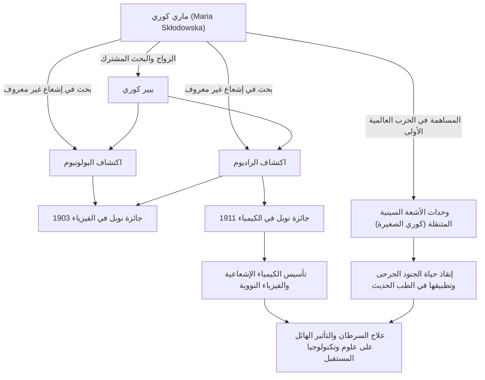

في تاريخ العلم، تُعد ماري كوري واحدة من الأشخاص الذين سلكوا أروع المسارات وأكثرها قسوة. إنها أول امرأة تفوز بجائزة نوبل والشخص الوحيد في التاريخ الذي فاز بجوائز نوبل في مجالين علميين مختلفين: الفيزياء والكيمياء. تتلون حياتها بشغف نقي متعطش للمعرفة وحب عميق لمستقبل البشرية. في هذا المقال، نتعمق في حياة ماري كوري، والفلسفة التي تبنتها، وتأثيرها الهائل الذي يستمر حتى يومنا هذا.

## الانطلاق من الشدائد: من وارسو إلى باريس

ولدت ماريا سكودوفسكا (ماري كوري لاحقًا) في وارسو، بولندا، عام 1867، وأظهرت ذاكرة وذكاءً استثنائيين منذ صغرها. في ذلك الوقت، كانت بولندا تحت حكم الإمبراطورية الروسية، وكان يُحظر على النساء تلقي التعليم العالي في الجامعات. ومع ذلك، لم يستطع أحد أن يوقف تعطشها للتعلم.

بعد أن ادخرت المال أثناء عملها كمربية، أوفت ماري بوعدها مع أختها وانتقلت أخيرًا إلى باريس في عام 1891 عن عمر يناهز 24 عامًا. التحقت بجامعة السوربون (جامعة باريس)، وانغمست في الفيزياء والرياضيات بينما كانت تعيش في فقر مدقع في غرفة في العلية. على الرغم من أن تلك الأيام مرت في الدراسة مع تحمل البرد والجوع، إلا أنها بالنسبة لها كانت عصرًا ذهبيًا مليئًا "بفرحة البحث عن الحقيقة".

## اكتشاف الراديوم والتنازل عن حقوق براءة الاختراع: استكشاف علمي نقي

خلال حياتها البحثية في باريس، التقت بشريك قدرها، الفيزيائي بيير كوري. تقاسم الاثنان الشغف بالعلم وتزوجا. ثم بدأوا في تحدي لغز الإشعاع الصادر من اليورانيوم الذي اكتشفه هنري بيكريل (والذي أطلقت عليه ماري لاحقًا اسم "النشاط الإشعاعي (radioactivity)").

بعد عمل شاق لتنقية أطنان من خام اليورانينيت (البِتشبلند) يدويًا في مختبر ذي ظروف سيئة، اكتشف الاثنان العناصر الجديدة غير المعروفة "البولونيوم" و"الراديوم" في عام 1898. من أجل هذا الإنجاز العظيم، مُنحت ماري جائزة نوبل في الفيزياء عام 1903، إلى جانب زوجها بيير وبيكريل.

ما يجب ملاحظته هنا هو فلسفة ماري وبيير. لم يحصلوا على براءة اختراع لطريقة عزل الراديوم. كان بإمكانهم الحصول على ثروة هائلة إذا حصلوا على براءة اختراع، لكنهم كانوا مقتنعين تمامًا بأن "العلم ملك للجميع ولا ينبغي احتكاره لتحقيق مكاسب شخصية". كان لهذه الروح غير الأنانية تأثير كبير على العلماء اللاحقين وأظهرت موقفًا يمكن أن يُطلق عليه حجر الزاوية في العلم المفتوح الحديث، وهو مشاركة المعرفة العلمية.

## التغلب على الفقدان والحزن

ومع ذلك، سرعان ما انتهت أيام البحث التعاوني السعيد بشكل مفاجئ. في عام 1906، توفي بيير، زوجها الحبيب وأكبر داعم لها، بشكل غير متوقع بعد أن دهسته عربة تجرها الخيول. كان حزن ماري لا يقاس، ولكن كما لو كانت تنفذ رغبة بيير الأخيرة، عادت إلى المختبر وأصبحت أول أستاذة في جامعة السوربون.

ثم، في عام 1911، ولإنجازها في العزل الناجح لمعدن الراديوم، حصلت على جائزة نوبل في الكيمياء بمفردها. متغلبة على الفقدان اليائس لوفاة زوجها، فتحت أفقًا جديدًا للعلم بقوتها الخاصة.

## الحرب العالمية الأولى و "كوري الصغيرة": خدمة المجتمع

لم تظل إنجازات ماري كوري داخل المختبر. عندما اندلعت الحرب العالمية الأولى في عام 1914، شعرت أن تكنولوجيا الإشعاع ستكون مفيدة لعلاج الجنود الجرحى. قامت بجمع التبرعات بنفسها وطورت وحدات أشعة سينية متنقلة مزودة بمعدات التصوير الشعاعي (المعروفة باسم "كوري الصغيرة").

تعلمت تكنولوجيا الأشعة السينية بنفسها وذهبت إلى الخطوط الأمامية مع ابنتها إيرين، مما ساعد في إنقاذ حياة ما يقال إنه أكثر من مليون جندي. هذا الإجراء المتمثل في تطبيق الاكتشافات العلمية على الطب في العالم الحقيقي والركض لإنقاذ الأشخاص الذين يعانون أمامها يرمز إلى حبها للبشرية والشعور القوي بالأخلاق.

## التأثير على الأجيال القادمة والإرث الخالد

أنشأ البحث حول الراديوم والنشاط الإشعاعي الذي اكتشفته ماري كوري مجالًا جديدًا للفيزياء النووية. أحدث هذا تغييرًا في الفهم الأساسي للمادة ومهد الطريق لتطوير الطاقة النووية من قبل العلماء اللاحقين والعلاج الإشعاعي للسرطان في الطب الحديث.

ومع ذلك، كان الاكتشاف أيضًا شيئًا قصر حياتها. بسبب التعرض طويل الأمد للإشعاع، عانت من فقر الدم اللاتنسجي وتوفيت في عام 1934 عن عمر يناهز 66 عامًا. لا تزال دفاتر تجاربها مشعة للغاية حتى اليوم وتُخزن في صناديق مبطنة بالرصاص.

تعلمنا حياة ماري كوري أهمية "عدم الخوف من المجهول، بل محاولة فهمه". إن إيمانها الذي لا يتزعزع، وشجاعتها في مواجهة الصعوبات، وحبها غير المشروط للإنسانية من خلال العلم يستمر في التألق عبر العصور.

## مخطط الإنجازات والارتباطات

يوضح المخطط التالي اكتشافات ماري كوري الرئيسية وكيف أثرت على المجتمع والأجيال القادمة.

لا يزال الضوء الذي تركته ماري كوري يضيء عالم العلم بشكل مشرق حتى اليوم.
