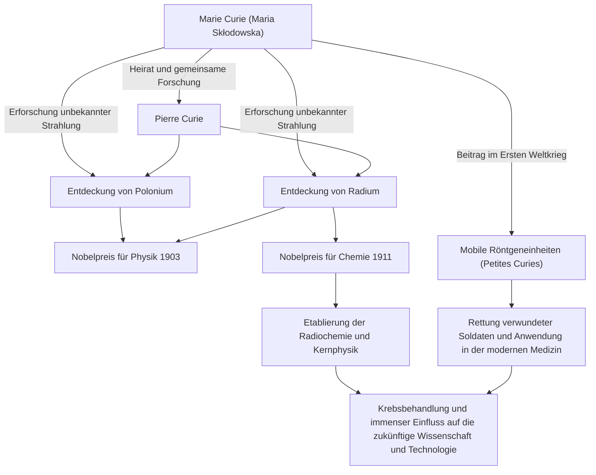

In der Geschichte der Wissenschaft ist Marie Curie (Madame Curie) eine der Personen, die den brillantesten und zugleich härtesten Weg gegangen ist. Sie ist die erste Frau, die einen Nobelpreis gewann, und die einzige Person in der Geschichte, die in zwei verschiedenen wissenschaftlichen Bereichen – Physik und Chemie – mit Nobelpreisen ausgezeichnet wurde. Ihr Leben ist geprägt von einer reinen Leidenschaft, die nach Wissen dürstete, und einer tiefen Liebe für die Zukunft der Menschheit. In diesem Artikel tauchen wir tief in das Leben von Marie Curie, ihre Philosophie und ihren immensen Einfluss ein, der bis heute anhält.

## Aufbruch aus der Not: Von Warschau nach Paris

Die 1867 in Warschau, Polen, geborene Maria Skłodowska (später Marie Curie) bewies schon in jungen Jahren ein außergewöhnliches Gedächtnis und eine hohe Intelligenz. Damals stand Polen unter der Herrschaft des Russischen Reiches, und Frauen war es verboten, an Universitäten eine höhere Bildung zu erhalten. Ihr Wissensdurst ließ sich jedoch von niemandem aufhalten.

Nachdem sie als Gouvernante Geld gespart hatte, hielt Marie ein Versprechen an ihre Schwester und zog schließlich 1891 im Alter von 24 Jahren nach Paris. Sie schrieb sich an der Sorbonne (Universität Paris) ein und vertiefte sich in Physik und Mathematik, während sie in extremer Armut in einer Dachkammer lebte. Obwohl sie diese Tage damit verbrachte zu lernen und dabei Kälte und Hunger ertrug, war es für sie ein goldenes Zeitalter, erfüllt von der „Freude an der Suche nach der Wahrheit“.

## Die Entdeckung von Radium und der Verzicht auf Patentrechte: Reine wissenschaftliche Erforschung

Während ihres Forschungslebens in Paris lernte sie ihren Schicksalspartner, den Physiker Pierre Curie, kennen. Beide teilten die Leidenschaft für die Wissenschaft und heirateten. Dann begannen sie, das Geheimnis der von Henri Becquerel entdeckten Uranstrahlung (die Marie später als „Radioaktivität“ (radioactivity) bezeichnete) zu erforschen.

Nach aufreibender Arbeit, bei der sie tonnenweise Pechblende unter schlechten Bedingungen von Hand raffinierten, entdeckten die beiden 1898 die unbekannten neuen Elemente „Polonium“ und „Radium“. Für diese großartige Leistung wurde Marie 1903 zusammen mit ihrem Mann Pierre und Becquerel der Nobelpreis für Physik verliehen.

Besonders hervorzuheben ist hierbei die Philosophie von Marie und Pierre. Sie ließen das Verfahren zur Isolierung von Radium nicht patentieren. Sie hätten enormen Reichtum erlangen können, wenn sie es patentiert hätten, aber sie waren fest davon überzeugt, dass „die Wissenschaft allen gehört und nicht für persönlichen Gewinn monopolisiert werden sollte“. Dieser selbstlose Geist hatte einen großen Einfluss auf nachfolgende Wissenschaftler und zeigte eine Haltung, die als Eckpfeiler der modernen Open Science, dem Teilen von wissenschaftlichem Wissen, bezeichnet werden kann.

## Verlust und Trauer überwinden

Die Tage der glücklichen gemeinsamen Forschung fanden jedoch ein plötzliches Ende. Im Jahr 1906 starb Pierre, ihr geliebter Ehemann und größter Unterstützer, unerwartet, nachdem er von einer Pferdekutsche überfahren worden war. Maries Trauer war unermesslich, aber als wollte sie Pierres letzten Willen erfüllen, kehrte sie ins Labor zurück und wurde die erste Professorin an der Sorbonne.

Im Jahr 1911 wurde sie für ihre Leistung bei der erfolgreichen Isolierung von metallischem Radium als alleinige Empfängerin mit dem Nobelpreis für Chemie ausgezeichnet. Sie überwand den schmerzlichen Verlust durch den Tod ihres Mannes und eröffnete mit eigener Kraft einen neuen Horizont in der Wissenschaft.

## Der Erste Weltkrieg und die „Petites Curies“: Dienst an der Gesellschaft

Die Errungenschaften von Marie Curie blieben nicht auf das Labor beschränkt. Als 1914 der Erste Weltkrieg ausbrach, spürte sie, dass die Strahlentechnologie bei der Behandlung verwundeter Soldaten nützlich sein würde. Sie sammelte selbst Geld und entwickelte mobile Röntgeneinheiten, die mit Radiographiegeräten ausgestattet waren (allgemein bekannt als „Petites Curies“).

Sie erlernte die Röntgentechnik selbst und ging mit ihrer Tochter Irène an die Front, wo sie half, das Leben von schätzungsweise über einer Million Soldaten zu retten. Diese Tat, wissenschaftliche Entdeckungen in der realen Medizin anzuwenden und sich um die Rettung leidender Menschen zu kümmern, symbolisiert ihre Liebe zur Menschheit und ihr starkes ethisches Bewusstsein.

## Einfluss auf zukünftige Generationen und ewiges Vermächtnis

Die von Marie Curie entdeckte Forschung über Radium und Radioaktivität begründete das neue Feld der Kernphysik. Sie veränderte das grundlegende Verständnis von Materie und ebnete den Weg für die Entwicklung der Kernenergie durch spätere Wissenschaftler und die Strahlentherapie gegen Krebs in der modernen Medizin.

Die Entdeckung war jedoch auch etwas, das ihr Leben verkürzte. Aufgrund langjähriger Strahlenbelastung litt sie an aplastischer Anämie und verstarb 1934 im Alter von 66 Jahren. Ihre Notizbücher aus den Experimenten sind bis heute stark radioaktiv und werden in bleigefütterten Schachteln aufbewahrt.

Das Leben von Marie Curie lehrt uns, wie wichtig es ist, „das Unbekannte nicht zu fürchten, sondern zu versuchen, es zu verstehen“. Ihr unerschütterlicher Glaube, ihr Mut, sich Schwierigkeiten zu stellen, und ihre bedingungslose Liebe zur Menschheit durch die Wissenschaft leuchten über die Epochen hinweg.

## Flussdiagramm der Errungenschaften und Korrelationen

Das folgende Diagramm zeigt die wichtigsten Entdeckungen von Marie Curie und wie sie die Gesellschaft und zukünftige Generationen beeinflusst haben.

Das von Marie Curie hinterlassene Licht erhellt die Welt der Wissenschaft bis heute.
