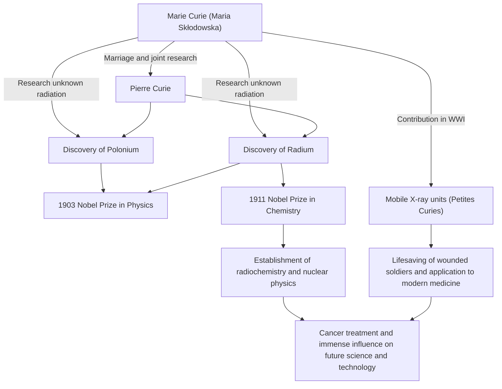

In the history of science, one of the people who walked the most brilliant and grueling paths is Marie Curie (Madame Curie). She is the first woman to win a Nobel Prize and the only person in history to win Nobel Prizes in two different scientific fields: physics and chemistry. Her life is colored by a pure passion that thirsted for knowledge and a deep love for the future of humanity. In this article, we delve deeply into the life of Marie Curie, the philosophy she held, and her immense influence that continues to this day.

## Departure from Adversity: From Warsaw to Paris

Born in Warsaw, Poland, in 1867, Maria Skłodowska (later Marie Curie) demonstrated exceptional memory and intelligence from a young age. At that time, Poland was under the rule of the Russian Empire, and women were prohibited from receiving higher education at universities. However, her thirst for learning could not be stopped by anyone.

Having saved funds while working as a governess, Marie fulfilled a promise with her sister and finally moved to Paris in 1891 at the age of 24. Enrolling at the Sorbonne (University of Paris), she immersed herself in physics and mathematics while living in extreme poverty in an attic room. Although those days were spent studying while enduring cold and hunger, for her, it was a golden age filled with the "joy of seeking the truth."

## The Discovery of Radium and Renunciation of Patent Rights: Pure Scientific Exploration

During her research life in Paris, she met her destined partner, the physicist Pierre Curie. The two shared a passion for science and married. They then began to challenge the mystery of the radiation from uranium discovered by Henri Becquerel (which Marie later named "radioactivity").

After grueling labor refining tons of pitchblende by hand in a laboratory with poor conditions, the two discovered the unknown new elements "polonium" and "radium" in 1898. For this great achievement, Marie was awarded the Nobel Prize in Physics in 1903, along with her husband Pierre and Becquerel.

What should be noted here is the philosophy of Marie and Pierre. They did not obtain a patent for the method of isolating radium. They could have gained massive wealth if they had patented it, but they held a strong conviction that "science belongs to everyone and should not be monopolized for personal gain." This selfless spirit had a major impact on subsequent scientists and demonstrated an attitude that can be called the cornerstone of modern open science, the sharing of scientific knowledge.

## Overcoming Loss and Sorrow

However, the days of happy collaborative research suddenly came to an end. In 1906, Pierre, her beloved husband and greatest supporter, died unexpectedly after being run over by a horse-drawn carriage. Marie's sorrow was immeasurable, but as if to carry on Pierre's dying wish, she returned to the laboratory and became the first female professor at the Sorbonne.

Then, in 1911, for her achievement of successfully isolating radium metal, she was awarded the Nobel Prize in Chemistry on her own. Overcoming the desperate loss of her husband's death, she opened up a new horizon of science with her own power.

## World War I and the "Petites Curies": Service to Society

Marie Curie's achievements did not remain within the laboratory. When World War I broke out in 1914, she intuited that radiation technology would be useful for treating wounded soldiers. She raised funds herself and developed mobile X-ray units equipped with radiography equipment (commonly known as "Petites Curies").

She learned X-ray technology herself and went to the front lines with her daughter Irène, helping to save the lives of what is said to be over a million soldiers. This action of applying scientific discoveries to real-world medicine and running around to save suffering people in front of her symbolizes her love for humanity and strong sense of ethics.

## Influence on Future Generations and Eternal Legacy

The research on radium and radioactivity discovered by Marie Curie created a new field of nuclear physics. It transformed the fundamental understanding of matter and paved the way for the development of nuclear energy by later scientists and radiation therapy for cancer in modern medicine.

However, the discovery was also something that cut her life short. Due to long-term exposure to radiation, she suffered from aplastic anemia and passed away in 1934 at the age of 66. Her experimental notebooks are still highly radioactive today and are stored in lead-lined boxes.

Marie Curie's life teaches us the importance of "not fearing the unknown, but trying to understand it." Her unwavering belief, courage to face difficulties, and unconditional love for humanity through science continue to shine across the ages.

## Flowchart of Achievements and Correlations

The following diagram shows Marie Curie's major discoveries and how they influenced society and future generations.

The light left by Marie Curie continues to brightly illuminate the world of science even today.
