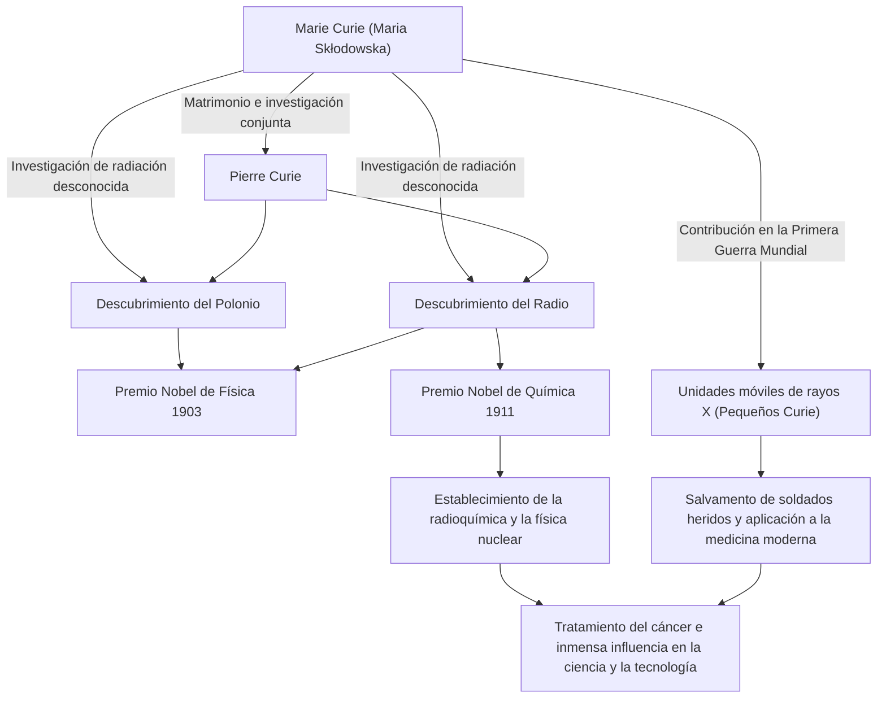

En la historia de la ciencia, una de las personas que recorrió el camino más brillante y arduo es Marie Curie (Madame Curie). Es la primera mujer en ganar un Premio Nobel y la única persona en la historia en ganar Premios Nobel en dos campos científicos diferentes: física y química. Su vida está marcada por una pasión pura que sedienta de conocimiento y un profundo amor por el futuro de la humanidad. En este artículo, profundizaremos en la vida de Marie Curie, la filosofía que mantuvo y su inmensa influencia que perdura hasta el día de hoy.

## Partida desde la Adversidad: De Varsovia a París

Nacida en Varsovia, Polonia, en 1867, Maria Skłodowska (más tarde Marie Curie) demostró una memoria e inteligencia excepcionales desde una edad temprana. En ese momento, Polonia estaba bajo el dominio del Imperio Ruso, y se prohibía a las mujeres recibir educación superior en las universidades. Sin embargo, nadie podía detener su sed de aprendizaje.

Habiendo ahorrado fondos mientras trabajaba como institutriz, Marie cumplió una promesa con su hermana y finalmente se mudó a París en 1891 a la edad de 24 años. Al matricularse en la Sorbona (Universidad de París), se sumergió en la física y las matemáticas mientras vivía en extrema pobreza en un ático. Aunque esos días los pasaba estudiando mientras soportaba el frío y el hambre, para ella fue una época dorada llena de la "alegría de buscar la verdad".

## El Descubrimiento del Radio y la Renuncia a los Derechos de Patente: Exploración Científica Pura

Durante su vida de investigación en París, conoció a su pareja destinada, el físico Pierre Curie. Los dos compartieron la pasión por la ciencia y se casaron. Luego comenzaron a desafiar el misterio de la radiación del uranio descubierta por Henri Becquerel (que Marie más tarde llamó "radiactividad").

Después de un trabajo extenuante refinando toneladas de pechblenda a mano en un laboratorio con malas condiciones, los dos descubrieron los nuevos elementos desconocidos "polonio" y "radio" en 1898. Por este gran logro, Marie fue galardonada con el Premio Nobel de Física en 1903, junto con su esposo Pierre y Becquerel.

Lo que debe notarse aquí es la filosofía de Marie y Pierre. No obtuvieron una patente para el método de aislamiento del radio. Podrían haber obtenido una enorme riqueza si lo hubieran patentado, pero tenían la firme convicción de que "la ciencia pertenece a todos y no debe ser monopolizada para beneficio personal". Este espíritu desinteresado tuvo un gran impacto en los científicos posteriores y demostró una actitud que se puede llamar la piedra angular de la ciencia abierta moderna, el intercambio de conocimientos científicos.

## Superando la Pérdida y el Dolor

Sin embargo, los días de feliz investigación colaborativa llegaron repentinamente a su fin. En 1906, Pierre, su amado esposo y mayor partidario, murió inesperadamente al ser atropellado por un carruaje de caballos. El dolor de Marie fue inconmensurable, pero como para llevar a cabo el último deseo de Pierre, regresó al laboratorio y se convirtió en la primera mujer profesora en la Sorbona.

Luego, en 1911, por su logro en el aislamiento exitoso del radio metálico, fue galardonada con el Premio Nobel de Química por su cuenta. Superando la desesperada pérdida de la muerte de su esposo, abrió un nuevo horizonte científico con sus propias fuerzas.

## La Primera Guerra Mundial y los "Pequeños Curie": Servicio a la Sociedad

Los logros de Marie Curie no se quedaron dentro del laboratorio. Cuando estalló la Primera Guerra Mundial en 1914, ella intuyó que la tecnología de radiación sería útil para tratar a los soldados heridos. Recaudó fondos ella misma y desarrolló unidades móviles de rayos X equipadas con equipos de radiografía (comúnmente conocidas como "Pequeños Curie").

Aprendió la tecnología de rayos X por sí misma y fue al frente con su hija Irène, ayudando a salvar la vida de lo que se dice que son más de un millón de soldados. Esta acción de aplicar descubrimientos científicos a la medicina del mundo real y correr para salvar a las personas que sufren frente a ella simboliza su amor por la humanidad y su fuerte sentido ético.

## Influencia en Generaciones Futuras y Legado Eterno

La investigación sobre el radio y la radiactividad descubiertos por Marie Curie creó el nuevo campo de la física nuclear. Transformó la comprensión fundamental de la materia y allanó el camino para el desarrollo de la energía nuclear por parte de científicos posteriores y la radioterapia para el cáncer en la medicina moderna.

Sin embargo, el descubrimiento también fue algo que acortó su vida. Debido a la exposición prolongada a la radiación, sufrió de anemia aplásica y falleció en 1934 a la edad de 66 años. Sus cuadernos experimentales siguen siendo altamente radiactivos hoy en día y se almacenan en cajas revestidas de plomo.

La vida de Marie Curie nos enseña la importancia de "no temer a lo desconocido, sino tratar de comprenderlo". Su creencia inquebrantable, su valor para enfrentar dificultades y su amor incondicional por la humanidad a través de la ciencia continúan brillando a través de las edades.

## Diagrama de Flujo de Logros y Correlaciones

El siguiente diagrama muestra los principales descubrimientos de Marie Curie y cómo influyeron en la sociedad y en las generaciones futuras.

La luz dejada por Marie Curie continúa iluminando brillantemente el mundo de la ciencia incluso hoy.
