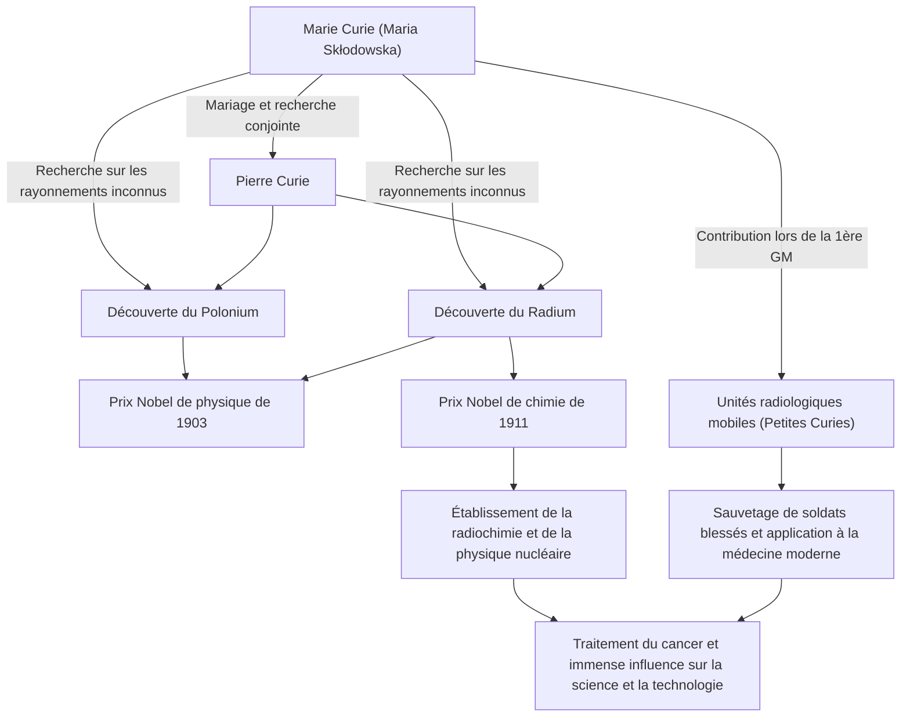

Dans l'histoire des sciences, l'une des personnes ayant parcouru le chemin le plus brillant et le plus ardu est Marie Curie (Madame Curie). Elle est la première femme à remporter un prix Nobel et la seule personne dans l'histoire à avoir remporté des prix Nobel dans deux domaines scientifiques différents : la physique et la chimie. Sa vie est colorée par une passion pure, assoiffée de connaissances, et un amour profond pour l'avenir de l'humanité. Dans cet article, nous plongerons profondément dans la vie de Marie Curie, la philosophie qu'elle a adoptée, et son immense influence qui perdure encore aujourd'hui.

## Départ de l'Adversité : De Varsovie à Paris

Née à Varsovie, en Pologne, en 1867, Maria Skłodowska (plus tard Marie Curie) a fait preuve d'une mémoire et d'une intelligence exceptionnelles dès son plus jeune âge. À l'époque, la Pologne était sous la domination de l'Empire russe, et il était interdit aux femmes de recevoir un enseignement supérieur dans les universités. Cependant, sa soif d'apprendre ne pouvait être arrêtée par personne.

Ayant économisé des fonds en travaillant comme gouvernante, Marie a honoré une promesse faite à sa sœur et a finalement déménagé à Paris en 1891, à l'âge de 24 ans. S'inscrivant à la Sorbonne (Université de Paris), elle s'est plongée dans la physique et les mathématiques tout en vivant dans une extrême pauvreté dans une chambre de bonne. Bien que ces journées aient été passées à étudier tout en endurant le froid et la faim, ce fut pour elle un âge d'or rempli de la "joie de chercher la vérité".

## La Découverte du Radium et le Renoncement aux Droits de Brevet : Exploration Scientifique Pure

Au cours de sa vie de recherche à Paris, elle a rencontré le partenaire de son destin, le physicien Pierre Curie. Les deux ont partagé une passion pour la science et se sont mariés. Ils ont ensuite commencé à défier le mystère du rayonnement de l'uranium découvert par Henri Becquerel (que Marie a plus tard nommé "radioactivité").

Après un travail exténuant pour raffiner des tonnes de pechblende à la main dans un laboratoire aux conditions médiocres, les deux ont découvert les nouveaux éléments inconnus "polonium" et "radium" en 1898. Pour cette grande réalisation, Marie a reçu le prix Nobel de physique en 1903, avec son mari Pierre et Becquerel.

Ce qu'il faut noter ici, c'est la philosophie de Marie et Pierre. Ils n'ont pas obtenu de brevet pour la méthode d'isolement du radium. Ils auraient pu acquérir une richesse massive s'ils l'avaient brevetée, mais ils avaient la forte conviction que "la science appartient à tous et ne devrait pas être monopolisée pour un gain personnel". Cet esprit désintéressé a eu un impact majeur sur les scientifiques ultérieurs et a démontré une attitude que l'on peut qualifier de pierre angulaire de la science ouverte moderne : le partage des connaissances scientifiques.

## Surmonter la Perte et le Chagrin

Cependant, les jours de recherche collaborative heureuse ont soudainement pris fin. En 1906, Pierre, son mari bien-aimé et son plus grand soutien, est décédé subitement après avoir été renversé par une voiture à cheval. Le chagrin de Marie était incommensurable, mais comme pour poursuivre la volonté de Pierre, elle est retournée au laboratoire et est devenue la première femme professeur à la Sorbonne.

Puis, en 1911, pour son exploit d'avoir réussi à isoler le radium métallique, elle a reçu seule le prix Nobel de chimie. Surmontant la perte désespérée due à la mort de son mari, elle a ouvert un nouvel horizon scientifique par ses propres moyens.

## La Première Guerre Mondiale et les "Petites Curies" : Service à la Société

Les réalisations de Marie Curie ne se sont pas limitées au laboratoire. Lorsque la Première Guerre mondiale a éclaté en 1914, elle a pressenti que la technologie des rayonnements serait utile pour soigner les soldats blessés. Elle a elle-même collecté des fonds et développé des unités radiologiques mobiles équipées d'appareils de radiographie (communément appelées "Petites Curies").

Elle a elle-même appris la technologie des rayons X et est allée au front avec sa fille Irène, aidant à sauver la vie de plus d'un million de soldats, dit-on. Cette action d'appliquer les découvertes scientifiques à la médecine réelle et de courir pour sauver les personnes souffrantes devant elle symbolise son amour pour l'humanité et son fort sens de l'éthique.

## Influence sur les Générations Futures et Héritage Éternel

Les recherches sur le radium et la radioactivité découvertes par Marie Curie ont créé le nouveau domaine de la physique nucléaire. Cela a transformé la compréhension fondamentale de la matière et a ouvert la voie au développement de l'énergie nucléaire par les scientifiques ultérieurs et à la radiothérapie pour le cancer dans la médecine moderne.

Cependant, cette découverte a aussi raccourci sa vie. En raison d'une exposition prolongée aux rayonnements, elle a souffert d'anémie aplasique et est décédée en 1934 à l'âge de 66 ans. Ses carnets d'expériences sont encore hautement radioactifs aujourd'hui et sont conservés dans des boîtes en plomb.

La vie de Marie Curie nous enseigne l'importance de "ne pas craindre l'inconnu, mais d'essayer de le comprendre". Sa conviction inébranlable, son courage face aux difficultés et son amour inconditionnel pour l'humanité à travers la science continuent de briller à travers les âges.

## Organigramme des Réalisations et Corrélations

Le diagramme suivant montre les principales découvertes de Marie Curie et comment elles ont influencé la société et les générations futures.

La lumière laissée par Marie Curie continue d'éclairer brillamment le monde de la science encore aujourd'hui.
