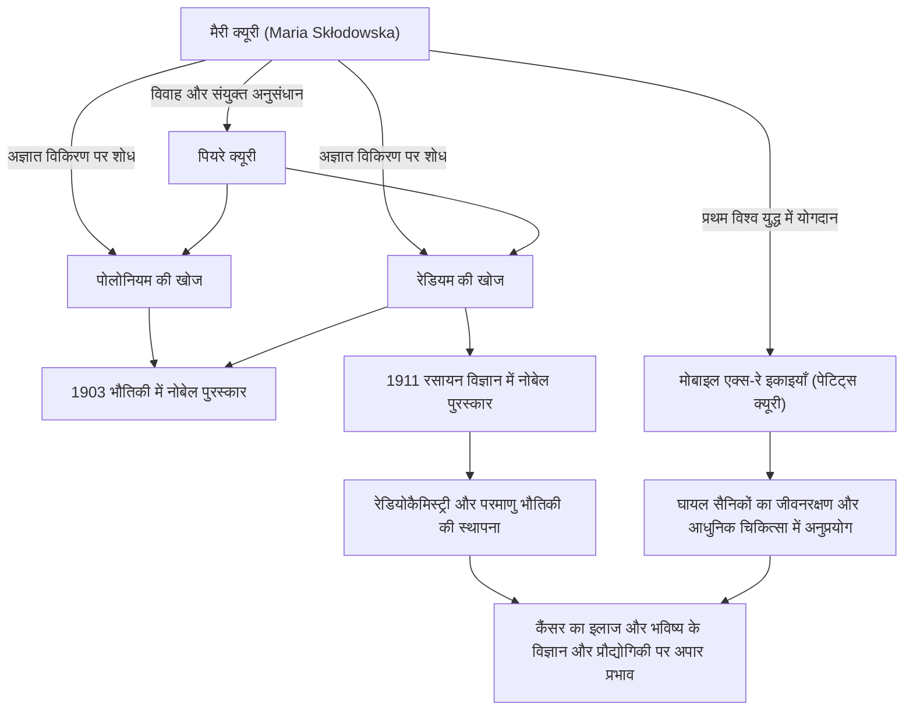

विज्ञान के इतिहास में, सबसे शानदार और सबसे कठिन रास्तों पर चलने वाले लोगों में से एक मैरी क्यूरी (मैडम क्यूरी) हैं। वह नोबेल पुरस्कार जीतने वाली पहली महिला हैं और इतिहास में भौतिकी और रसायन विज्ञान जैसे दो अलग-अलग वैज्ञानिक क्षेत्रों में नोबेल पुरस्कार जीतने वाली एकमात्र व्यक्ति हैं। उनका जीवन ज्ञान की प्यास और मानवता के भविष्य के लिए गहरे प्यार से रंगा हुआ है। इस लेख में, हम मैरी क्यूरी के जीवन, उनके दर्शन, और उनके अपार प्रभाव पर गहराई से विचार करेंगे जो आज भी जारी है।

## विपत्ति से प्रस्थान: वारसॉ से पेरिस तक

1867 में पोलैंड के वारसॉ में जन्मीं, मारिया स्कोलोडोव्स्का (बाद में मैरी क्यूरी) ने कम उम्र से ही असाधारण स्मृति और बुद्धिमत्ता का प्रदर्शन किया। उस समय, पोलैंड रूसी साम्राज्य के शासन के अधीन था, और महिलाओं को विश्वविद्यालयों में उच्च शिक्षा प्राप्त करने की मनाही थी। हालाँकि, उनकी सीखने की प्यास को कोई नहीं रोक सकता था।

एक शिक्षिका के रूप में काम करते हुए धन बचाने के बाद, मैरी ने अपनी बहन के साथ एक वादा निभाया और अंततः 1891 में 24 वर्ष की आयु में पेरिस चली गईं। सोरबोन (पेरिस विश्वविद्यालय) में दाखिला लेकर, वह एक अटारी के कमरे में अत्यधिक गरीबी में रहते हुए भौतिकी और गणित में डूब गईं। हालांकि उन दिनों को ठंड और भूख सहते हुए अध्ययन करने में बिताया गया था, उनके लिए यह "सत्य की खोज के आनंद" से भरा स्वर्ण युग था।

## रेडियम की खोज और पेटेंट अधिकारों का त्याग: शुद्ध वैज्ञानिक अन्वेषण

पेरिस में अपने शोध जीवन के दौरान, वह अपने भाग्यशाली साथी, भौतिक विज्ञानी पियरे क्यूरी से मिलीं। दोनों ने विज्ञान के लिए एक जुनून साझा किया और शादी कर ली। इसके बाद उन्होंने हेनरी बेकरेल द्वारा खोजी गई यूरेनियम से विकिरण के रहस्य (जिसे बाद में मैरी ने "रेडियोधर्मिता (radioactivity)" नाम दिया) को चुनौती देना शुरू किया।

खराब स्थिति वाली प्रयोगशाला में हाथों से टन पिचब्लेंड को साफ करने के कठिन श्रम के बाद, दोनों ने 1898 में अज्ञात नए तत्वों "पोलोनियम" और "रेडियम" की खोज की। इस महान उपलब्धि के लिए, मैरी को 1903 में उनके पति पियरे और बेकरेल के साथ भौतिकी में नोबेल पुरस्कार से सम्मानित किया गया।

यहाँ मैरी और पियरे के दर्शन पर ध्यान दिया जाना चाहिए। उन्होंने रेडियम को अलग करने की विधि के लिए पेटेंट प्राप्त नहीं किया। यदि वे इसे पेटेंट कराते तो वे भारी धन प्राप्त कर सकते थे, लेकिन उनका दृढ़ विश्वास था कि "विज्ञान सभी का है और व्यक्तिगत लाभ के लिए एकाधिकार नहीं होना चाहिए।" इस निस्वार्थ भावना ने बाद के वैज्ञानिकों पर एक बड़ा प्रभाव डाला और एक ऐसा दृष्टिकोण प्रदर्शित किया जिसे वैज्ञानिक ज्ञान को साझा करने, आधुनिक खुले विज्ञान की आधारशिला कहा जा सकता है।

## हानि और दुख पर काबू पाना

हालाँकि, खुशी के सहयोगी शोध के दिन अचानक समाप्त हो गए। 1906 में, पियरे, उनके प्यारे पति और सबसे बड़े समर्थक, की घोड़े से खींची जाने वाली गाड़ी से कुचले जाने के बाद अप्रत्याशित रूप से मृत्यु हो गई। मैरी का दुःख अथाह था, लेकिन जैसे पियरे की अंतिम इच्छा को पूरा करने के लिए, वह प्रयोगशाला में लौट आईं और सोरबोन में पहली महिला प्रोफेसर बनीं।

फिर, 1911 में, रेडियम धातु को सफलतापूर्वक अलग करने की उनकी उपलब्धि के लिए, उन्हें अपने दम पर रसायन विज्ञान में नोबेल पुरस्कार से सम्मानित किया गया। अपने पति की मृत्यु की हताश हानि पर काबू पाते हुए, उन्होंने अपनी शक्ति से विज्ञान के एक नए क्षितिज को खोल दिया।

## प्रथम विश्व युद्ध और "पेटिट्स क्यूरी": समाज की सेवा

मैरी क्यूरी की उपलब्धियां प्रयोगशाला तक ही सीमित नहीं रहीं। 1914 में जब प्रथम विश्व युद्ध छिड़ गया, तो उन्हें लगा कि विकिरण तकनीक घायल सैनिकों के इलाज के लिए उपयोगी होगी। उन्होंने खुद धन जुटाया और रेडियोग्राफी उपकरणों से लैस मोबाइल एक्स-रे इकाइयाँ (जिन्हें आमतौर पर "पेटिट्स क्यूरी" कहा जाता है) विकसित कीं।

उन्होंने स्वयं एक्स-रे तकनीक सीखी और अपनी बेटी इरेन के साथ मोर्चे पर गईं, जिससे कहा जाता है कि एक लाख से अधिक सैनिकों की जान बचाने में मदद मिली। वैज्ञानिक खोजों को वास्तविक दुनिया की चिकित्सा में लागू करने और पीड़ित लोगों को बचाने के लिए दौड़ने की यह कार्रवाई मानवता और मजबूत नैतिकता के प्रति उनके प्यार का प्रतीक है।

## भावी पीढ़ियों पर प्रभाव और शाश्वत विरासत

मैरी क्यूरी द्वारा खोजे गए रेडियम और रेडियोधर्मिता पर शोध ने परमाणु भौतिकी का नया क्षेत्र बनाया। इसने पदार्थ की मौलिक समझ को बदल दिया और बाद के वैज्ञानिकों द्वारा परमाणु ऊर्जा के विकास और आधुनिक चिकित्सा में कैंसर के लिए विकिरण चिकित्सा का मार्ग प्रशस्त किया।

हालाँकि, खोज ने उनके जीवन को भी छोटा कर दिया। विकिरण के लंबे समय तक संपर्क के कारण, वह अप्लास्टिक एनीमिया से पीड़ित हुईं और 1934 में 66 वर्ष की आयु में उनका निधन हो गया। उनकी प्रयोगात्मक नोटबुक आज भी अत्यधिक रेडियोधर्मी हैं और सीसे के बक्से में संग्रहीत हैं।

मैरी क्यूरी का जीवन हमें सिखाता है कि "अज्ञात से डरना नहीं, बल्कि उसे समझने की कोशिश करना" महत्वपूर्ण है। उनका अटूट विश्वास, कठिनाइयों का सामना करने का साहस और विज्ञान के माध्यम से मानवता के लिए बिना शर्त प्यार युगों से चमकता रहा है।

## उपलब्धियों और सहसंबंधों का फ्लोचार्ट

निम्नलिखित आरेख मैरी क्यूरी की प्रमुख खोजों को दर्शाता है और यह भी कि उन्होंने समाज और भविष्य की पीढ़ियों को कैसे प्रभावित किया।

मैरी क्यूरी द्वारा छोड़ी गई रोशनी आज भी विज्ञान की दुनिया को उज्ज्वल रूप से रोशन कर रही है।
