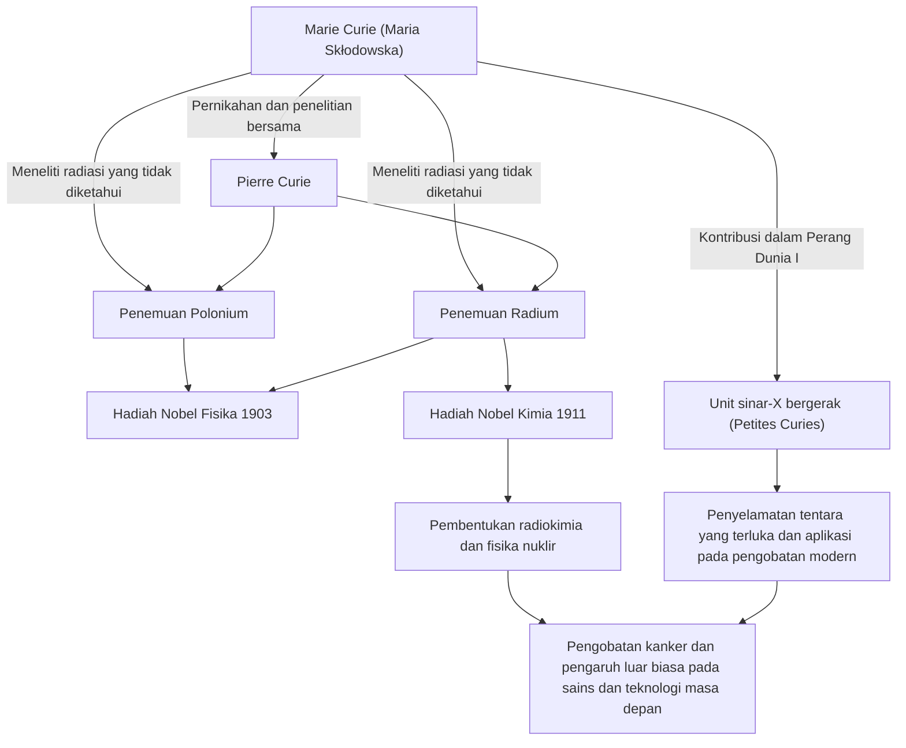

Dalam sejarah sains, salah satu orang yang menempuh jalan paling cemerlang dan paling melelahkan adalah Marie Curie (Nyonya Curie). Dia adalah wanita pertama yang memenangkan Hadiah Nobel dan satu-satunya orang dalam sejarah yang memenangkan Hadiah Nobel dalam dua bidang sains yang berbeda: fisika dan kimia. Kehidupannya diwarnai oleh semangat murni yang haus akan pengetahuan dan kecintaan yang mendalam pada masa depan umat manusia. Dalam artikel ini, kita mendalami kehidupan Marie Curie, filosofi yang dipegangnya, dan pengaruh besarnya yang terus berlanjut hingga hari ini.

## Keberangkatan dari Kesulitan: Dari Warsawa ke Paris

Lahir di Warsawa, Polandia, pada tahun 1867, Maria Skłodowska (kemudian dikenal sebagai Marie Curie) menunjukkan ingatan dan kecerdasan luar biasa sejak usia muda. Pada waktu itu, Polandia berada di bawah kekuasaan Kekaisaran Rusia, dan perempuan dilarang menerima pendidikan tinggi di universitas. Namun, kehausannya akan pembelajaran tidak dapat dihentikan oleh siapa pun.

Setelah menabung dana saat bekerja sebagai pengasuh, Marie memenuhi janjinya dengan saudara perempuannya dan akhirnya pindah ke Paris pada tahun 1891 pada usia 24 tahun. Mendaftar di Sorbonne (Universitas Paris), dia membenamkan dirinya dalam fisika dan matematika sambil hidup dalam kemiskinan ekstrem di sebuah kamar loteng. Meskipun hari-hari itu dihabiskan untuk belajar sambil menahan dingin dan lapar, baginya itu adalah zaman keemasan yang dipenuhi dengan "kegembiraan mencari kebenaran."

## Penemuan Radium dan Pelepasan Hak Paten: Eksplorasi Ilmiah Murni

Selama kehidupan penelitiannya di Paris, dia bertemu dengan pasangan takdirnya, fisikawan Pierre Curie. Keduanya berbagi hasrat akan sains dan menikah. Mereka kemudian mulai menantang misteri radiasi dari uranium yang ditemukan oleh Henri Becquerel (yang kemudian dinamai Marie "radioaktivitas" (radioactivity)).

Setelah kerja keras memurnikan berton-ton bijih uranium (pitchblende) dengan tangan di laboratorium dengan kondisi buruk, keduanya menemukan unsur baru yang tidak diketahui "polonium" dan "radium" pada tahun 1898. Untuk pencapaian besar ini, Marie dianugerahi Hadiah Nobel dalam Fisika pada tahun 1903, bersama suaminya Pierre dan Becquerel.

Yang harus diperhatikan di sini adalah filosofi Marie dan Pierre. Mereka tidak mematenkan metode isolasi radium. Mereka bisa saja memperoleh kekayaan besar jika mematenkannya, tetapi mereka memiliki keyakinan kuat bahwa "sains milik semua orang dan tidak boleh dimonopoli untuk keuntungan pribadi." Semangat tanpa pamrih ini berdampak besar pada ilmuwan berikutnya dan menunjukkan sikap yang bisa disebut sebagai batu loncatan dari sains terbuka modern, yaitu berbagi pengetahuan ilmiah.

## Mengatasi Kehilangan dan Kesedihan

Namun, hari-hari penelitian kolaboratif yang bahagia tiba-tiba berakhir. Pada tahun 1906, Pierre, suami tercintanya dan pendukung terbesarnya, meninggal secara tak terduga setelah ditabrak kereta kuda. Kesedihan Marie tak terukur, tetapi seolah ingin meneruskan keinginan terakhir Pierre, dia kembali ke laboratorium dan menjadi profesor wanita pertama di Sorbonne.

Kemudian, pada tahun 1911, atas pencapaiannya dalam berhasil mengisolasi logam radium, dia dianugerahi Hadiah Nobel dalam Kimia atas usahanya sendiri. Mengatasi kehilangan yang menyedihkan atas kematian suaminya, dia membuka cakrawala sains baru dengan kekuatannya sendiri.

## Perang Dunia I dan "Petites Curies": Pelayanan kepada Masyarakat

Pencapaian Marie Curie tidak terbatas di dalam laboratorium. Ketika Perang Dunia I pecah pada tahun 1914, dia merasa bahwa teknologi radiasi akan berguna untuk merawat tentara yang terluka. Dia mengumpulkan dana sendiri dan mengembangkan unit sinar-X bergerak yang dilengkapi dengan peralatan radiografi (umumnya dikenal sebagai "Petites Curies").

Dia mempelajari teknologi sinar-X sendiri dan pergi ke garis depan bersama putrinya Irène, membantu menyelamatkan nyawa yang dikatakan lebih dari satu juta tentara. Tindakan menerapkan penemuan ilmiah pada pengobatan dunia nyata dan berlari untuk menyelamatkan orang-orang yang menderita di depannya melambangkan cintanya pada kemanusiaan dan rasa etika yang kuat.

## Pengaruh pada Generasi Mendatang dan Warisan Abadi

Penelitian tentang radium dan radioaktivitas yang ditemukan oleh Marie Curie menciptakan bidang fisika nuklir yang baru. Hal ini mengubah pemahaman fundamental tentang materi dan membuka jalan bagi pengembangan energi nuklir oleh ilmuwan berikutnya serta terapi radiasi untuk kanker dalam pengobatan modern.

Namun, penemuan itu juga merupakan sesuatu yang memperpendek hidupnya. Akibat paparan radiasi jangka panjang, dia menderita anemia aplastik dan meninggal pada tahun 1934 pada usia 66 tahun. Buku catatan eksperimennya masih sangat radioaktif hingga hari ini dan disimpan di dalam kotak berlapis timbal.

Kehidupan Marie Curie mengajarkan kita pentingnya "tidak takut pada hal yang tidak diketahui, tetapi berusaha untuk memahaminya." Keyakinannya yang tak tergoyahkan, keberanian menghadapi kesulitan, dan cinta tanpa syarat kepada umat manusia melalui sains terus bersinar melintasi zaman.

## Diagram Alir Pencapaian dan Korelasi

Diagram berikut menunjukkan penemuan-penemuan utama Marie Curie dan bagaimana penemuan tersebut memengaruhi masyarakat dan generasi mendatang.

Cahaya yang ditinggalkan oleh Marie Curie terus menerangi dunia sains dengan terang hingga hari ini.
