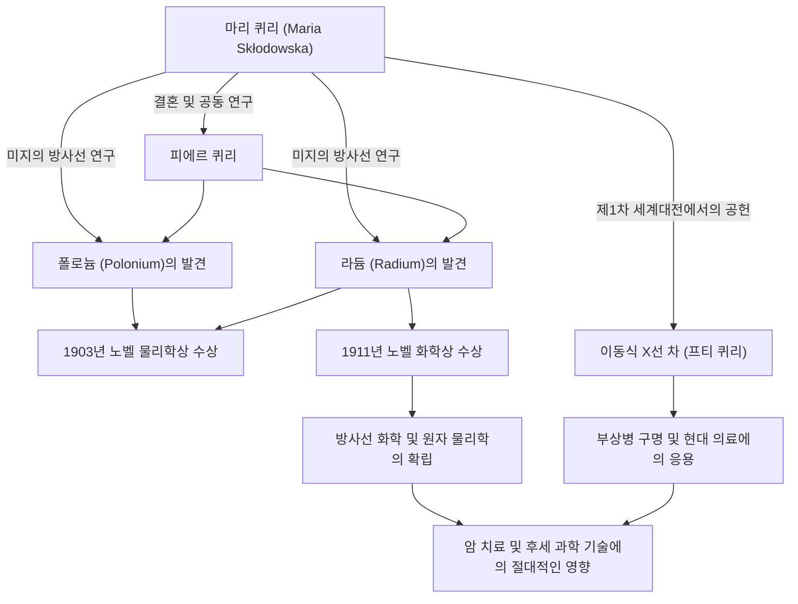

과학의 역사에서 가장 눈부시면서도 가장 가혹한 길을 걸었던 인물 중 한 명이 바로 마리 퀴리(퀴리 부인)입니다. 그녀는 여성으로서 최초로 노벨상을 수상했으며, 더 나아가 물리학과 화학이라는 서로 다른 두 과학 분야에서 노벨상을 수상한 역사상 유일한 인물입니다. 그녀의 생애는 지식을 갈망하는 순수한 열정과 인류의 미래에 대한 깊은 사랑으로 채색되어 있습니다. 본 기사에서는 마리 퀴리의 생애, 그녀가 가졌던 철학, 그리고 현대에까지 이어지는 그 절대적인 영향에 대해 깊이 파헤쳐 봅니다.

## 역경에서의 출발: 바르샤바에서 파리로

1867년 폴란드 바르샤바에서 태어난 마리아 스크워도프스카(훗날의 마리 퀴리)는 어릴 적부터 탁월한 기억력과 지성을 발휘했습니다. 당시 폴란드는 러시아 제국의 지배하에 있었으며, 여성이 대학에서 고등 교육을 받는 것은 금지되어 있었습니다. 그러나 그녀의 배움에 대한 갈망은 누구도 막을 수 없었습니다.

가정교사로 일하며 자금을 모은 마리는 언니와의 약속을 지키기 위해 1891년, 24세의 나이로 마침내 파리로 건너갑니다. 소르본 대학(파리 대학)에 입학한 그녀는 다락방에서의 극빈 생활을 보내면서도 물리학과 수학에 몰두했습니다. 추위와 굶주림을 견디며 학업에 매진하는 나날이었지만, 그녀에게 그것은 '진리를 탐구하는 기쁨'으로 가득 찬 황금기이기도 했습니다.

## 라듐의 발견과 특허권 포기: 순수한 과학적 탐구

파리에서의 연구 생활 중, 그녀는 운명의 상대인 물리학자 피에르 퀴리와 만납니다. 두 사람은 과학에 대한 열정을 공유하며 결혼합니다. 그리고 앙리 베크렐이 발견한 우라늄의 방사선(훗날 마리가 '방사능(radioactivity)'이라고 명명함)의 수수께끼에 도전하기 시작합니다.

열악한 환경의 실험실에서 수 톤의 피치블렌드(역청우라늄광)를 직접 손으로 정제하는 가혹한 노동 끝에, 1898년 두 사람은 미지의 신원소인 '폴로늄'과 '라듐'을 발견했습니다. 이 위대한 업적으로 1903년 마리는 남편 피에르, 그리고 베크렐과 함께 노벨 물리학상을 수상합니다.

여기서 주목해야 할 점은 마리와 피에르의 철학입니다. 그들은 라듐 분리법에 관한 특허를 취득하지 않았습니다. 특허를 냈다면 막대한 부를 얻을 수 있었겠지만, "과학은 만인의 것이며, 개인의 이익을 위해 독점해서는 안 된다"는 강한 신념을 가지고 있었습니다. 이 무욕의 정신은 훗날의 과학자들에게 큰 영향을 미쳤으며, 과학 지식의 공유라는 현대 오픈 사이언스의 초석이라고도 할 수 있는 태도를 보여주었습니다.

## 상실과 비애를 넘어서

그러나 행복했던 공동 연구의 나날은 갑작스럽게 끝을 맺습니다. 1906년, 가장 사랑하는 남편이자 최대의 이해자였던 피에르가 마차에 치여 불의의 죽음을 맞이한 것입니다. 마리의 슬픔은 헤아릴 수 없는 것이었지만, 그녀는 피에르의 유지를 이어받듯 연구실로 돌아가 소르본 대학에서 최초의 여성 교수로 취임합니다.

그리고 1911년, 금속 라듐 분리에 성공한 공로로 이번에는 단독으로 노벨 화학상을 수상합니다. 남편의 죽음이라는 절망적인 상실을 극복하고, 그녀는 스스로의 힘으로 과학의 새로운 지평을 열었던 것입니다.

## 제1차 세계대전과 '프티 퀴리': 사회에 대한 봉사

마리 퀴리의 업적은 실험실 안에만 머물지 않았습니다. 1914년 제1차 세계대전이 발발하자, 그녀는 방사선 기술이 부상병 치료에 도움이 될 것이라고 직감합니다. 그녀는 스스로 자금을 조달하여 X선 촬영 장치를 탑재한 이동식 엑스레이 차(통칭 '프티 퀴리')를 개발했습니다.

스스로 엑스레이 기술을 배우고, 딸 이렌과 함께 전선으로 향하여 100만 명 이상이라고도 일컬어지는 병사들의 생명을 구하는 데 조력했습니다. 과학적 발견을 현실의 의료에 응용하고, 눈앞에서 고통받는 사람들을 구하기 위해 분주히 움직였던 이 행동은 그녀의 인류애와 강한 윤리관을 상징합니다.

## 후세에의 영향과 영원한 유산

마리 퀴리가 발견한 라듐과 방사능 연구는 원자 물리학이라는 새로운 분야를 창출했습니다. 그것은 물질의 근원적인 이해를 변혁시켰고, 후세 과학자들에 의한 원자핵 에너지의 개발이나 현대 의학에서의 암 방사선 치료로의 길을 열었습니다.

그러나 그 발견은 동시에 그녀의 생명을 갉아먹는 것이기도 했습니다. 오랜 세월에 걸친 방사선 피폭으로 인해 그녀는 재생불량성 빈혈을 앓게 되었고, 1934년 66세의 나이로 세상을 떠났습니다. 그녀의 실험 노트는 현재까지도 강한 방사능을 띠고 있으며, 납 상자에 보관되어 있습니다.

마리 퀴리의 생애는 '미지의 것을 두려워하는 것이 아니라 이해하려고 노력하는 것'의 중요성을 우리에게 가르쳐 줍니다. 그녀의 흔들림 없는 신념, 어려움에 맞서는 용기, 그리고 과학을 통한 인류에 대한 무조건적인 사랑은 시대를 넘어 계속해서 빛나고 있습니다.

## 업적과 상관관계 흐름도

다음 그림은 마리 퀴리의 주요 발견부터 그것이 어떻게 사회나 후세에 영향을 미쳤는지를 보여줍니다.

마리 퀴리가 남긴 빛은 지금도 여전히 과학의 세계를 밝게 비추고 있습니다.
