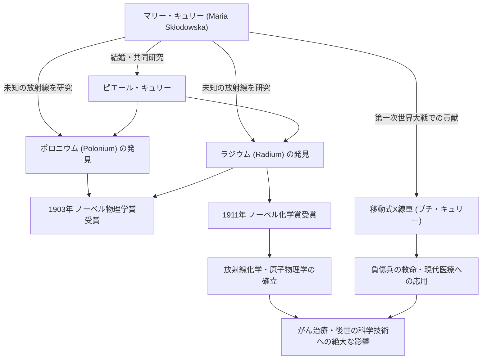

科学の歴史において、最も輝かしく、そして最も過酷な道を歩んだ人物の一人がマリー・キュリー（キュリー夫人）です。女性として初めてノーベル賞を受賞し、さらに物理学と化学という異なる2つの科学分野でノーベル賞を受賞した史上唯一の人物でもあります。彼女の生涯は、知を渇望する純粋な情熱と、人類の未来に対する深い愛情によって彩られています。本記事では、マリー・キュリーの生涯、彼女が抱いた哲学、そして現代にまで続くその絶大な影響について深く掘り下げます。

## 逆境からの出発：ワルシャワからパリへ

1867年、ポーランドのワルシャワに生まれたマリア・スクウォドフスカ（後のマリー・キュリー）は、幼い頃から卓越した記憶力と知性を発揮していました。当時のポーランドはロシア帝国の支配下にあり、女性が大学で高等教育を受けることは禁じられていました。しかし、彼女の学ぶことへの渇望は誰にも止めることができませんでした。

家庭教師として働きながら資金を貯めたマリーは、姉との約束を果たし、1891年、24歳でついにパリへ渡ります。ソルボンヌ大学（パリ大学）に入学した彼女は、屋根裏部屋での極貧生活を送りながらも、物理学と数学に没頭しました。寒さと飢えに耐えながら勉学に励む日々でしたが、彼女にとってそれは「真理を探究する喜び」に満ちた黄金時代でもありました。

## ラジウムの発見と特許権の放棄：純粋な科学的探求

パリでの研究生活のなかで、彼女は運命の相手である物理学者ピエール・キュリーと出会います。二人は科学への情熱を共有し、結婚。そして、アンリ・ベクレルが発見したウランの放射線（後にマリーが「放射能 (radioactivity)」と命名）の謎に挑み始めます。

劣悪な環境の実験室で、何トンものピッチブレンド（閃ウラン鉱）を自らの手で精製するという過酷な労働の末、1898年に二人は未知の新元素「ポロニウム」と「ラジウム」を発見しました。この偉業により、1903年にマリーは夫ピエール、そしてベクレルと共にノーベル物理学賞を受賞します。

ここで注目すべきは、マリーとピエールの哲学です。彼らはラジウムの分離法に関する特許を取得しませんでした。特許を取れば莫大な富を得られたはずですが、「科学は万人のものであり、個人的な利益のために独占すべきではない」という強い信念を持っていたのです。この無私の精神は、後の科学者たちに大きな影響を与え、科学知識の共有という現代のオープンサイエンスの礎とも言える姿勢を示しました。

## 喪失と悲哀を乗り越えて

しかし、幸福な共同研究の日々は突然終わりを告げます。1906年、最愛の夫であり最大の理解者であったピエールが馬車に轢かれて不慮の死を遂げたのです。マリーの悲しみは計り知れないものでしたが、彼女はピエールの遺志を継ぐように研究室に戻り、ソルボンヌ大学で初の女性教授に就任します。

そして1911年、金属ラジウムの分離に成功した功績により、今度は単独でノーベル化学賞を受賞します。夫の死という絶望的な喪失を乗り越え、彼女は自らの力で科学の新たな地平を切り拓いたのです。

## 第一次世界大戦と「プチ・キュリー」：社会への奉仕

マリー・キュリーの功績は、実験室の中にとどまりませんでした。1914年に第一次世界大戦が勃発すると、彼女は放射線技術が負傷兵の治療に役立つと直感します。彼女は自ら資金を調達し、X線撮影装置を搭載した移動式レントゲン車（通称「プチ・キュリー」）を開発しました。

自らもレントゲン技術を学び、娘のイレーヌと共に前線へ赴き、100万人以上とも言われる兵士の命を救う手助けをしました。科学的発見を現実の医療に応用し、目の前の苦しむ人々を救うために奔走したこの行動は、彼女の人間愛と強い倫理観を象徴しています。

## 後世への影響と永遠の遺産

マリー・キュリーが発見したラジウムと放射能の研究は、原子物理学という新たな分野を創出しました。それは物質の根源的な理解を変革し、後世の科学者たちによる原子核エネルギーの開発や、現代医学におけるがんの放射線治療への道を拓きました。

しかし、その発見は同時に彼女の命を削るものでもありました。長年にわたる放射線の被曝により、彼女は再生不良性貧血を患い、1934年に66歳でこの世を去りました。彼女の実験ノートは現在でも強い放射能を帯びており、鉛の箱に保管されています。

マリー・キュリーの生涯は、「未知のものを恐れるのではなく、理解しようとすること」の重要性を私たちに教えてくれます。彼女の揺るぎない信念、困難に立ち向かう勇気、そして科学を通じた人類への無償の愛は、時代を超えて輝き続けています。

## 功績と相関のフロー図

以下の図は、マリー・キュリーの主要な発見から、それがどのように社会や後世へ影響を与えていったかを示したものです。

マリー・キュリーの遺した光は、今もなお科学の世界を明るく照らし続けています。
