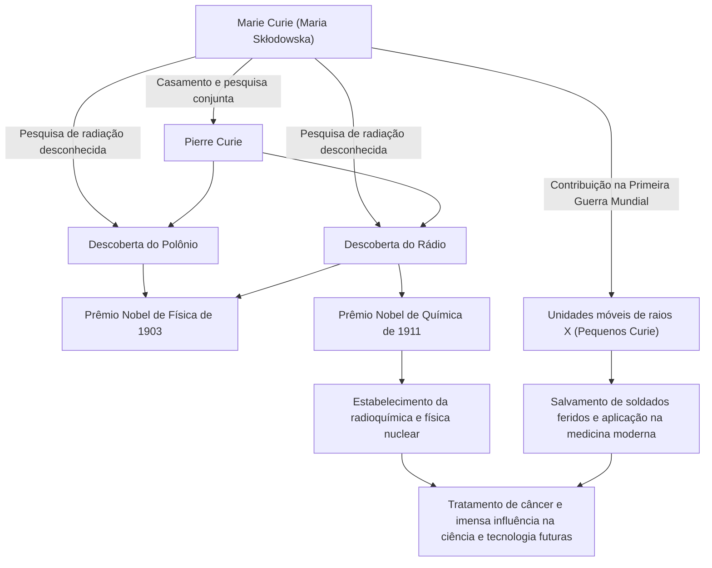

Na história da ciência, uma das pessoas que percorreu o caminho mais brilhante e árduo é Marie Curie (Madame Curie). Ela é a primeira mulher a ganhar um Prêmio Nobel e a única pessoa na história a ganhar Prêmios Nobel em dois campos científicos diferentes: física e química. Sua vida é colorida por uma pura paixão sedenta por conhecimento e um profundo amor pelo futuro da humanidade. Neste artigo, vamos nos aprofundar na vida de Marie Curie, na filosofia que ela mantinha e em sua imensa influência que continua até hoje.

## Partida da Adversidade: De Varsóvia a Paris

Nascida em Varsóvia, Polônia, em 1867, Maria Skłodowska (mais tarde Marie Curie) demonstrou memória e inteligência excepcionais desde tenra idade. Naquela época, a Polônia estava sob o domínio do Império Russo, e as mulheres eram proibidas de receber educação superior nas universidades. No entanto, sua sede de aprendizado não pôde ser detida por ninguém.

Tendo economizado fundos enquanto trabalhava como governanta, Marie cumpriu uma promessa com sua irmã e finalmente se mudou para Paris em 1891, aos 24 anos. Matriculando-se na Sorbonne (Universidade de Paris), ela mergulhou na física e na matemática enquanto vivia em extrema pobreza em um quarto de sótão. Embora esses dias fossem passados estudando enquanto suportava frio e fome, para ela foi uma época de ouro cheia da "alegria de buscar a verdade".

## A Descoberta do Rádio e a Renúncia aos Direitos de Patente: Pura Exploração Científica

Durante sua vida de pesquisa em Paris, ela conheceu seu parceiro de destino, o físico Pierre Curie. Os dois compartilhavam uma paixão pela ciência e se casaram. Eles então começaram a desafiar o mistério da radiação do urânio descoberta por Henri Becquerel (que Marie mais tarde chamou de "radioatividade").

Após um trabalho extenuante refinando toneladas de pechblenda à mão em um laboratório com condições precárias, os dois descobriram os novos elementos desconhecidos "polônio" e "rádio" em 1898. Por essa grande conquista, Marie recebeu o Prêmio Nobel de Física em 1903, junto com seu marido Pierre e Becquerel.

O que deve ser notado aqui é a filosofia de Marie e Pierre. Eles não obtiveram uma patente para o método de isolamento do rádio. Eles poderiam ter ganhado uma riqueza enorme se o tivessem patenteado, mas mantinham a forte convicção de que "a ciência pertence a todos e não deve ser monopolizada para ganho pessoal". Esse espírito altruísta teve um grande impacto nos cientistas subsequentes e demonstrou uma atitude que pode ser chamada de pedra angular da ciência aberta moderna, o compartilhamento do conhecimento científico.

## Superando a Perda e a Tristeza

No entanto, os dias de feliz pesquisa colaborativa chegaram repentinamente ao fim. Em 1906, Pierre, seu amado marido e maior apoiador, morreu inesperadamente após ser atropelado por uma carruagem puxada por cavalos. A tristeza de Marie foi imensurável, mas como que para realizar o último desejo de Pierre, ela retornou ao laboratório e se tornou a primeira professora mulher na Sorbonne.

Então, em 1911, por sua conquista de isolar com sucesso o rádio metálico, ela foi premiada com o Prêmio Nobel de Química por conta própria. Superando a perda desesperadora da morte de seu marido, ela abriu um novo horizonte da ciência com sua própria força.

## Primeira Guerra Mundial e os "Pequenos Curie": Serviço à Sociedade

As conquistas de Marie Curie não ficaram restritas ao laboratório. Quando a Primeira Guerra Mundial estourou em 1914, ela intuiu que a tecnologia de radiação seria útil para tratar soldados feridos. Ela mesma arrecadou fundos e desenvolveu unidades móveis de raios X equipadas com equipamento de radiografia (comumente conhecidas como "Pequenos Curie").

Ela mesma aprendeu a tecnologia de raios X e foi para as linhas de frente com sua filha Irène, ajudando a salvar as vidas de mais de um milhão de soldados, segundo dizem. Essa ação de aplicar descobertas científicas à medicina do mundo real e correr para salvar pessoas sofrendo na sua frente simboliza seu amor pela humanidade e um forte senso de ética.

## Influência nas Gerações Futuras e Legado Eterno

A pesquisa sobre rádio e radioatividade descoberta por Marie Curie criou o novo campo da física nuclear. Isso transformou a compreensão fundamental da matéria e abriu caminho para o desenvolvimento da energia nuclear por cientistas posteriores e da radioterapia para o câncer na medicina moderna.

No entanto, a descoberta também foi algo que encurtou sua vida. Devido à exposição a longo prazo à radiação, ela sofreu de anemia aplástica e faleceu em 1934, aos 66 anos. Seus cadernos experimentais ainda são altamente radioativos hoje e são armazenados em caixas forradas de chumbo.

A vida de Marie Curie nos ensina a importância de "não temer o desconhecido, mas tentar entendê-lo". Sua crença inabalável, coragem para enfrentar dificuldades e amor incondicional pela humanidade por meio da ciência continuam a brilhar através dos tempos.

## Fluxograma de Conquistas e Correlações

O diagrama a seguir mostra as principais descobertas de Marie Curie e como elas influenciaram a sociedade e as gerações futuras.

A luz deixada por Marie Curie continua a iluminar brilhantemente o mundo da ciência até hoje.
