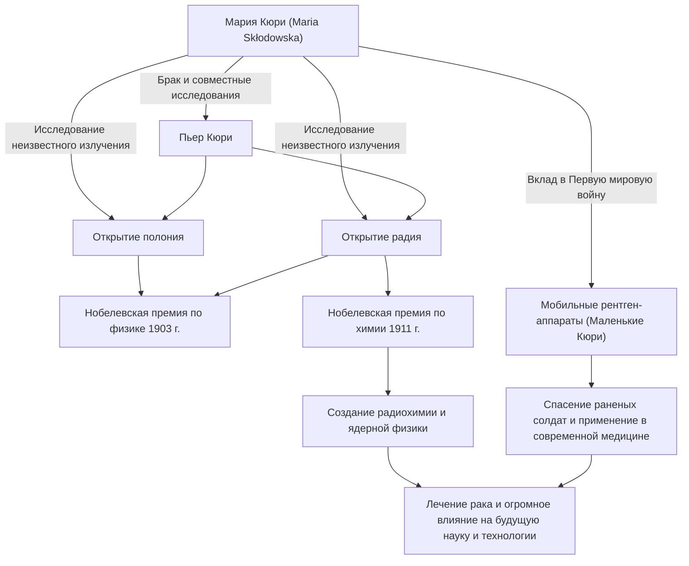

В истории науки одним из людей, прошедших самый блестящий и самый суровый путь, является Мария Кюри (мадам Кюри). Она — первая женщина, получившая Нобелевскую премию, и единственный человек в истории, получивший Нобелевские премии в двух разных научных областях: физике и химии. Ее жизнь окрашена чистой страстью к знаниям и глубокой любовью к будущему человечества. В этой статье мы подробно рассмотрим жизнь Марии Кюри, философию, которой она придерживалась, и ее огромное влияние, которое продолжается и по сей день.

## Путь из невзгод: от Варшавы до Парижа

Родившаяся в Варшаве, Польша, в 1867 году, Мария Склодовская (позже Мария Кюри) с юных лет демонстрировала исключительную память и интеллект. В то время Польша находилась под властью Российской империи, и женщинам было запрещено получать высшее образование в университетах. Однако ее жажду к обучению никто не мог остановить.

Накопив средства, работая гувернанткой, Мария сдержала обещание, данное сестре, и наконец переехала в Париж в 1891 году в возрасте 24 лет. Поступив в Сорбонну (Парижский университет), она с головой погрузилась в физику и математику, живя в крайней нищете в мансарде. Хотя те дни были проведены в учебе в условиях холода и голода, для нее это был золотой век, наполненный "радостью поиска истины".

## Открытие радия и отказ от патентных прав: чистое научное исследование

Во время своей исследовательской жизни в Париже она встретила партнера, предназначенного ей судьбой, — физика Пьера Кюри. Они разделили страсть к науке и поженились. Затем они начали разгадывать тайну излучения урана, открытого Анри Беккерелем (которое Мария позже назвала "радиоактивностью" (radioactivity)).

После изнурительного труда по ручной очистке тонн настурана (урановой смолки) в лаборатории с плохими условиями, в 1898 году они открыли неизвестные новые элементы "полоний" и "радий". За это великое достижение Мария была удостоена Нобелевской премии по физике в 1903 году вместе со своим мужем Пьером и Беккерелем.

Здесь следует отметить философию Марии и Пьера. Они не запатентовали метод выделения радия. Они могли бы получить огромное богатство, если бы запатентовали его, но они твердо верили, что "наука принадлежит всем и не должна монополизироваться ради личной выгоды". Этот бескорыстный дух оказал большое влияние на последующих ученых и продемонстрировал отношение, которое можно назвать краеугольным камнем современной открытой науки — обмен научными знаниями.

## Преодоление потери и горя

Однако дни счастливых совместных исследований внезапно подошли к концу. В 1906 году Пьер, ее любимый муж и самый большой сторонник, неожиданно погиб, попав под конный экипаж. Горе Марии было безмерно, но, как бы выполняя последнюю волю Пьера, она вернулась в лабораторию и стала первой женщиной-профессором в Сорбонне.

Затем, в 1911 году, за успех в выделении металлического радия она единолично была удостоена Нобелевской премии по химии. Преодолев отчаянную утрату мужа, она своими силами открыла новые горизонты науки.

## Первая мировая война и «Маленькие Кюри»: служение обществу

Достижения Марии Кюри не ограничились лабораторией. Когда в 1914 году разразилась Первая мировая война, она интуитивно поняла, что радиационные технологии будут полезны для лечения раненых солдат. Она сама собрала средства и разработала мобильные рентгеновские установки, оснащенные рентгенографическим оборудованием (в просторечии известные как "Маленькие Кюри").

Она сама изучила рентгеновские технологии и отправилась на передовую вместе со своей дочерью Ирен, помогая спасти жизни, как говорят, более миллиона солдат. Этот поступок применения научных открытий к реальной медицине и стремление спасти страдающих людей символизирует ее любовь к человечеству и сильное чувство этики.

## Влияние на будущие поколения и вечное наследие

Исследования радия и радиоактивности, открытые Марией Кюри, создали новую область — ядерную физику. Это изменило фундаментальное понимание материи и проложило путь для развития ядерной энергии будущими учеными и лучевой терапии рака в современной медицине.

Однако это открытие также сократило ее жизнь. Из-за длительного воздействия радиации она заболела апластической анемией и скончалась в 1934 году в возрасте 66 лет. Ее экспериментальные дневники по-прежнему сильно радиоактивны сегодня и хранятся в свинцовых ящиках.

Жизнь Марии Кюри учит нас важности "не бояться неизвестного, а пытаться понять его". Ее непоколебимая вера, мужество перед лицом трудностей и безусловная любовь к человечеству через науку продолжают сиять сквозь века.

## Блок-схема достижений и взаимосвязей

На следующей диаграмме показаны основные открытия Марии Кюри и то, как они повлияли на общество и будущие поколения.

Свет, оставленный Марией Кюри, продолжает ярко освещать мир науки и по сей день.
