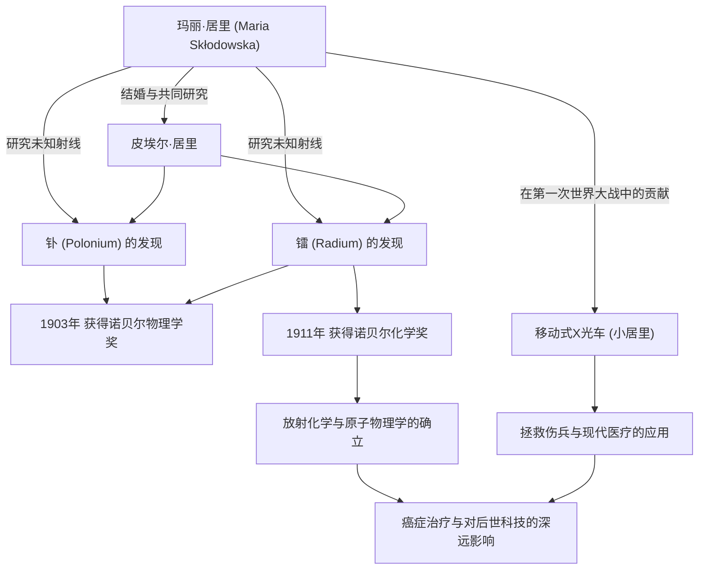

在科学史上，玛丽·居里（居里夫人）是走过最辉煌同时也是最艰辛道路的人物之一。她不仅是第一位获得诺贝尔奖的女性，更是历史上唯一一位在物理学和化学两个不同科学领域均获得诺贝尔奖的人。她的一生因对知识的纯粹渴望与对人类未来的深切关爱而熠熠生辉。本文将深入探讨居里夫人的生平、她所秉持的哲学，以及她对现代产生的深远影响。

## 逆境中的启航：从华沙到巴黎

1867年出生于波兰华沙的玛丽亚·斯克沃多夫斯卡（后来的玛丽·居里），从小就展现出了卓越的记忆力和才智。当时的波兰处于俄罗斯帝国的统治之下，女性被禁止在大学接受高等教育。然而，谁也无法阻挡她对学习的渴望。

玛丽通过做家庭教师攒下了资金，履行了与姐姐的约定，终于在1891年，以24岁的年纪来到了巴黎。进入索邦大学（巴黎大学）后，尽管她在阁楼里过着极度贫困的生活，但仍全身心地投入到物理学和数学中。虽然每天都在忍受寒冷和饥饿中努力学习，但对她来说，那却是一个充满“探求真理之喜悦”的黄金时代。

## 镭的发现与放弃专利权：纯粹的科学探索

在巴黎的研究生活中，她遇到了命运的伴侣——物理学家皮埃尔·居里。两人共享着对科学的激情并结为连理。随后，他们开始挑战由亨利·贝克勒尔发现的铀射线（后被玛丽命名为“放射性 (radioactivity)”）之谜。

在环境恶劣的实验室里，经过亲手提炼数吨沥青铀矿的繁重劳动，两人于1898年发现了未知的新元素“钋”和“镭”。凭借这项伟大的成就，玛丽在1903年与丈夫皮埃尔以及贝克勒尔共同获得了诺贝尔物理学奖。

这里值得注意的是玛丽和皮埃尔的哲学。他们并没有为镭的提炼方法申请专利。如果申请专利，他们本可以获得巨额财富，但他们坚信“科学属于全人类，不应为了个人利益而垄断”。这种无私的精神对后来的科学家产生了巨大的影响，展现了一种可以说是现代开放科学基石的态度——即科学知识的共享。

## 跨越丧失与悲痛

然而，幸福的共同研究时光突然宣告结束。1906年，她最爱的丈夫、也是她最大的理解者皮埃尔不幸被马车碾压身亡。玛丽的悲痛是无法估量的，但为了继承皮埃尔的遗志，她回到了实验室，并成为了索邦大学首位女性教授。

接着在1911年，由于成功分离出金属镭的功绩，她这次单独获得了诺贝尔化学奖。跨越了丈夫去世这一绝望的丧失，她凭借自己的力量开拓了科学的新视野。

## 第一次世界大战与“小居里”：服务社会

玛丽·居里的功绩并未局限于实验室。1914年第一次世界大战爆发时，她直觉到放射技术将有助于治疗伤兵。她亲自筹集资金，开发了配备X射线摄影设备的移动式X光车（俗称“小居里”）。

她自己也学习了X光技术，并与女儿伊雷娜一起奔赴前线，帮助拯救了据说超过一百万名士兵的生命。将科学发现应用于现实医疗，并为拯救眼前受苦受难的人们而奔走，这一行动象征着她的人类大爱与强烈的伦理观。

## 对后世的影响与永恒的遗产

玛丽·居里发现的镭和放射性研究，开创了原子物理学这一新领域。它变革了对物质的根本理解，并为后世科学家开发核能，以及现代医学中癌症的放射治疗开辟了道路。

然而，这些发现同时也消耗着她的生命。由于长期受到辐射，她患上了再生障碍性贫血，于1934年离世，享年66岁。她的实验笔记至今仍带有强烈的放射性，被保存在铅盒中。

玛丽·居里的一生告诉我们：“不要惧怕未知，而要努力去理解它”的重要性。她坚定不移的信念、面对困难的勇气，以及通过科学对人类无私的爱，跨越时代，依然闪耀着光芒。

## 功绩与相关性流程图

下图展示了玛丽·居里的主要发现，以及它如何对社会和后世产生影响。

玛丽·居里留下的光芒，至今仍照亮着科学的世界。
