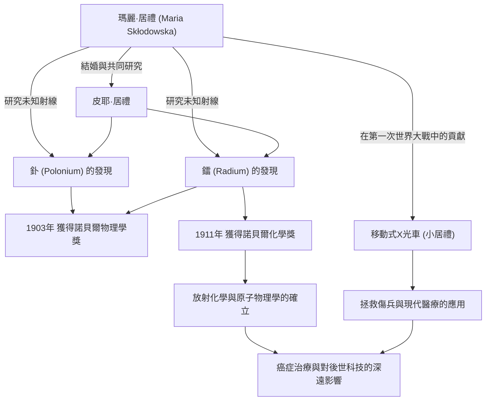

在科學史上，瑪麗·居禮（居禮夫人）是走過最輝煌同時也是最艱辛道路的人物之一。她不僅是第一位獲得諾貝爾獎的女性，更是歷史上唯一一位在物理學和化學兩個不同科學領域均獲得諾貝爾獎的人。她的一生因對知識的純粹渴望與對人類未來的深切關愛而熠熠生輝。本文將深入探討居禮夫人的生平、她所秉持的哲學，以及她對現代產生的深遠影響。

## 逆境中的啟航：從華沙到巴黎

1867年出生於波蘭華沙的瑪麗亞·斯克沃多夫斯卡（後來的瑪麗·居禮），從小就展現出了卓越的記憶力和才智。當時的波蘭處於俄羅斯帝國的統治之下，女性被禁止在大學接受高等教育。然而，誰也無法阻擋她對學習的渴望。

瑪麗透過做家庭教師存下了資金，履行了與姐姐的約定，終於在1891年，以24歲的年紀來到了巴黎。進入索邦大學（巴黎大學）後，儘管她在閣樓裡過著極度貧困的生活，但仍全身心地投入到物理學和數學中。雖然每天都在忍受寒冷和飢餓中努力學習，但對她來說，那卻是一個充滿「探求真理之喜悅」的黃金時代。

## 鐳的發現與放棄專利權：純粹的科學探索

在巴黎的研究生活中，她遇到了命運的伴侶——物理學家皮耶·居禮。兩人共享著對科學的熱情並結為連理。隨後，他們開始挑戰由亨利·貝克勒發現的鈾射線（後被瑪麗命名為「放射性 (radioactivity)」）之謎。

在環境惡劣的實驗室裡，經過親手提煉數噸瀝青鈾礦的繁重勞動，兩人於1898年發現了未知的新元素「釙」和「鐳」。憑藉這項偉大的成就，瑪麗在1903年與丈夫皮耶以及貝克勒共同獲得了諾貝爾物理學獎。

這裡值得注意的是瑪麗和皮耶的哲學。他們並沒有為鐳的提煉方法申請專利。如果申請專利，他們本可以獲得巨額財富，但他們堅信「科學屬於全人類，不應為了個人利益而壟斷」。這種無私的精神對後來的科學家產生了巨大的影響，展現了一種可以說是現代開放科學基石的態度——即科學知識的共享。

## 跨越喪失與悲痛

然而，幸福的共同研究時光突然宣告結束。1906年，她最愛的丈夫、也是她最大的理解者皮耶不幸被馬車碾壓身亡。瑪麗的悲痛是無法估量的，但為了繼承皮耶的遺志，她回到了實驗室，並成為了索邦大學首位女性教授。

接著在1911年，由於成功分離出金屬鐳的功績，她這次單獨獲得了諾貝爾化學獎。跨越了丈夫去世這一絕望的喪失，她憑藉自己的力量開拓了科學的新視野。

## 第一次世界大戰與「小居禮」：服務社會

瑪麗·居禮的功績並未侷限於實驗室。1914年第一次世界大戰爆發時，她直覺到放射技術將有助於治療傷兵。她親自籌集資金，開發了配備X射線攝影設備的移動式X光車（俗稱「小居禮」）。

她自己也學習了X光技術，並與女兒伊雷娜一起奔赴前線，幫助拯救了據說超過一百萬名士兵的生命。將科學發現應用於現實醫療，並為拯救眼前受苦受難的人們而奔走，這一行動象徵著她的人類大愛與強烈的倫理觀。

## 對後世的影響與永恆的遺產

瑪麗·居禮發現的鐳和放射性研究，開創了原子物理學這一新領域。它變革了對物質的根本理解，並為後世科學家開發核能，以及現代醫學中癌症的放射治療開闢了道路。

然而，這些發現同時也消耗著她的生命。由於長期受到輻射，她患上了再生不良性貧血，於1934年離世，享年66歲。她的實驗筆記至今仍帶有強烈的放射性，被保存在鉛盒中。

瑪麗·居禮的一生告訴我們：「不要懼怕未知，而要努力去理解它」的重要性。她堅定不移的信念、面對困難的勇氣，以及透過科學對人類無私的愛，跨越時代，依然閃耀著光芒。

## 功績與相關性流程圖

下圖展示了瑪麗·居禮的主要發現，以及它如何對社會和後世產生影響。

瑪麗·居禮留下的光芒，至今仍照亮著科學的世界。
