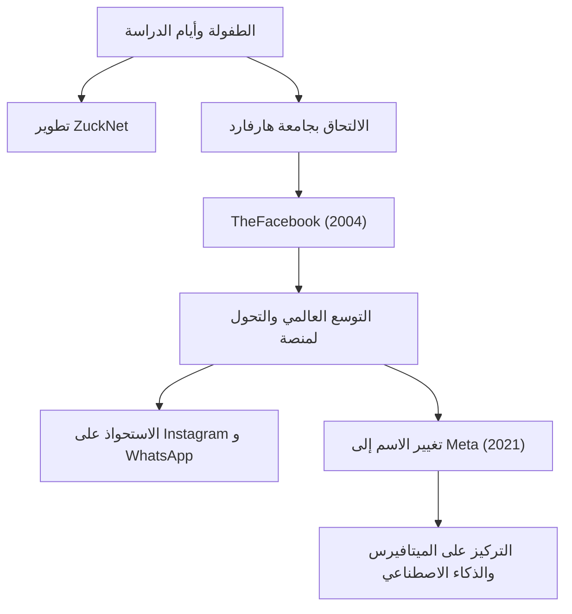

## من هاكر وحيد إلى صانع للتواصل

ولد مارك إليوت زوكربيرج (Mark Elliot Zuckerberg) في 14 مايو 1984، في وايت بلينس، نيويورك. نشأ في بيئة عائلية متميزة لأب طبيب أسنان وأم طبيبة نفسية، وأظهر اهتمامًا قويًا بالبرمجة منذ سن مبكرة. وبحلول المرحلة الإعدادية، كان قد بدأ بالفعل في إظهار لمحات من موهبته، حيث طور برنامج مراسلة يسمى "ZuckNet" يربط مكتب الاستقبال في عيادة والده بغرف الفحص.

عندما التحق بجامعة هارفارد المرموقة، كان العالم لا يزال يخرج للتو من فجر الإنترنت. في عام 2004، اجتاح "TheFacebook"، الذي تم إطلاقه من غرفة سكن جامعي مع زملائه، الحرم الجامعي بسرعة وتطور في النهاية إلى منصة ضخمة "Facebook (الآن Meta)" تربط الناس في جميع أنحاء العالم. ما كان يدفعه لم يكن مجرد نجاح مالي، بل رؤية قوية: "جعل العالم أكثر انفتاحًا وتواصلاً (To make the world more open and connected)".

## "Move Fast and Break Things" —— فلسفة طريق الهاكر

تعد عبارة "تحرك بسرعة وحطم الأشياء (Move Fast and Break Things)" مرادفة لفلسفة إدارة زوكربيرج. بدلاً من قضاء وقت طويل في بناء شيء مثالي، فإن النهج هو إطلاقه أولاً ثم إجراء تحسينات سريعة بناءً على ملاحظات المستخدمين. يمكن القول أن هذا هو جوهر "طريق الهاكر (Hacker Way)" في وادي السيليكون.

لقد وضع روح الهاكر المتمثلة في التحسين المستمر للنظام وتحدي الحدود في صميم ثقافة شركته. وراء النمو السريع لفيسبوك، واستحواذاته المتتالية على إنستغرام وواتساب، والتوسع المستمر لنظامه البيئي تكمن هذه الفلسفة المتمثلة في "عدم الرضا أبدًا عن الوضع الراهن ومتابعة الابتكار المدمر دائمًا".

## التحديات والتطور وآفاق الميتافيرس الجديدة

في حين بدا مسار زوكربيرج وكأنه إبحار سلس، فقد واجه في السنوات الأخيرة انتقادات قاسية معتادة لشركات التكنولوجيا الكبرى، بما في ذلك قضايا الخصوصية، وانتشار الأخبار المزيفة، والانقسام المجتمعي القائم على الخوارزميات. على وجه الخصوص، أثارت فضيحة كامبريدج أناليتيكا عدم ثقة أساسيًا في أنظمة إدارة بيانات فيسبوك.

ومع ذلك، فهو يستغل هذه الشدائد كفرصة لمحاولة إعادة تعريف هدف الشركة. كان قرار تغيير اسم الشركة إلى "Meta" في عام 2021 إعلانًا واضحًا عن طموحه التالي. وهو تطوير الإنترنت ليتجاوز الشاشة ثنائية الأبعاد إلى مساحة افتراضية ثلاثية الأبعاد تسمى "الميتافيرس (Metaverse)"، حيث يمكن للناس التعايش.

يؤمن زوكربيرج بمستقبل يمكن للناس فيه التفاعل والعمل والتعلم متجاوزين القيود المادية. وتتجه أنظاره دائمًا نحو "الشكل التالي للتواصل" الذي يكمن وراء التغلب على التحديات الحالية.

## التأثير على الأجيال القادمة وإرث لم يكتمل

إن التأثير الذي أحدثه مارك زوكربيرج على المجتمع الحديث لا يقاس. فقد غيّرت المنصة التي بناها بشكل أساسي طريقة تواصل الناس وسرّعت بشكل كبير من سرعة تدفق المعلومات. من الحركات الاجتماعية مثل الربيع العربي إلى مشاركة اللحظات اليومية الصغيرة، أصبح فيسبوك بنية تحتية اجتماعية على نطاق غير مسبوق في تاريخ البشرية.

من ناحية أخرى، قدمت الإمبراطورية الرقمية الواسعة التي أنشأها أيضًا تحديات جديدة للبشرية، ألا وهي التأثير السلبي للتكنولوجيا على علم النفس البشري والديمقراطية. سيعتمد إرث زوكربيرج الحقيقي على كيفية تعامله مع هذه التحديات وكيفية بناء الجيل القادم من الإنترنت (الميتافيرس والذكاء الاصطناعي).

"أكبر خطر هو عدم خوض أي مخاطرة. (The biggest risk is not taking any risk.)"

وفقًا لكلماته، يستمر زوكربيرج دائمًا في تحمل المخاطر والدخول في مناطق مجهولة. بدءًا من كونه هاكر في غرفة سكن جامعي، وربط العالم، والتوسع المستمر في العوالم الافتراضية، فإن رحلته هي تاريخ لا يزال قيد التكوين. ما هو التأثير الذي سيحدثه المستقبل الذي يتخيله علينا؟ لا يمكننا أن نرفع أعيننا عن تحديه التالي.
