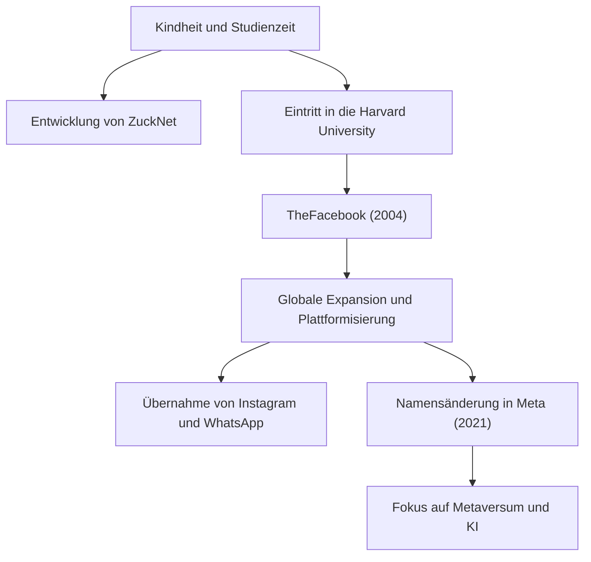

## Vom einsamen Hacker zum Schöpfer von Verbindungen

Mark Elliot Zuckerberg wurde am 14. Mai 1984 in White Plains, New York, geboren. In einem privilegierten Umfeld mit einem Vater als Zahnarzt und einer Mutter als Psychiaterin aufgewachsen, zeigte er schon früh ein starkes Interesse an der Programmierung. Schon in der Mittelschule zeigte sich sein Talent, als er eine Messaging-Software namens „ZuckNet“ entwickelte, die den Empfang in der Zahnarztpraxis seines Vaters mit den Behandlungsräumen verband.

Als er an der renommierten Harvard University aufgenommen wurde, begann die Welt gerade erst, die Anfänge des Internets hinter sich zu lassen. Im Jahr 2004 eroberte „TheFacebook“, das in einem Studentenwohnheim mit seinen Mitbewohnern gestartet wurde, schnell den Campus und wuchs schließlich zu der riesigen Plattform „Facebook (heute Meta)“ heran, die Menschen weltweit verbindet. Was ihn antrieb, war nicht bloßer finanzieller Erfolg, sondern eine starke Vision: „Die Welt offener und verbundener machen (To make the world more open and connected).“

## „Move Fast and Break Things“ —— Die Philosophie des Hacker Way

Der Satz „Move Fast and Break Things (Bewege dich schnell und mache Dinge kaputt)“ ist das Symbol für Zuckerbergs Managementphilosophie. Anstatt viel Zeit in die Perfektionierung einer Sache zu investieren, besteht der Ansatz darin, sie zuerst auf den Markt zu bringen und basierend auf dem Feedback der Nutzer schnell zu verbessern. Dies kann als die Essenz des „Hacker Way“ im Silicon Valley angesehen werden.

Er stellte den Hacker-Geist der kontinuierlichen Systemverbesserung und das Überschreiten von Grenzen in den Mittelpunkt seiner Unternehmenskultur. Hinter dem rasanten Wachstum von Facebook, den aufeinanderfolgenden Übernahmen von Instagram und WhatsApp und der kontinuierlichen Erweiterung seines Ökosystems steht diese Philosophie, sich „nie mit dem Status quo zufrieden zu geben und stets nach disruptiven Innovationen zu streben“.

## Gegenwind, Evolution und die neue Grenze des Metaversums

Obwohl Zuckerbergs Weg scheinbar reibungslos verlief, war er in den letzten Jahren heftiger Kritik ausgesetzt, die typisch für Big Tech ist, darunter Datenschutzprobleme, die Verbreitung von Fake News und die durch Algorithmen bedingte gesellschaftliche Spaltung. Insbesondere der Cambridge-Analytica-Skandal führte zu einem grundlegenden Misstrauen gegenüber den Datenverwaltungssystemen von Facebook.

Er nutzt diese Widrigkeiten jedoch als Gelegenheit, um zu versuchen, den Zweck des Unternehmens neu zu definieren. Die Entscheidung, den Firmennamen im Jahr 2021 in „Meta“ zu ändern, war eine klare Erklärung seiner nächsten Ambition. Es geht darum, das Internet über den zweidimensionalen Bildschirm hinaus zu einem dreidimensionalen virtuellen Raum, dem „Metaversum“, weiterzuentwickeln, in dem Menschen koexistieren können.

Zuckerberg glaubt an eine Zukunft, in der Menschen jenseits physischer Einschränkungen interagieren, arbeiten und lernen können. Sein Blick ist stets auf die „nächste Form der Verbindung“ gerichtet, die jenseits der Bewältigung aktueller Herausforderungen liegt.

## Auswirkungen auf die Nachwelt und ein unvollendetes Vermächtnis

Die Auswirkungen, die Mark Zuckerberg auf die moderne Gesellschaft hatte, sind unermesslich. Die von ihm aufgebaute Plattform veränderte die Art und Weise, wie Menschen kommunizieren, grundlegend und beschleunigte die Geschwindigkeit des Informationsflusses dramatisch. Von sozialen Bewegungen wie dem Arabischen Frühling bis hin zum Teilen kleiner, alltäglicher Momente ist Facebook zu einer sozialen Infrastruktur von beispiellosem Ausmaß in der Menschheitsgeschichte geworden.

Andererseits hat das riesige digitale Imperium, das er geschaffen hat, die Menschheit auch vor neue Herausforderungen gestellt, nämlich die negativen Auswirkungen von Technologie auf die menschliche Psychologie und die Demokratie. Zuckerbergs wahres Vermächtnis wird davon abhängen, wie er diese Herausforderungen angeht und wie er das Internet der nächsten Generation (Metaversum und KI) aufbaut.

„Das größte Risiko besteht darin, kein Risiko einzugehen. (The biggest risk is not taking any risk.)“

Getreu seinen Worten geht Zuckerberg kontinuierlich Risiken ein und betritt unbekanntes Terrain. Angefangen als Hacker in einem Studentenwohnheim, die Welt verbindend und sich kontinuierlich in virtuelle Welten ausdehnend, ist seine Reise eine Geschichte, die sich noch in der Entstehung befindet. Welchen Einfluss wird die Zukunft, die er sich vorstellt, auf uns haben? Wir können unsere Augen nicht von seiner nächsten Herausforderung abwenden.
