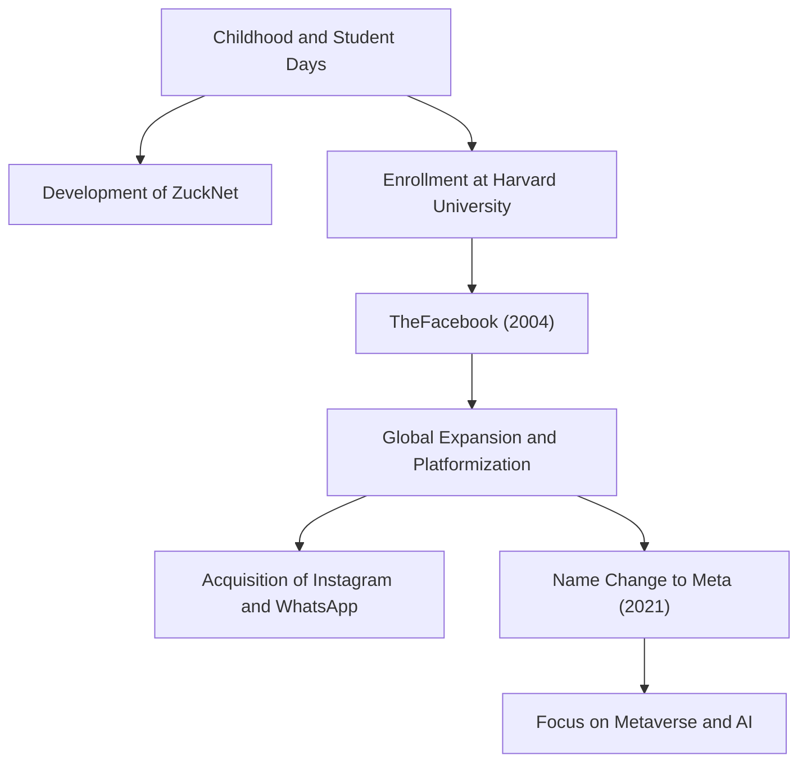

## From Lonely Hacker to Creator of Connections

Mark Elliot Zuckerberg was born on May 14, 1984, in White Plains, New York. Raised in a privileged environment with a dentist father and a psychiatrist mother, he showed a strong interest in programming from an early age. By middle school, he was already displaying glimpses of his talent, developing a messaging software called "ZuckNet" that connected the receptionist in his father's dental clinic with the examination rooms.

When he entered the prestigious Harvard University, the world was just beginning to emerge from the dawn of the internet. In 2004, "TheFacebook," launched from a dorm room with his roommates, quickly swept across the campus and eventually grew into the massive platform "Facebook (now Meta)" that connects people worldwide. What drove him was not mere financial success, but a powerful vision: "To make the world more open and connected."

## "Move Fast and Break Things" —— The Philosophy of the Hacker Way

The phrase "Move Fast and Break Things" is synonymous with Zuckerberg's management philosophy. Rather than spending a long time building something perfect, the approach is to release it first and quickly iterate based on user feedback. This can be said to be the essence of the "Hacker Way" in Silicon Valley.

He placed the hacker spirit of continuous system improvement and pushing boundaries at the core of his corporate culture. Behind Facebook's rapid growth, its successive acquisitions of Instagram and WhatsApp, and the continuous expansion of its ecosystem lies this philosophy of "never being satisfied with the status quo and always pursuing disruptive innovation."

## Headwinds, Evolution, and the New Frontier of the Metaverse

While Zuckerberg's path seemed like smooth sailing, in recent years he has faced harsh criticism typical of Big Tech, including privacy issues, the spread of fake news, and algorithmic social division. The Cambridge Analytica scandal, in particular, sparked fundamental distrust in Facebook's data management systems.

However, he is using these adversities as an opportunity to attempt to redefine the company's purpose. The decision to change the company name to "Meta" in 2021 was a clear declaration of his next ambition. It is to evolve the internet beyond the two-dimensional screen into a three-dimensional virtual space called the "Metaverse," where people can coexist.

Zuckerberg believes in a future where people can interact, work, and learn beyond physical constraints. His gaze is always directed toward the "next form of connection" that lies beyond overcoming current challenges.

## Impact on Posterity and an Unfinished Legacy

The impact Mark Zuckerberg has had on modern society is immeasurable. The platform he built fundamentally changed how people communicate and dramatically accelerated the speed of information flow. From social movements like the Arab Spring to sharing small, everyday moments, Facebook has become a social infrastructure of unprecedented scale in human history.

On the other hand, the vast digital empire he created has also presented humanity with new challenges, namely the negative impact of technology on human psychology and democracy. Zuckerberg's true legacy depends on how he addresses these challenges and how he builds the next generation of the internet (Metaverse and AI).

"The biggest risk is not taking any risk."

True to his words, Zuckerberg continuously takes risks and steps into unknown territories. Starting as a hacker in a dorm room, connecting the world, and continually expanding into virtual realms, his journey is a history still in the making. What impact will the future he envisions have on us? We cannot take our eyes off his next challenge.
