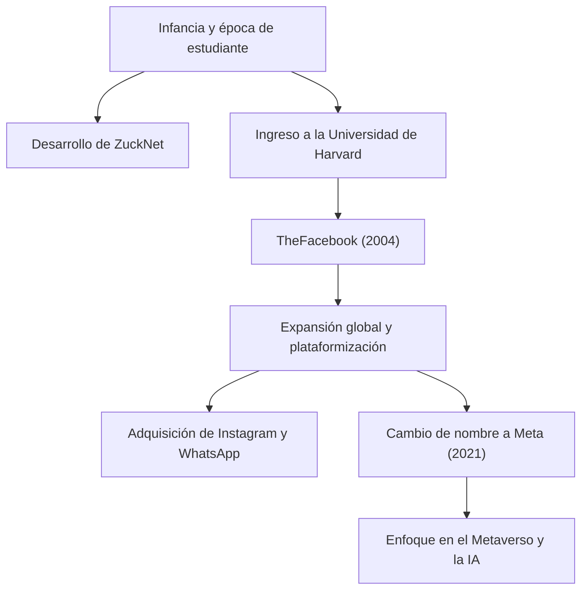

## De hacker solitario a creador de conexiones

Mark Elliot Zuckerberg nació el 14 de mayo de 1984 en White Plains, Nueva York. Criado en un entorno privilegiado con un padre dentista y una madre psiquiatra, mostró un fuerte interés por la programación desde una edad temprana. En la escuela secundaria, ya dejaba entrever su talento al desarrollar un software de mensajería llamado "ZuckNet" que conectaba la recepción de la clínica dental de su padre con las salas de examen.

Cuando ingresó a la prestigiosa Universidad de Harvard, el mundo apenas comenzaba a emerger de los albores de internet. En 2004, "TheFacebook", lanzado desde una habitación de la residencia de estudiantes con sus compañeros, se extendió rápidamente por el campus y con el tiempo se convirtió en la enorme plataforma "Facebook (ahora Meta)" que conecta a personas de todo el mundo. Lo que lo impulsaba no era un simple éxito financiero, sino una poderosa visión: "Hacer el mundo más abierto y conectado" (To make the world more open and connected).

## "Move Fast and Break Things" —— La filosofía del estilo hacker

La frase "Move Fast and Break Things" (Muévete rápido y rompe cosas) es un símbolo de la filosofía de gestión de Zuckerberg. En lugar de pasar mucho tiempo creando algo perfecto, el enfoque es lanzarlo al mercado y realizar mejoras rápidas basadas en los comentarios de los usuarios. Esta podría considerarse la esencia del "Hacker Way" en Silicon Valley.

Colocó el espíritu hacker de mejora continua de sistemas y de desafiar los límites en el centro de su cultura corporativa. Detrás del rápido crecimiento de Facebook, de sus sucesivas adquisiciones de Instagram y WhatsApp, y de la continua expansión de su ecosistema, se esconde esta filosofía de "nunca estar satisfecho con el status quo y buscar siempre la innovación disruptiva".

## Vientos en contra, evolución y la nueva frontera del metaverso

Si bien el camino de Zuckerberg parecía ir sobre ruedas, en los últimos años se ha enfrentado a duras críticas típicas de las grandes empresas tecnológicas, que incluyen problemas de privacidad, la difusión de noticias falsas y la división social impulsada por algoritmos. El escándalo de Cambridge Analytica, en particular, generó una profunda desconfianza en los sistemas de gestión de datos de Facebook.

Sin embargo, está utilizando estas adversidades como una oportunidad para redefinir el propósito de la empresa. El cambio de nombre a "Meta" en 2021 fue una clara declaración de su próxima ambición. Es evolucionar internet más allá de la pantalla bidimensional hacia un espacio virtual tridimensional, el "Metaverso", donde las personas puedan coexistir.

Zuckerberg cree en un futuro donde las personas puedan interactuar, trabajar y aprender superando las limitaciones físicas. Su mirada siempre está dirigida a "la siguiente forma de conexión" que se encuentra más allá de superar los desafíos actuales.

## Impacto en la posteridad y un legado inacabado

El impacto que Mark Zuckerberg ha tenido en la sociedad moderna es incalculable. La plataforma que construyó cambió fundamentalmente la forma en que las personas se comunican y aceleró drásticamente la velocidad del flujo de información. Desde movimientos sociales como la Primavera Árabe hasta compartir pequeños momentos cotidianos, Facebook se ha convertido en una infraestructura social de una escala sin precedentes en la historia de la humanidad.

Por otro lado, el vasto imperio digital que creó también ha presentado a la humanidad nuevos desafíos, como el impacto negativo de la tecnología en la psicología humana y en la democracia. El verdadero legado de Zuckerberg dependerá de cómo afronte estos desafíos y de cómo construya la próxima generación de internet (el metaverso y la IA).

"El mayor riesgo es no asumir ningún riesgo." (The biggest risk is not taking any risk.)

Fiel a sus palabras, Zuckerberg se adentra continuamente en territorios desconocidos asumiendo riesgos. Comenzando como un hacker en un dormitorio, conectando al mundo y expandiéndose continuamente al reino virtual, su viaje es una historia en pleno desarrollo. ¿Qué impacto tendrá en nosotros el futuro que él imagina? No podemos apartar la vista de su próximo desafío.
