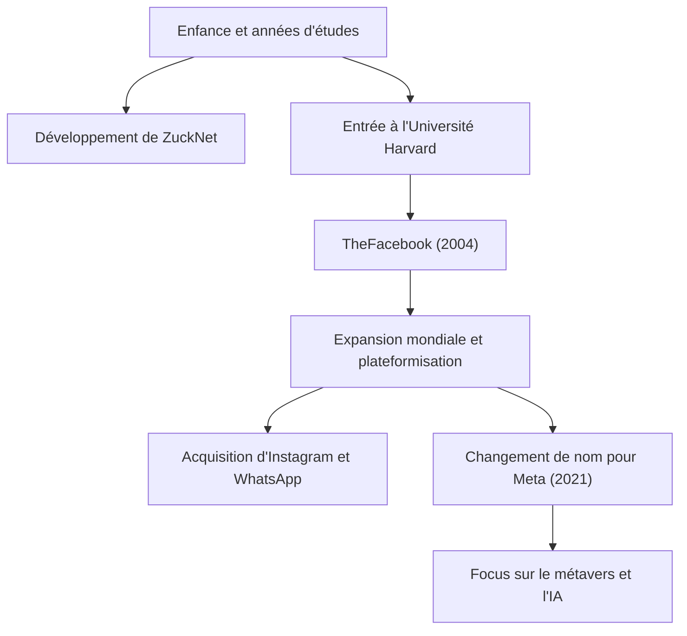

## De hacker solitaire à créateur de connexions

Mark Elliot Zuckerberg est né le 14 mai 1984 à White Plains, dans l'État de New York. Élevé dans un environnement privilégié avec un père dentiste et une mère psychiatre, il a montré un fort intérêt pour la programmation dès son plus jeune âge. Au collège, il montrait déjà des aperçus de son talent en développant un logiciel de messagerie appelé "ZuckNet" qui reliait la réception du cabinet dentaire de son père aux salles d'examen.

Lorsqu'il est entré à la prestigieuse Université de Harvard, le monde commençait à peine à émerger de l'aube de l'internet. En 2004, "TheFacebook", lancé depuis une chambre d'étudiant avec ses colocataires, a rapidement balayé le campus et est finalement devenu la plateforme massive "Facebook (maintenant Meta)" qui connecte les gens du monde entier. Ce qui le motivait n'était pas un simple succès financier, mais une vision puissante : "Rendre le monde plus ouvert et connecté" (To make the world more open and connected).

## "Move Fast and Break Things" —— La philosophie de la voie du hacker

L'expression "Move Fast and Break Things" (Agir vite et casser des choses) est le symbole de la philosophie de gestion de Zuckerberg. Plutôt que de passer beaucoup de temps à construire quelque chose de parfait, l'approche consiste à le lancer en premier et à l'améliorer rapidement en fonction des retours des utilisateurs. On peut dire que c'est l'essence même du "Hacker Way" dans la Silicon Valley.

Il a placé l'esprit hacker d'amélioration continue des systèmes et de dépassement des limites au cœur de sa culture d'entreprise. Derrière la croissance rapide de Facebook, ses acquisitions successives d'Instagram et de WhatsApp, et l'expansion continue de son écosystème se cache cette philosophie de "ne jamais se satisfaire du statu quo et de toujours poursuivre l'innovation de rupture".

## Vents contraires, évolution et la nouvelle frontière du métavers

Bien que le parcours de Zuckerberg ait semblé se dérouler sans accroc, il a été confronté ces dernières années aux critiques sévères typiques des grandes entreprises technologiques, notamment les problèmes de confidentialité, la diffusion de fausses nouvelles et la division sociale algorithmique. Le scandale de Cambridge Analytica, en particulier, a suscité une méfiance fondamentale à l'égard des systèmes de gestion des données de Facebook.

Cependant, il utilise ces adversités comme une opportunité pour tenter de redéfinir la mission de l'entreprise. La décision de changer le nom de l'entreprise en "Meta" en 2021 était une déclaration claire de sa prochaine ambition. Il s'agit de faire évoluer l'internet au-delà de l'écran bidimensionnel vers un espace virtuel tridimensionnel appelé le "métavers", où les gens peuvent coexister.

Zuckerberg croit en un avenir où les gens peuvent interagir, travailler et apprendre au-delà des contraintes physiques. Son regard est toujours tourné vers "la prochaine forme de connexion" qui se trouve au-delà de la résolution des défis actuels.

## Impact sur la postérité et héritage inachevé

L'impact que Mark Zuckerberg a eu sur la société moderne est incommensurable. La plateforme qu'il a construite a fondamentalement changé la façon dont les gens communiquent et a considérablement accéléré la vitesse de circulation de l'information. Des mouvements sociaux comme le Printemps arabe au partage de petits moments quotidiens, Facebook est devenu une infrastructure sociale d'une ampleur sans précédent dans l'histoire de l'humanité.

D'un autre côté, le vaste empire numérique qu'il a créé a également présenté à l'humanité de nouveaux défis, à savoir l'impact négatif de la technologie sur la psychologie humaine et la démocratie. Le véritable héritage de Zuckerberg dépendra de la manière dont il relèvera ces défis et dont il construira la prochaine génération d'internet (métavers et IA).

"Le plus grand risque est de ne prendre aucun risque." (The biggest risk is not taking any risk.)

Fidèle à ses paroles, Zuckerberg continue de prendre des risques et de s'aventurer dans des territoires inconnus. Commençant comme un hacker dans une chambre d'étudiant, connectant le monde et s'étendant continuellement dans les royaumes virtuels, son voyage est une histoire toujours en cours de création. Quel impact l'avenir qu'il envisage aura-t-il sur nous ? Nous ne pouvons pas quitter des yeux son prochain défi.
