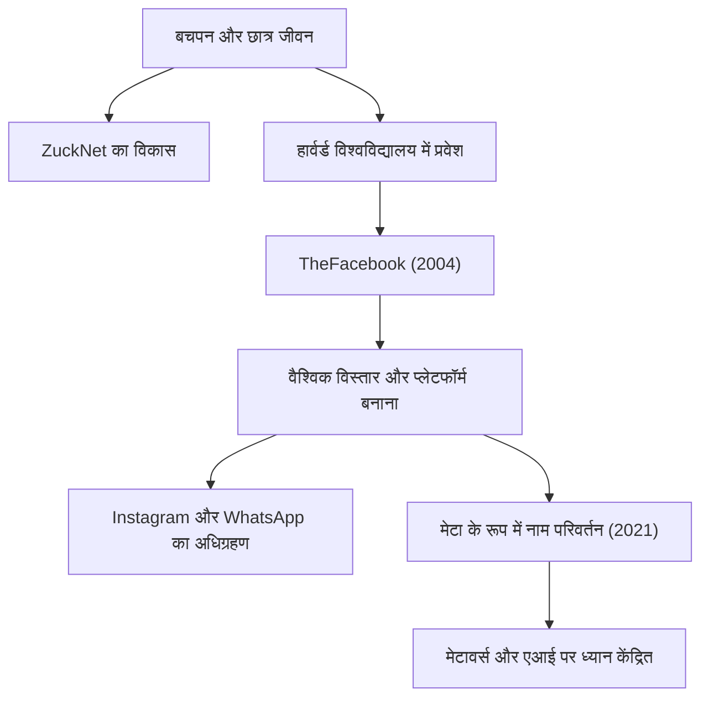

## एक अकेले हैकर से "कनेक्शन" के निर्माता तक

मार्क एलियट जुकरबर्ग (Mark Elliot Zuckerberg) का जन्म 14 मई, 1984 को वाइट प्लेन्स, न्यूयॉर्क में हुआ था। एक डेंटिस्ट पिता और मनोचिकित्सक माँ के विशेषाधिकार प्राप्त पारिवारिक वातावरण में पले-बढ़े, उन्होंने कम उम्र से ही प्रोग्रामिंग में गहरी दिलचस्पी दिखाई। मिडिल स्कूल तक, उन्होंने अपनी प्रतिभा की झलक दिखाना शुरू कर दिया था, "ZuckNet" नामक एक मैसेजिंग सॉफ्टवेयर विकसित किया जिसने उनके पिता के डेंटल क्लिनिक के रिसेप्शन को परीक्षा कक्षों से जोड़ा।

जब उन्होंने प्रतिष्ठित हार्वर्ड विश्वविद्यालय में प्रवेश लिया, तब दुनिया इंटरनेट की शुरुआत से बाहर निकल ही रही थी। 2004 में, अपने रूममेट्स के साथ एक छात्रावास के कमरे से शुरू किया गया "TheFacebook", जल्दी ही पूरे कैंपस में फैल गया और अंततः लोगों को दुनिया भर में जोड़ने वाले विशाल मंच "Facebook (अब Meta)" के रूप में विकसित हुआ। जो चीज़ उन्हें प्रेरित कर रही थी वह केवल वित्तीय सफलता नहीं थी, बल्कि एक शक्तिशाली दृष्टिकोण था: "दुनिया को अधिक खुला और जुड़ा हुआ बनाना (To make the world more open and connected)।"

## "Move Fast and Break Things" —— हैकर वे का दर्शन

"तेजी से आगे बढ़ें और चीजों को तोड़ें (Move Fast and Break Things)" जुकरबर्ग के प्रबंधन दर्शन का प्रतीक है। किसी चीज को परफेक्ट बनाने में लंबा समय लगाने के बजाय, पहले उसे लॉन्च करना और उपयोगकर्ताओं के फीडबैक के आधार पर तेजी से सुधार करना। यह सिलिकॉन वैली में "हैकर वे (Hacker Way)" का सार कहा जा सकता है।

उन्होंने लगातार सिस्टम सुधार और सीमाओं को चुनौती देने वाली हैकर भावना को अपनी कॉर्पोरेट संस्कृति के मूल में रखा। Facebook की तीव्र वृद्धि, Instagram और WhatsApp के क्रमिक अधिग्रहण, और इसके पारिस्थितिकी तंत्र के निरंतर विस्तार के पीछे "यथास्थिति से कभी संतुष्ट न होने और हमेशा विघटनकारी नवाचार को आगे बढ़ाने" का यही दर्शन है।

## विपरीत परिस्थितियां, विकास और मेटावर्स का नया सीमांत

हालांकि जुकरबर्ग का सफर सुचारू लग रहा था, हाल के वर्षों में उन्हें बिग टेक की ठेठ कड़ी आलोचनाओं का सामना करना पड़ा है, जिनमें गोपनीयता के मुद्दे, फर्जी खबरों का प्रसार, और एल्गोरिथम से होने वाला सामाजिक विभाजन शामिल हैं। विशेष रूप से कैम्ब्रिज एनालिटिका स्कैंडल ने Facebook की डेटा प्रबंधन प्रणालियों में मूलभूत अविश्वास पैदा किया।

हालाँकि, वह इन प्रतिकूलताओं का उपयोग कंपनी के उद्देश्य को फिर से परिभाषित करने के अवसर के रूप में कर रहे हैं। 2021 में कंपनी का नाम बदलकर "Meta" करना उनकी अगली महत्वाकांक्षा की स्पष्ट घोषणा थी। यह इंटरनेट को द्वि-आयामी स्क्रीन से परे एक त्रि-आयामी आभासी स्थान, "मेटावर्स (Metaverse)", में विकसित करना है जहां लोग सह-अस्तित्व में रह सकें।

जुकरबर्ग एक ऐसे भविष्य में विश्वास करते हैं जहां लोग भौतिक बाधाओं से परे बातचीत, काम और सीख सकते हैं। उनकी नज़र हमेशा वर्तमान चुनौतियों पर काबू पाने के बाद "कनेक्शन के अगले रूप" की ओर केंद्रित है।

## आने वाली पीढ़ियों पर प्रभाव और एक अधूरी विरासत

आधुनिक समाज पर मार्क जुकरबर्ग का जो प्रभाव पड़ा है वह अथाह है। उनके द्वारा बनाए गए मंच ने लोगों के संवाद करने के तरीके को मौलिक रूप से बदल दिया और सूचना के प्रवाह की गति को नाटकीय रूप से तेज कर दिया। अरब स्प्रिंग जैसे सामाजिक आंदोलनों से लेकर छोटी-छोटी रोजमर्रा की बातों को साझा करने तक, Facebook मानव इतिहास में अभूतपूर्व पैमाने का एक सामाजिक बुनियादी ढांचा बन गया है।

दूसरी ओर, उनके द्वारा बनाए गए विशाल डिजिटल साम्राज्य ने मानवता के सामने नई चुनौतियाँ भी पेश की हैं, जैसे कि मानव मनोविज्ञान और लोकतंत्र पर प्रौद्योगिकी का नकारात्मक प्रभाव। जुकरबर्ग की सच्ची विरासत इस बात पर निर्भर करेगी कि वे इन चुनौतियों का सामना कैसे करते हैं और वे अगली पीढ़ी के इंटरनेट (मेटावर्स और एआई) का निर्माण कैसे करते हैं।

"सबसे बड़ा जोखिम कोई जोखिम न लेना है (The biggest risk is not taking any risk)।"

अपने शब्दों के अनुसार, जुकरबर्ग लगातार जोखिम उठाते हैं और अज्ञात क्षेत्रों में कदम रखते हैं। एक छात्रावास में हैकर के रूप में शुरुआत करते हुए, दुनिया को जोड़ते हुए, और आभासी दुनिया में लगातार विस्तार करते हुए, उनकी यात्रा इतिहास का एक चल रहा हिस्सा है। उन्होंने भविष्य की जो तस्वीर सोची है, उसका हम पर क्या प्रभाव पड़ेगा? हम उनकी अगली चुनौती से अपनी आँखें नहीं हटा सकते।
