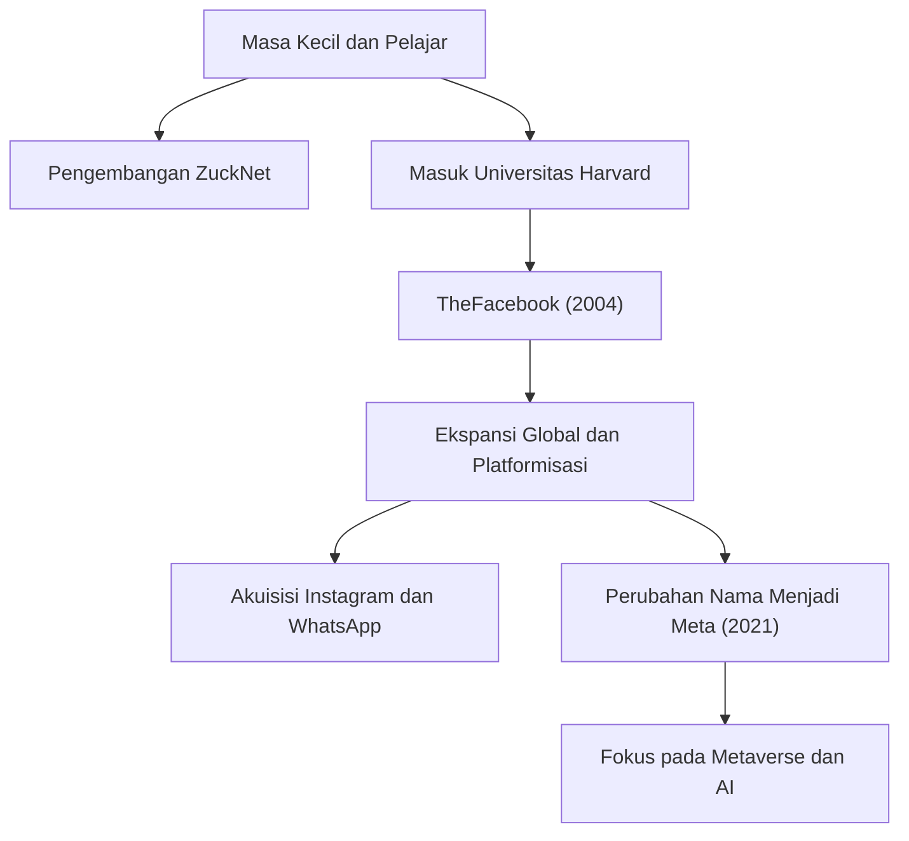

## Dari Hacker Penyendiri Menjadi Pencipta "Koneksi"

Mark Elliot Zuckerberg lahir pada 14 Mei 1984 di White Plains, New York. Dibesarkan dalam lingkungan keluarga yang beruntung dengan ayah seorang dokter gigi dan ibu seorang psikiater, ia menunjukkan minat yang kuat pada pemrograman sejak usia dini. Pada saat SMP, ia sudah menunjukkan bakatnya, mengembangkan perangkat lunak perpesanan yang disebut "ZuckNet" yang menghubungkan resepsionis di klinik gigi ayahnya dengan ruang periksa.

Ketika ia masuk ke Universitas Harvard yang bergengsi, dunia baru saja mulai bangkit dari awal mula internet. Pada tahun 2004, "TheFacebook," yang diluncurkan dari kamar asrama bersama teman-teman sekamarnya, dengan cepat menyapu kampus dan akhirnya tumbuh menjadi platform besar "Facebook (sekarang Meta)" yang menghubungkan orang-orang di seluruh dunia. Yang mendorongnya bukanlah semata-mata kesuksesan finansial, melainkan visi yang kuat: "Untuk membuat dunia lebih terbuka dan terhubung (To make the world more open and connected)."

## "Move Fast and Break Things" —— Filosofi Jalan Hacker

Ungkapan "Bergerak Cepat dan Hancurkan Berbagai Hal (Move Fast and Break Things)" adalah simbol filosofi manajemen Zuckerberg. Daripada menghabiskan banyak waktu untuk membangun sesuatu yang sempurna, pendekatannya adalah meluncurkannya terlebih dahulu dan dengan cepat meningkatkan berdasarkan umpan balik pengguna. Hal ini dapat dikatakan sebagai esensi dari "Jalan Hacker (Hacker Way)" di Lembah Silikon.

Ia menempatkan semangat hacker untuk perbaikan sistem yang berkelanjutan dan menantang batasan sebagai inti dari budaya perusahaannya. Di balik pertumbuhan pesat Facebook, akuisisi berturut-turut atas Instagram dan WhatsApp, serta perluasan ekosistemnya yang berkelanjutan, terdapat filosofi "tidak pernah puas dengan status quo dan selalu mengejar inovasi yang mengganggu".

## Angin Sakal, Evolusi, dan Batas Baru Metaverse

Meskipun jalan Zuckerberg tampak mulus, dalam beberapa tahun terakhir ia menghadapi kritik keras yang khas terhadap perusahaan teknologi besar, termasuk masalah privasi, penyebaran berita palsu, dan perpecahan sosial algoritmik. Skandal Cambridge Analytica, khususnya, memicu ketidakpercayaan mendasar terhadap sistem manajemen data Facebook.

Namun, ia menggunakan kesulitan-kesulitan ini sebagai peluang untuk mencoba mendefinisikan kembali tujuan perusahaan. Keputusan untuk mengubah nama perusahaan menjadi "Meta" pada tahun 2021 merupakan deklarasi jelas atas ambisinya selanjutnya. Ini adalah untuk mengevolusi internet melampaui layar dua dimensi ke dalam ruang virtual tiga dimensi yang disebut "Metaverse," di mana orang dapat hidup berdampingan.

Zuckerberg percaya pada masa depan di mana orang dapat berinteraksi, bekerja, dan belajar melampaui batasan fisik. Pandangannya selalu tertuju pada "bentuk koneksi berikutnya" yang terletak di luar mengatasi tantangan saat ini.

## Dampak pada Generasi Mendatang dan Warisan yang Belum Selesai

Dampak yang diberikan Mark Zuckerberg pada masyarakat modern tidak dapat diukur. Platform yang dibangunnya secara fundamental mengubah cara orang berkomunikasi dan secara dramatis mempercepat kecepatan aliran informasi. Dari gerakan sosial seperti Musim Semi Arab hingga berbagi momen-momen kecil sehari-hari, Facebook telah menjadi infrastruktur sosial dalam skala yang belum pernah ada sebelumnya dalam sejarah umat manusia.

Di sisi lain, kerajaan digital luas yang ia ciptakan juga memberikan tantangan baru bagi umat manusia, yaitu dampak negatif teknologi terhadap psikologi manusia dan demokrasi. Warisan sejati Zuckerberg bergantung pada bagaimana ia mengatasi tantangan-tantangan ini dan bagaimana ia membangun generasi internet berikutnya (Metaverse dan AI).

"Risiko terbesar adalah tidak mengambil risiko apa pun. (The biggest risk is not taking any risk.)"

Sesuai dengan kata-katanya, Zuckerberg terus mengambil risiko dan melangkah ke wilayah yang tidak diketahui. Dimulai sebagai hacker di kamar asrama, menghubungkan dunia, dan terus berekspansi ke ranah virtual, perjalanannya adalah sejarah yang masih terus dibuat. Dampak apa yang akan diberikan oleh masa depan yang dibayangkannya kepada kita? Kita tidak dapat mengalihkan pandangan dari tantangan berikutnya.
