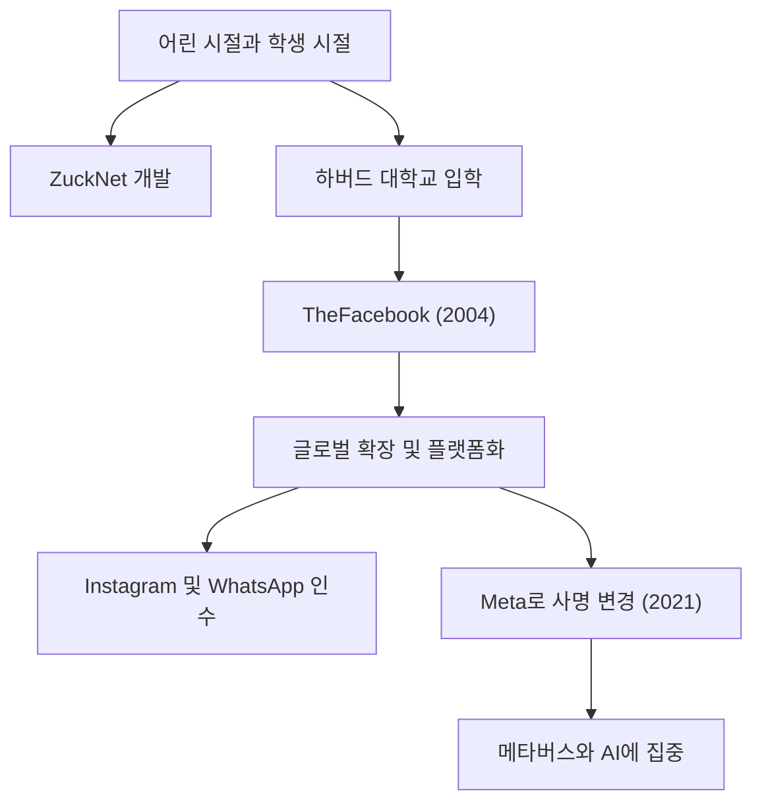

## 고독한 해커에서 '연결'의 창조자로

마크 엘리엇 저커버그(Mark Elliot Zuckerberg)는 1984년 5월 14일 뉴욕주 화이트 플레인스에서 태어났습니다. 치과의사 아버지와 정신과 의사 어머니라는 유복한 가정 환경에서 자란 그는 어린 시절부터 프로그래밍에 강한 관심을 보였습니다. 중학생 때 이미 아버지의 치과 병원 접수처와 진료실을 연결하는 메시지 소프트웨어 'ZuckNet'을 개발하는 등 자신의 재능을 보여주기 시작했습니다.

그가 명문 하버드 대학교에 입학했을 당시, 세계는 막 인터넷의 여명기를 벗어나고 있는 시기였습니다. 2004년, 기숙사 방에서 룸메이트들과 함께 시작한 'TheFacebook'은 순식간에 캠퍼스를 휩쓸었고, 결국 전 세계 사람들을 연결하는 거대한 플랫폼 'Facebook(현 [Meta](/ko/p/history-of-meta-facebook/))'으로 성장하게 됩니다. 그를 움직이게 한 것은 단순한 금전적 성공이 아니라, "세상을 더 개방적이고 연결되게 만들겠다(To make the world more open and connected)"는 강력한 비전이었습니다.

## "Move Fast and Break Things" —— 해커 웨이의 철학

'빠르게 움직이고 파괴하라(Move Fast and Break Things)'는 저커버그의 경영 철학을 상징하는 말입니다. 완벽한 것을 시간을 들여 만들기보다는, 우선 세상에 내놓고 사용자들의 피드백을 얻으며 빠르게 개선을 반복하는 것. 이것이 실리콘밸리에서 말하는 '해커 웨이(Hacker Way)'의 진수라고 할 수 있습니다.

그는 시스템을 지속적으로 개선하고 한계에 도전하는 해커 정신을 기업 문화의 핵심에 두었습니다. Facebook이 급성장을 이루고, Instagram과 WhatsApp을 차례로 인수하며 지속적으로 자사의 생태계를 확장할 수 있었던 배경에는 이 "현재에 만족하지 않고 항상 파괴적인 혁신을 추구한다"는 철학이 있습니다.

## 역풍과 진화, 그리고 메타버스라는 새로운 개척지로

저커버그의 행보는 순조로워 보였지만, 최근 몇 년 동안 그는 프라이버시 문제, 가짜 뉴스의 확산, 알고리즘으로 인한 사회 분열 등 거대 테크 기업 특유의 혹독한 비판에 직면해 있습니다. 특히 케임브리지 애널리티카 사건은 Facebook의 데이터 관리 시스템에 대한 근본적인 불신을 초래했습니다.

하지만 그는 이러한 역경을 기회로 삼아 기업의 존재 이유를 재정의하려고 시도하고 있습니다. 2021년에 회사 이름을 '[Meta](/ko/p/history-of-meta-facebook/)'로 변경한 것은 그의 다음 야망을 명확히 선언한 것입니다. 그것은 2차원 화면 너머의 인터넷을 사람들이 공존할 수 있는 3차원 가상 공간인 '메타버스(Metaverse)'로 진화시키는 것입니다.

저커버그는 사람들이 물리적 제약을 넘어 교류하고, 일하고, 배울 수 있는 미래를 믿습니다. 그의 시선은 항상 현재의 과제를 극복한 그 너머에 있는 '다음 형태의 연결'을 향해 있습니다.

## 후세에 미칠 영향과 미완의 유산

마크 저커버그가 현대 사회에 미친 영향은 헤아릴 수 없습니다. 그가 구축한 플랫폼은 사람들의 소통 방식을 근본적으로 바꾸었고, 정보의 유통 속도를 극적으로 가속화했습니다. '아랍의 봄'과 같은 사회 운동부터 소소한 일상의 공유까지, Facebook은 인류 역사상 전례 없는 규모의 사회적 인프라가 되었습니다.

한편, 그가 만들어낸 거대한 디지털 제국은 기술이 인간의 심리와 민주주의에 미치는 부정적인 영향이라는, 인류에게 새로운 과제 또한 제시하고 있습니다. 저커버그의 진정한 평가는 그가 이러한 과제들에 어떻게 대처하고, 차세대 인터넷(메타버스와 AI)을 어떻게 구축해 나갈지에 달려 있습니다.

"가장 큰 위험은 아무런 위험도 감수하지 않는 것이다. (The biggest risk is not taking any risk.)"

그의 말처럼 저커버그는 항상 미지의 영역으로 위험을 무릅쓰고 나아가고 있습니다. 기숙사의 해커에서 시작해 세상을 연결하고, 그리고 가상 세계로 계속 확장해 나가는 그의 여정은 현재 진행형인 역사 그 자체입니다. 그가 그리는 미래의 모습이 우리에게 어떤 영향을 미칠 것인가. 그의 다음 도전에서 우리는 눈을 뗄 수 없습니다.
