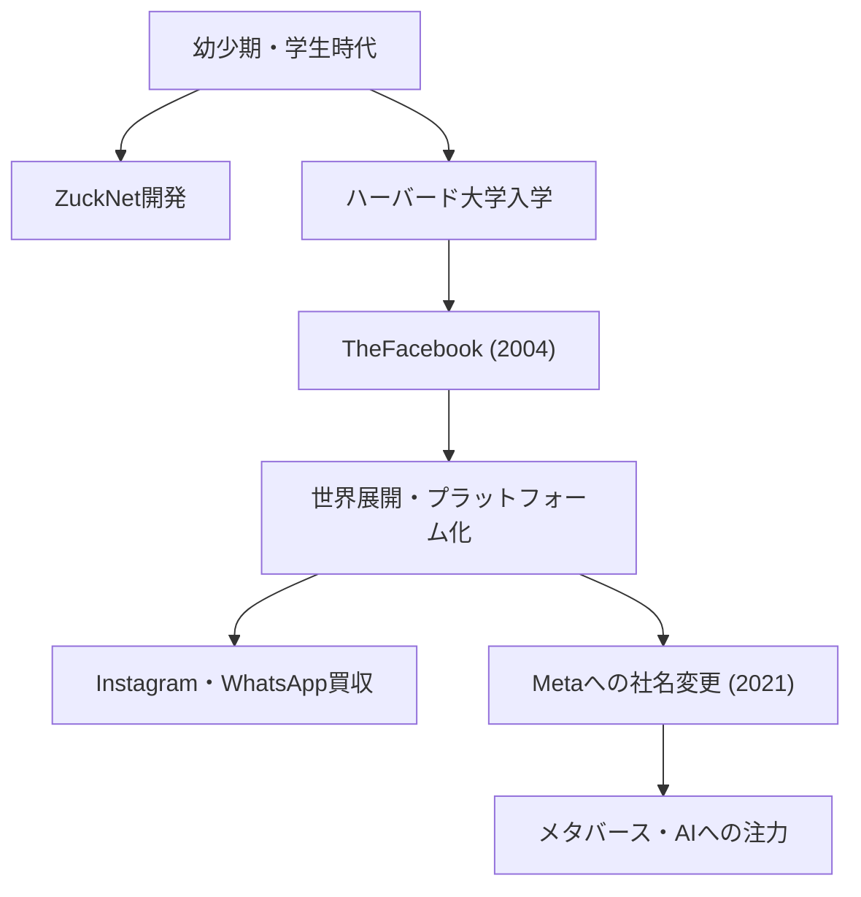

## 孤独なハッカーから「つながり」の創造者へ

マーク・エリオット・ザッカーバーグ（Mark Elliot Zuckerberg）は、1984年5月14日、ニューヨーク州ホワイト・プレインズで生まれました。歯科医の父と精神科医の母という恵まれた家庭環境の中、彼は幼い頃からプログラミングに強い関心を示しました。中学生の時にはすでに、父の歯科医院の受付と診察室をつなぐメッセージソフト「ZuckNet」を開発するなど、その才能の片鱗を見せ始めていました。

彼が名門ハーバード大学に入学した当時、世界はまだインターネットの黎明期を脱しつつある時期でした。2004年、学生寮の一室でルームメイトたちと共に立ち上げた「TheFacebook」は、瞬く間にキャンパスを席巻し、やがて世界中の人々を繋ぐ巨大なプラットフォーム「Facebook（現Meta）」へと成長を遂げます。彼を突き動かしていたのは、単なる金銭的成功ではなく、「世界をオープンにし、つなげる（To make the world more open and connected）」という強烈なビジョンでした。

## 「Move Fast and Break Things」——ハッカーウェイの哲学

ザッカーバーグの経営哲学を象徴する言葉に「Move Fast and Break Things（素早く動き、破壊せよ）」があります。完璧なものを時間をかけて作るよりも、まずは世に出し、ユーザーからのフィードバックを得ながら素早く改善を繰り返す。これはシリコンバレーにおける「ハッカーウェイ（Hacker Way）」の真髄とも言えるアプローチです。

彼は、システムを継続的に改善し、限界に挑戦するハッカー精神を企業文化の核に据えました。Facebookが急成長を遂げ、InstagramやWhatsAppを次々と買収し、自らのエコシステムを拡大し続けた背景には、この「現状に満足せず、常に破壊的なイノベーションを追求する」という哲学があります。

## 逆風と進化、そしてメタバースという新たなフロンティアへ

順風満帆に見えたザッカーバーグの歩みですが、近年はプライバシー問題やフェイクニュースの拡散、アルゴリズムによる社会の分断など、巨大テック企業特有の厳しい批判に直面しています。特にケンブリッジ・アナリティカ事件は、Facebookのデータ管理体制に対する根本的な不信を招きました。

しかし、彼はこれらの逆境を機に、企業の存在意義を再定義しようと試みています。2021年、社名を「Meta」に変更したことは、彼の次なる野望の明確な宣言でした。それは、二次元のスクリーンの向こう側にあるインターネットを、人々が共存できる三次元の仮想空間「メタバース」へと進化させることです。

ザッカーバーグは、物理的な制約を超えて人々が交流し、働き、学ぶことができる未来を信じています。彼の視線は常に、現在の課題を乗り越えた先にある「次のつながりの形」に向けられているのです。

## 後世への影響と未完のレガシー

マーク・ザッカーバーグが現代社会に与えた影響は計り知れません。彼が築き上げたプラットフォームは、人々のコミュニケーションのあり方を根本から変え、情報の流通速度を劇的に加速させました。アラブの春のような社会運動から、日々のささやかな日常の共有まで、Facebookは人類の歴史において前例のない規模の社会的インフラとなりました。

一方で、彼が創り出した巨大なデジタル帝国は、テクノロジーが人間の心理や民主主義に与える負の影響という、人類にとっての新たな課題をも提示しています。ザッカーバーグの真の評価は、彼がこれらの課題にどう向き合い、次世代のインターネット（メタバースやAI）をいかに構築していくかにかかっています。

「The biggest risk is not taking any risk.（最大のリスクは、何のリスクも取らないことだ）」

彼のこの言葉通り、ザッカーバーグは常に未知の領域へリスクを取って踏み出し続けています。学生寮のハッカーから始まり、世界を繋ぎ、そして仮想世界へと拡張し続ける彼の旅は、現在進行形の歴史そのものです。彼が描く未来の姿が、私たちにどのような影響を与えるのか。彼の挑戦から、私たちは目を離すことができません。
