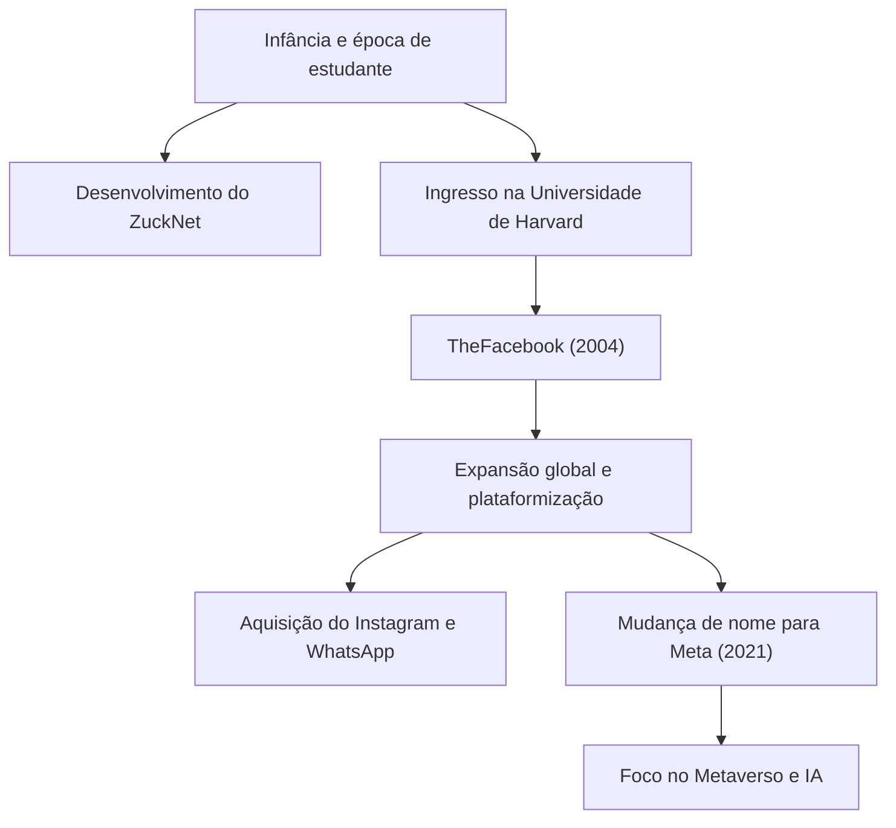

## De Hacker Solitário a Criador de Conexões

Mark Elliot Zuckerberg nasceu em 14 de maio de 1984, em White Plains, Nova York. Criado em um ambiente familiar privilegiado com um pai dentista e uma mãe psiquiatra, ele mostrou um forte interesse em programação desde cedo. No ensino fundamental, ele já demonstrava vislumbres de seu talento, desenvolvendo um software de mensagens chamado "ZuckNet" que conectava a recepção da clínica dentária de seu pai às salas de exame.

Quando ingressou na prestigiada Universidade de Harvard, o mundo estava apenas começando a emergir do alvorecer da internet. Em 2004, "TheFacebook", lançado de um quarto de dormitório com seus colegas de quarto, rapidamente varreu o campus e, eventualmente, se tornou a enorme plataforma "Facebook (agora Meta)" que conecta pessoas em todo o mundo. O que o movia não era o mero sucesso financeiro, mas uma visão poderosa: "Tornar o mundo mais aberto e conectado (To make the world more open and connected)".

## "Move Fast and Break Things" —— A Filosofia do Hacker Way

A frase "Mova-se Rápido e Quebre as Coisas (Move Fast and Break Things)" é o símbolo da filosofia de gestão de Zuckerberg. Em vez de gastar muito tempo construindo algo perfeito, a abordagem é lançá-lo primeiro e melhorá-lo rapidamente com base no feedback do usuário. Pode-se dizer que essa é a essência do "Hacker Way" no Vale do Silício.

Ele colocou o espírito hacker de melhoria contínua de sistemas e de desafiar os limites no centro de sua cultura corporativa. Por trás do rápido crescimento do Facebook, de suas aquisições sucessivas do Instagram e WhatsApp e da expansão contínua de seu ecossistema, reside essa filosofia de "nunca estar satisfeito com o status quo e sempre buscar a inovação disruptiva".

## Ventos Contrários, Evolução e a Nova Fronteira do Metaverso

Embora o caminho de Zuckerberg parecesse tranquilo, nos últimos anos ele enfrentou críticas severas típicas das grandes empresas de tecnologia, incluindo problemas de privacidade, disseminação de notícias falsas e divisão social algorítmica. O escândalo da Cambridge Analytica, em particular, gerou uma desconfiança fundamental nos sistemas de gerenciamento de dados do Facebook.

No entanto, ele está usando essas adversidades como uma oportunidade para tentar redefinir o propósito da empresa. A decisão de mudar o nome da empresa para "Meta" em 2021 foi uma declaração clara de sua próxima ambição. É evoluir a internet além da tela bidimensional para um espaço virtual tridimensional chamado "Metaverso", onde as pessoas podem coexistir.

Zuckerberg acredita em um futuro onde as pessoas podem interagir, trabalhar e aprender além das restrições físicas. Seu olhar está sempre voltado para a "próxima forma de conexão" que se encontra além da superação dos desafios atuais.

## Impacto na Posteridade e um Legado Inacabado

O impacto que Mark Zuckerberg teve na sociedade moderna é imensurável. A plataforma que ele construiu mudou fundamentalmente a forma como as pessoas se comunicam e acelerou drasticamente a velocidade do fluxo de informações. De movimentos sociais como a Primavera Árabe a compartilhar pequenos momentos do dia a dia, o Facebook se tornou uma infraestrutura social de uma escala sem precedentes na história humana.

Por outro lado, o vasto império digital que ele criou também apresentou à humanidade novos desafios, ou seja, o impacto negativo da tecnologia na psicologia humana e na democracia. O verdadeiro legado de Zuckerberg dependerá de como ele lidará com esses desafios e de como construirá a próxima geração da internet (Metaverso e IA).

"O maior risco é não correr risco nenhum. (The biggest risk is not taking any risk.)"

Fiel às suas palavras, Zuckerberg continua assumindo riscos e entrando em territórios desconhecidos. Começando como um hacker em um dormitório, conectando o mundo e se expandindo continuamente em reinos virtuais, sua jornada é uma história ainda em formação. Que impacto o futuro que ele prevê terá sobre nós? Não podemos tirar os olhos do seu próximo desafio.
