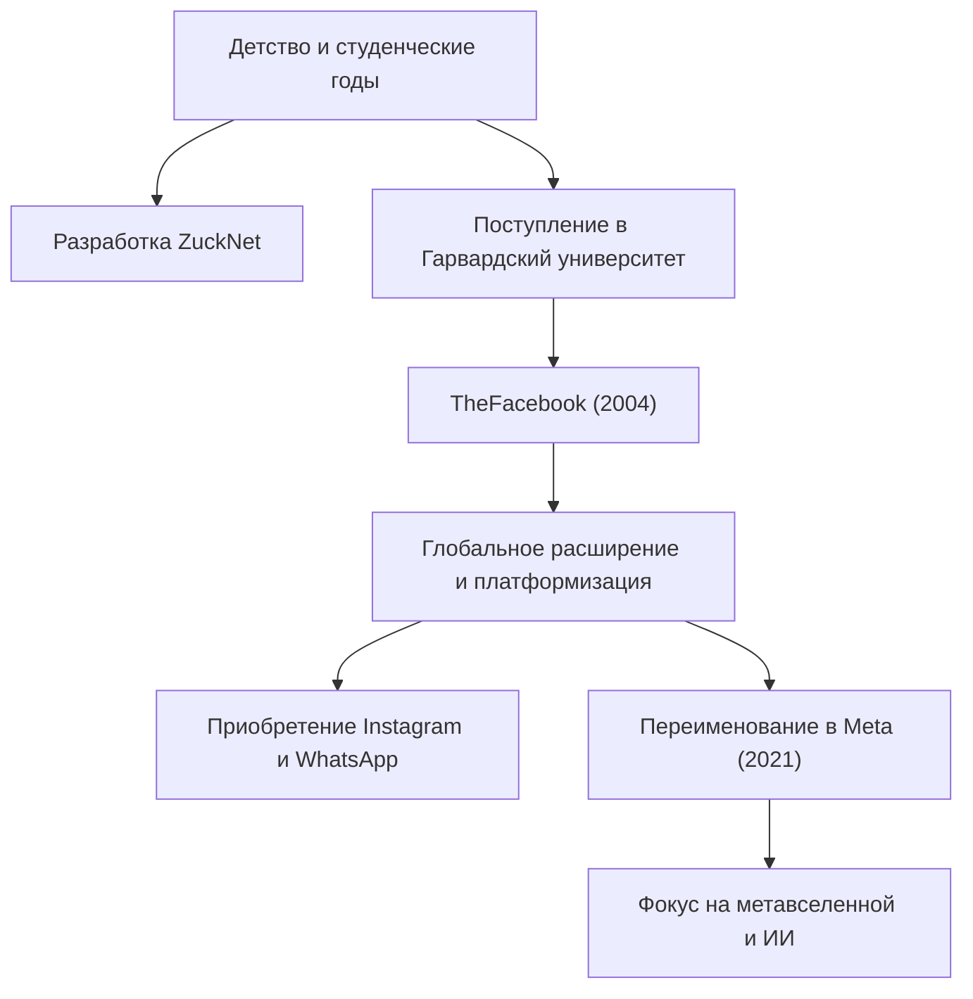

## От одинокого хакера к создателю связей

Марк Эллиот Цукерберг (Mark Elliot Zuckerberg) родился 14 мая 1984 года в Уайт-Плейнс, штат Нью-Йорк. Выросший в благополучной семье отца-дантиста и матери-психиатра, он с ранних лет проявлял сильный интерес к программированию. Уже в средней школе он начал демонстрировать проблески своего таланта, разработав программу обмена сообщениями под названием «ZuckNet», которая соединяла приемную в стоматологической клинике его отца со смотровыми кабинетами.

Когда он поступил в престижный Гарвардский университет, мир только начинал выходить из эпохи зарождения интернета. В 2004 году «TheFacebook», запущенный из комнаты в общежитии вместе с соседями, быстро охватил кампус и в конечном итоге превратился в огромную платформу «Facebook (ныне Meta)», которая объединяет людей по всему миру. Им двигал не просто финансовый успех, а мощное видение: «Сделать мир более открытым и связанным (To make the world more open and connected)».

## «Move Fast and Break Things» —— Философия пути хакера

Фраза «Двигайся быстро и ломай вещи (Move Fast and Break Things)» является символом философии управления Цукерберга. Вместо того, чтобы тратить много времени на создание чего-то идеального, подход заключается в том, чтобы сначала выпустить продукт на рынок и быстро его улучшать на основе отзывов пользователей. Можно сказать, что это суть «Пути хакера (Hacker Way)» в Кремниевой долине.

Он поставил хакерский дух постоянного улучшения системы и расширения границ в центр своей корпоративной культуры. За быстрым ростом Facebook, последовательными приобретениями Instagram и WhatsApp и постоянным расширением его экосистемы стоит эта философия: «никогда не удовлетворяться статусом-кво и всегда стремиться к прорывным инновациям».

## Встречный ветер, эволюция и новые рубежи метавселенной

Хотя путь Цукерберга казался гладким, в последние годы он столкнулся с суровой критикой, типичной для крупных технологических компаний, включая проблемы конфиденциальности, распространение фейковых новостей и социальное разделение, вызванное алгоритмами. Скандал с Cambridge Analytica, в частности, вызвал фундаментальное недоверие к системам управления данными Facebook.

Однако он использует эти трудности как возможность попытаться переосмыслить цель компании. Решение изменить название компании на «Meta» в 2021 году стало четким заявлением о его следующей амбиции. Это эволюция интернета за пределы двумерного экрана в трехмерное виртуальное пространство под названием «Метавселенная», где люди могут сосуществовать.

Цукерберг верит в будущее, в котором люди смогут взаимодействовать, работать и учиться за пределами физических ограничений. Его взгляд всегда устремлен на «следующую форму связи», которая находится за пределами преодоления текущих проблем.

## Влияние на потомков и незавершенное наследие

Влияние, которое Марк Цукерберг оказал на современное общество, неизмеримо. Созданная им платформа в корне изменила способы общения людей и резко ускорила скорость информационных потоков. От социальных движений, таких как «Арабская весна», до обмена небольшими повседневными моментами — Facebook стал социальной инфраструктурой беспрецедентного масштаба в истории человечества.

С другой стороны, созданная им огромная цифровая империя также поставила перед человечеством новые проблемы, а именно негативное влияние технологий на психологию человека и демократию. Истинное наследие Цукерберга зависит от того, как он решит эти проблемы и как построит интернет следующего поколения (Метавселенную и ИИ).

«Самый большой риск — не рисковать (The biggest risk is not taking any risk).»

Верный своим словам, Цукерберг постоянно идет на риск и шагает в неизведанные территории. Начав как хакер в комнате общежития, объединив мир и постоянно расширяясь в виртуальные миры, его путешествие — это история, которая все еще пишется. Какое влияние окажет на нас то будущее, которое он себе представляет? Мы не можем оторвать глаз от его следующего вызова.
