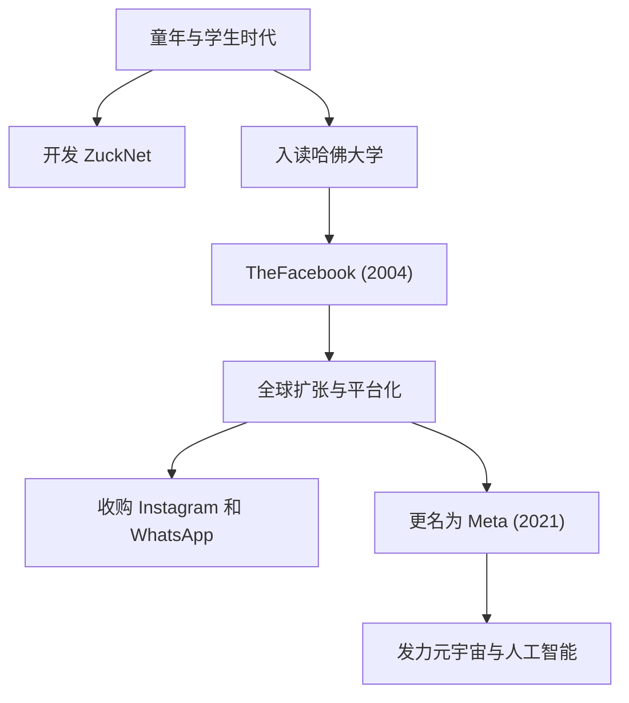

## 从孤独的黑客到“连接”的创造者

马克·埃利奥特·扎克伯格（Mark Elliot Zuckerberg）于1984年5月14日出生在纽约州白原市。在牙医父亲和精神科医生母亲的优渥家庭环境中长大，他从小就对编程表现出浓厚的兴趣。早在初中时期，他就已经展现出自己的才华，开发了一款名为“ZuckNet”的消息软件，将父亲牙医诊所的接待处与检查室连接起来。

当他进入著名的哈佛大学时，世界正逐渐从互联网的黎明期走出来。2004年，他与室友在大学宿舍里共同推出了“TheFacebook”，该平台迅速席卷校园，并最终发展成为连接全球用户的庞大平台“Facebook（现为Meta）”。驱使他前进的不仅仅是金钱上的成功，而是一个强烈的愿景：“让世界更加开放和互联（To make the world more open and connected）”。

## “Move Fast and Break Things”——黑客之道的哲学

“快速行动，打破常规（Move Fast and Break Things）”是扎克伯格管理哲学的标志。与其花大量时间去构建一个完美的产品，不如先将其推向市场，并在获取用户反馈的同时快速迭代。这可以说是硅谷“黑客之道（Hacker Way）”的精髓。

他将持续改进系统和挑战极限的黑客精神置于企业文化的核心。Facebook的快速增长，对Instagram和WhatsApp的连续收购，以及其生态系统的不断扩张，背后正是这种“不满足于现状，永远追求颠覆性创新”的哲学。

## 逆风与进化，走向元宇宙的新前沿

尽管扎克伯格的道路看似一帆风顺，但近年来他面临着大型科技公司典型的严厉批评，包括隐私问题、虚假新闻的传播以及算法导致的社会分化。特别是剑桥分析丑闻，引发了人们对Facebook数据管理系统的根本性不信任。

然而，他正利用这些逆境作为重新定义公司宗旨的契机。2021年，将公司名称更改为“Meta”是他下一个雄心的明确宣言。那就是将二维屏幕之外的互联网演变成一个人们可以共存的三维虚拟空间——“元宇宙”。

扎克伯格相信，在未来的世界里，人们可以超越物理限制进行互动、工作和学习。他的目光始终注视着克服当前挑战之后的“下一种连接形式”。

## 对后世的影响与未完成的遗产

马克·扎克伯格对现代社会产生的影响是不可估量的。他建立的平台从根本上改变了人们的交流方式，极大地加速了信息流动的速度。从“阿拉伯之春”等社会运动，到分享微小的日常生活时刻，Facebook已经成为人类历史上前所未有规模的社会基础设施。

另一方面，他所建立的庞大数字帝国也向人类提出了新的挑战，即技术对人类心理和民主的负面影响。扎克伯格的真正遗产取决于他将如何应对这些挑战，以及他将如何构建下一代互联网（元宇宙和人工智能）。

“最大的风险就是不冒任何风险（The biggest risk is not taking any risk.）”

正如他所说，扎克伯格不断冒险，踏入未知领域。从宿舍里的黑客起步，连接世界，并不断扩展到虚拟世界，他的旅程本身就是一段正在书写的历史。他构想的未来会对我们产生怎样的影响？我们无法将目光从他的下一次挑战上移开。
