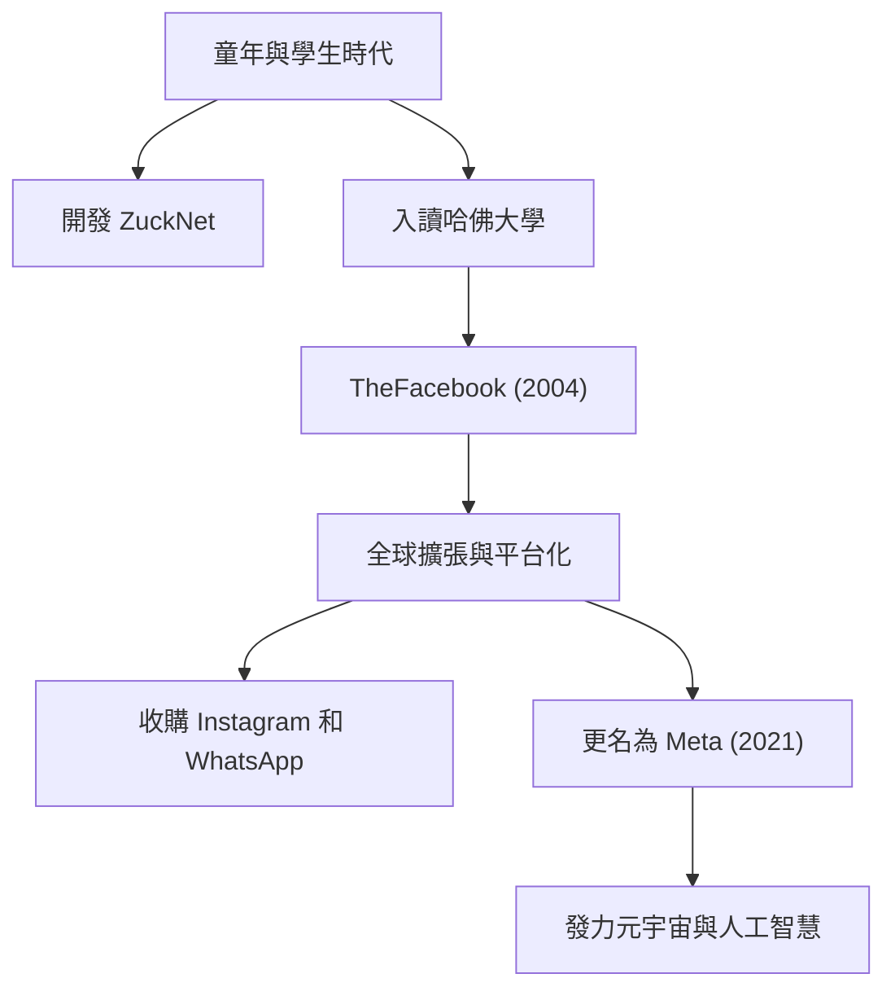

## 從孤獨的駭客到「連結」的創造者

馬克·艾略特·祖克柏（Mark Elliot Zuckerberg）於1984年5月14日出生在紐約州白原市。在牙醫父親和精神科醫生母親的優渥家庭環境中長大，他從小就對程式設計表現出濃厚的興趣。早在國中時期，他就已經展現出自己的才華，開發了一款名為「ZuckNet」的訊息軟體，將父親牙醫診所的接待處與診療室連結起來。

當他進入著名的哈佛大學時，世界正逐漸從網際網路的黎明期走出來。2004年，他與室友在大學宿舍裡共同推出了「TheFacebook」，該平台迅速席捲校園，並最終發展成為連結全球用戶的龐大平台「Facebook（現為[Meta](/zh-tw/p/history-of-meta-facebook/)）」。驅使他前進的這一切不僅僅是金錢上的成功，而是一個強烈的願景：「讓世界更加開放和互聯（To make the world more open and connected）」。

## 「Move Fast and Break Things」——駭客之道的哲學

「快速行動，打破常規（Move Fast and Break Things）」是祖克柏管理哲學的標誌。與其花大量時間去構建一個完美的產品，不如先將其推向市場，並在獲取用戶回饋的同時快速迭代。這可以說是矽谷「駭客之道（Hacker Way）」的精髓。

他將持續改進系統和挑戰極限的駭客精神置於企業文化的核心。Facebook的快速成長，對Instagram和WhatsApp的連續收購，以及其生態系統的不斷擴張，背後正是這種「不滿足於現狀，永遠追求顛覆性創新」的哲學。

## 逆風與進化，走向元宇宙的新前沿

儘管祖克柏的道路看似一帆風順，但近年來他面臨著大型科技公司典型的嚴厲批評，包括隱私問題、假新聞的傳播以及演算法導致的社會分化。特別是劍橋分析醜聞，引發了人們對Facebook數據管理系統的根本性不信任。

然而，他正利用這些逆境作為重新定義公司宗旨的契機。2021年，將公司名稱更改為「[Meta](/zh-tw/p/history-of-meta-facebook/)」是他下一個雄心的明確宣言。那就是將二維螢幕之外的網際網路演變成一個人們可以共存的三維虛擬空間——「元宇宙」。

祖克柏相信，在未來的世界裡，人們可以超越物理限制進行互動、工作和學習。他的目光始終注視著克服當前挑戰之後的「下一個連結形式」。

## 對後世的影響與未完成的遺產

馬克·祖克柏對現代社會產生的影響是不可估量的。他建立的平台從根本上改變了人們的交流方式，極大地加速了資訊流動的速度。從「阿拉伯之春」等社會運動，到分享微小的日常生活時刻，Facebook已經成為人類歷史上前所未有規模的社會基礎設施。

另一方面，他所建立的龐大數位帝國也向人類提出了新的挑戰，即技術對人類心理和民主的負面影響。祖克柏的真正遺產取決於他將如何應對這些挑戰，以及他將如何構建下一代網際網路（元宇宙和人工智慧）。

「最大的風險就是不冒任何風險（The biggest risk is not taking any risk.）」

正如他所說，祖克柏不斷冒險，踏入未知領域。從宿舍裡的駭客起步，連結世界，並不斷擴展到虛擬世界，他的旅程本身就是一段正在書寫的歷史。他構想的未來會對我們產生怎樣的影響？我們無法將目光從他的下一次挑戰上移開。
