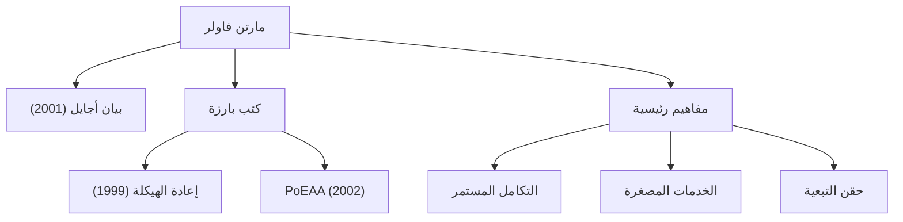

في تطوير البرمجيات الحديثة، لا يمر يوم دون سماع مصطلحات مثل "أجايل (Agile)"، و"إعادة الهيكلة (Refactoring)"، و"الخدمات المصغرة (Microservices)". الشخص الذي نشر هذه المفاهيم في جميع أنحاء الصناعة وغير هندسة البرمجيات جذرياً هو مارتن فاولر. في هذا المقال، نتعمق في حياة هذا المبرمج والمؤلف والمفكر، وفلسفته الأساسية، وتأثيره الدائم.

## حياته المبكرة وبدايات مسيرته المهنية

ولد مارتن فاولر في عام 1964 في والسال، إنجلترا. بفضل اهتمامه القوي بالتفكير المنطقي والأنظمة منذ صغره، درس الهندسة الإلكترونية وعلوم الكمبيوتر في كلية لندن الجامعية (UCL). عند دخوله عالم تطوير البرمجيات في أواخر الثمانينيات، شهد فاولر بشكل مباشر صرامة طريقة التطوير الشلالية (Waterfall) المهيمنة آنذاك وفشل المشاريع الناجم عن الإفراط في التصميم.

هذه التجربة حددت مسيرته اللاحقة. بينما كان يبحث عن إجابة لسؤال "كيف يمكننا بناء برمجيات بشكل أفضل وأكثر مرونة؟"، وجه انتباهه إلى إمكانات البرمجة كائنية التوجه، وانغمس في دراسة نمذجة الأنظمة وأنماط التصميم. في التسعينيات، أصبح مستشاراً مستقلاً، واكتسب خبرة عملية في العديد من المشاريع بدءاً من الأنظمة الصغيرة إلى أنظمة مستوى المؤسسات.

في عام 2000، انضم إلى ThoughtWorks، وهي شركة استشارات تكنولوجية عالمية، وأصبح كبير العلماء فيها. أصبحت ThoughtWorks المنصة المثالية له لوضع أفكاره موضع التنفيذ ومشاركتها مع العالم.

## الفلسفة والإنجازات التي شكلت تطوير البرمجيات

في جوهر فلسفة فاولر يكمن إدراك أن "البرمجيات كائن حي يستمر في التغير". وإيماناً منه باستحالة تصميم كل شيء بشكل مثالي مسبقاً، فقد دعا إلى أهمية أساليب التطوير والبنى المعمارية التي تفترض التغيير وتتكيف معه.

### 1. منهجية إعادة الهيكلة
نُشر كتابه "Refactoring" (إعادة الهيكلة) في عام 1999، وهو عمل ضخم في تطوير البرمجيات. عرّف فاولر "إعادة الهيكلة" بأنها عملية تحسين البنية الداخلية للكود الحالي دون تغيير سلوكه الخارجي، وقام بتنظيم تقنياتها المحددة (كتالوج). قلب هذا المفهوم التقليدي القائل بأن الكود جيد "طالما أنه يعمل"، مؤسساً الصيانة المستمرة لقاعدة كود سليمة كمسؤولية مهنية.

### 2. أنماط البنية المؤسسية
في كتابه "Patterns of Enterprise Application Architecture" (2002)، استخلص تحديات التصميم المتكررة التي تواجه بناء أنظمة الأعمال المعقدة وجمع أفضل الممارسات كأنماط. المفاهيم مثل Active Record و Data Mapper أثرت بشكل كبير على أطر عمل الويب اللاحقة مثل Ruby on Rails.

### 3. قيادة تطوير أجايل
في عام 2001، كان فاولر واحداً من 17 مهندس برمجيات تجمعوا في سنوبيرد، يوتا، ووقعوا "بيان أجايل (Agile Manifesto)". بإعطاء الأولوية للأفراد والتفاعلات على العمليات والأدوات، والبرمجيات الصالحة للعمل على التوثيق الشامل، يعمل هذا البيان كحجر الأساس لعمليات التطوير الحديثة. كما قدم مساهمات كبيرة في نشر ممارسات مثل التكامل المستمر (CI) والتطوير المدفوع بالاختبار (TDD).

### 4. تطور البنية: الخدمات المصغرة
في العقد الأول من القرن الحادي والعشرين، دعا هو وزميله جيمس لويس إلى الأسلوب المعماري لـ "الخدمات المصغرة (Microservices)" وقاما بتعريفه. هذا النهج، الذي يقسم التطبيقات المتجانسة الضخمة والمعقدة إلى مجموعة من الخدمات الصغيرة المستقلة القابلة للنشر، تم تبنيه من قبل الشركات في جميع أنحاء العالم كبنية قياسية في عصر الحوسبة السحابية الأصلية.

## التأثير على الأجيال القادمة ورسالته للمهندسين المعاصرين

أعظم إنجاز لمارتن فاولر هو صياغة "مبادئ هندسية عالمية" مستقلة عن لغات أو أدوات محددة ومشاركتها مع المجتمع. تظل مدونته (martinfowler.com) واحدة من أكثر مصادر المعلومات موثوقية للمهندسين على مستوى العالم، والعديد من المفاهيم التي قدمها أصبحت تعتبر "بديهيات" في تطوير البرمجيات الحديثة.

"أي أحمق يمكنه كتابة كود يفهمه الكمبيوتر. المبرمجون الجيدون يكتبون كوداً يفهمه البشر."

يعلمنا اقتباسه الشهير أن تطوير البرمجيات ليس مجرد إصدار أوامر للآلات، بل هو فعل تواصل بين البشر. بغض النظر عن مدى تطور التكنولوجيا أو إذا دخلنا عصراً يكتب فيه الذكاء الاصطناعي الأكواد، فإن الفلسفة التي بشر بها فاولر — "سهولة قراءة الكود"، و"القدرة على التكيف مع التغيير"، و"التحسين المستمر" — لن تتلاشى أبداً.

تمثل خطوات مارتن فاولر عملية الارتقاء بمجال هندسة البرمجيات غير الناضج إلى "مهنة" تتميز بالانضباط والإنسانية. إن تعلم أفكاره وعكسها في كودنا اليومي سيكون بمثابة علامة إرشادية موثوقة لتقديم برمجيات أفضل للعالم.
