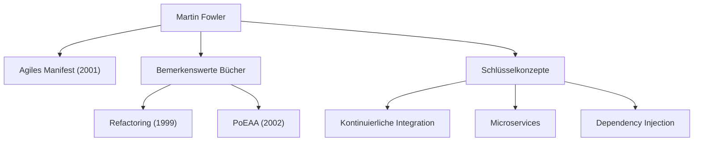

In der modernen Softwareentwicklung vergeht kaum ein Tag, an dem man nicht Begriffe wie „Agile“, „Refactoring“ oder „Microservices“ hört. Die Person, die diese Konzepte in der gesamten Branche populär gemacht und die Softwaretechnik grundlegend verändert hat, ist Martin Fowler. In diesem Artikel tauchen wir tief ein in das Leben, die zugrundeliegende Philosophie und den nachhaltigen Einfluss dieses Programmierers, Autors und Denkers.

## Frühes Leben und der Beginn seiner Karriere

Martin Fowler wurde 1964 in Walsall, England, geboren. Schon in jungen Jahren zeigte er starkes Interesse an logischem Denken und Systemen und studierte daraufhin Elektrotechnik und Informatik am University College London (UCL). Als er Ende der 1980er Jahre in die Welt der Softwareentwicklung eintrat, erlebte Fowler aus erster Hand die Starrheit der damals dominierenden Wasserfall-Methode und das durch Over-Engineering verursachte Scheitern von Projekten.

Diese Erfahrung prägte seine weitere Karriere. Auf der Suche nach einer Antwort auf die Frage, „Wie können wir Software besser und flexibler entwickeln?“, wandte er sich dem Potenzial der objektorientierten Programmierung zu und vertiefte sich in das Studium von Systemmodellierung und Entwurfsmustern (Design Patterns). In den 1990er Jahren wurde er unabhängiger Berater und sammelte praktische Erfahrungen in zahlreichen Projekten, von kleinen bis hin zu großen Enterprise-Systemen.

Im Jahr 2000 trat er der globalen Technologieberatung ThoughtWorks bei und wurde deren Chief Scientist. ThoughtWorks wurde zur idealen Plattform für ihn, um seine Ideen in die Praxis umzusetzen und sie mit der Welt zu teilen.

## Die Philosophie und Errungenschaften, die die Softwareentwicklung prägen

Im Zentrum von Fowlers Philosophie steht die Erkenntnis: „Software ist ein lebender Organismus, der sich ständig verändert“. Davon überzeugt, dass es unmöglich ist, alles im Voraus perfekt zu planen, plädierte er für die Bedeutung von Entwicklungsmethoden und Architekturen, die Veränderungen als gegeben voraussetzen.

### 1. Systematisierung des Refactorings
Sein 1999 veröffentlichtes Buch „Refactoring“ ist ein monumentales Werk der Softwareentwicklung. Fowler definierte „Refactoring“ als den Prozess zur Verbesserung der internen Struktur vorhandenen Codes, ohne dessen externes Verhalten zu verändern, und systematisierte dessen spezifische Techniken (einen Katalog). Dies räumte mit der traditionellen Ansicht auf, dass Code gut sei, „solange er funktioniert“, und etablierte die kontinuierliche Pflege einer gesunden Codebasis als professionelle Verantwortung.

### 2. Muster für Enterprise-Architekturen
In „Patterns of Enterprise Application Architecture“ (2002) extrahierte er wiederkehrende Designherausforderungen beim Aufbau komplexer Geschäftssysteme und fasste bewährte Methoden als Muster zusammen. Konzepte wie Active Record und Data Mapper beeinflussten spätere Web-Frameworks wie Ruby on Rails maßgeblich.

### 3. Vorantreiben der agilen Entwicklung
Im Jahr 2001 gehörte Fowler zu den 17 Softwareentwicklern, die in Snowbird, Utah, zusammenkamen und das „Agile Manifest“ unterzeichneten. Indem es Individuen und Interaktionen über Prozesse und Werkzeuge sowie funktionierende Software über umfassende Dokumentation stellt, dient dieses Manifest als Grundpfeiler moderner Entwicklungsprozesse. Zudem trug er wesentlich zur Verbreitung von Praktiken wie Continuous Integration (CI) und Test-Driven Development (TDD) bei.

### 4. Evolution der Architektur: Microservices
In den 2010er Jahren trat er zusammen mit seinem Kollegen James Lewis für den Architekturstil der „Microservices“ ein und definierte diesen. Dieser Ansatz, bei dem riesige, komplexe monolithische Anwendungen in eine Sammlung kleiner, unabhängig bereitstellbarer Dienste aufgeteilt werden, wurde von Unternehmen weltweit als Standardarchitektur im Cloud-Native-Zeitalter übernommen.

## Einfluss auf die Nachwelt und Botschaft an moderne Ingenieure

Martin Fowlers größte Errungenschaft ist es, sprach- oder werkzeugunabhängige „universelle Ingenieursprinzipien“ zu formulieren und diese mit der Community zu teilen. Sein Blog (martinfowler.com) bleibt weltweit eine der zuverlässigsten Informationsquellen für Ingenieure, und viele der von ihm eingeführten Konzepte haben sich als „gesunder Menschenverstand“ in der modernen Softwareentwicklung etabliert.

„Jeder Dummkopf kann Code schreiben, den ein Computer verstehen kann. Gute Programmierer schreiben Code, den Menschen verstehen können.“

Sein berühmtes Zitat lehrt uns, dass es bei der Softwareentwicklung nicht nur darum geht, Maschinen Befehle zu erteilen, sondern dass es sich um einen Akt der Kommunikation zwischen Menschen handelt. Ganz gleich, wie sehr sich die Technologie weiterentwickelt oder ob wir in eine Ära eintreten, in der KI Code schreibt – die von Fowler gepredigte Philosophie von „Lesbarkeit des Codes“, „Anpassungsfähigkeit an Veränderungen“ und „kontinuierlicher Verbesserung“ wird niemals an Bedeutung verlieren.

Martin Fowlers Fußstapfen repräsentieren genau jenen Prozess, durch den das noch unreife Gebiet der Softwaretechnik in eine „Profession“ verwandelt wurde, die durch Disziplin und Menschlichkeit gekennzeichnet ist. Seine Ideen zu studieren und sie in unserem täglichen Code widerzuspiegeln, ist zweifellos ein verlässlicher Wegweiser, um der Welt bessere Software zu liefern.
