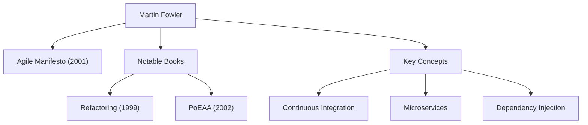

In modern software development, not a day goes by without hearing terms like "Agile," "Refactoring," and "Microservices." The person who popularized these concepts throughout the industry and fundamentally transformed software engineering is Martin Fowler. In this article, we delve deep into the life, underlying philosophy, and lasting impact of this programmer, author, and thinker.

## Early Life and the Dawn of His Career

Martin Fowler was born in 1964 in Walsall, England. Having a strong interest in logical thinking and systems from a young age, he studied electronic engineering and computer science at University College London (UCL). Entering the software development world in the late 1980s, Fowler witnessed firsthand the rigidity of the then-dominant waterfall development method and the project failures caused by over-designing.

This experience would define his subsequent career. While searching for an answer to the question, "How can we build software better and more flexibly?", he turned his attention to the potential of object-oriented programming, immersing himself in the study of system modeling and design patterns. In the 1990s, he became an independent consultant, gaining practical experience in numerous projects ranging from small-scale to enterprise-level systems.

In 2000, he joined ThoughtWorks, a global technology consulting firm, and became its Chief Scientist. ThoughtWorks became the ideal platform for him to put his ideas into practice and share them with the world.

## The Philosophy and Achievements Shaping Software Development

At the core of Fowler's philosophy is the recognition that "software is a living entity that continues to change." Believing it impossible to design everything perfectly in advance, he advocated for the importance of development methods and architectures that assume change.

### 1. Systematization of Refactoring
Published in 1999, his book "Refactoring" is a monumental work in software development. Fowler defined "refactoring" as the process of improving the internal structure of existing code without altering its external behavior, and he systematized its specific techniques (a catalog). This overturned the traditional notion that code is fine "as long as it works," establishing the continuous maintenance of a healthy codebase as a professional responsibility.

### 2. Patterns of Enterprise Architecture
In "Patterns of Enterprise Application Architecture" (2002), he extracted recurring design challenges encountered when building complex business systems and compiled best practices as patterns. Concepts like Active Record and Data Mapper heavily influenced later web frameworks such as Ruby on Rails.

### 3. Leading Agile Development
In 2001, Fowler was one of the 17 software engineers gathered in Snowbird, Utah, who signed the "Agile Manifesto." Prioritizing individuals and interactions over processes and tools, and working software over comprehensive documentation, this manifesto serves as the cornerstone of modern development processes. He also made significant contributions to popularizing practices like Continuous Integration (CI) and Test-Driven Development (TDD).

### 4. Evolution of Architecture: Microservices
In the 2010s, he, along with his colleague James Lewis, advocated for and defined the architectural style of "Microservices." This approach, which divides huge, complex monolithic applications into a collection of small, independently deployable services, has been adopted by companies worldwide as the standard architecture in the cloud-native era.

## Impact on Posterity and Message to Modern Engineers

Martin Fowler's greatest achievement is articulating "universal engineering principles" independent of specific languages or tools and sharing them with the community. His blog (martinfowler.com) remains one of the most reliable sources of information for engineers globally, and many of the concepts he introduced have become established as "common sense" in modern software development.

"Any fool can write code that a computer can understand. Good programmers write code that humans can understand."

His famous quote teaches us that software development is not merely about commanding machines, but an act of communication among humans. No matter how much technology evolves or if we enter an era where AI writes code, the philosophy Fowler preached—"code readability," "adaptability to change," and "continuous improvement"—will never fade.

Martin Fowler's footsteps represent the very process of elevating the immature field of software engineering into a "profession" characterized by discipline and humanity. Learning his ideas and reflecting them in our daily code will undoubtedly serve as a reliable signpost for delivering better software to the world.
