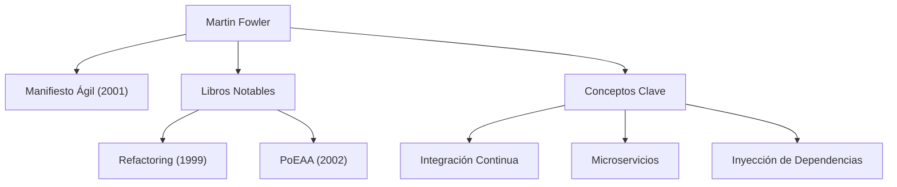

En el desarrollo de software moderno, no pasa un día sin escuchar términos como "Agile", "Refactorización" y "Microservicios". La persona que popularizó estos conceptos en toda la industria y transformó fundamentalmente la ingeniería de software es Martin Fowler. En este artículo, profundizamos en la vida, la filosofía subyacente y el impacto duradero de este programador, autor y pensador.

## Primeros Años y los Inicios de su Carrera

Martin Fowler nació en 1964 en Walsall, Inglaterra. Con un gran interés en el pensamiento lógico y los sistemas desde una edad temprana, estudió ingeniería electrónica y ciencias de la computación en el University College London (UCL). Al entrar en el mundo del desarrollo de software a finales de la década de 1980, Fowler fue testigo de la rigidez del método de desarrollo en cascada, dominante en ese entonces, y de los fracasos de proyectos causados por el exceso de diseño.

Esta experiencia definiría su carrera posterior. Mientras buscaba una respuesta a la pregunta: "¿Cómo podemos construir software de manera mejor y más flexible?", dirigió su atención al potencial de la programación orientada a objetos, sumergiéndose en el estudio del modelado de sistemas y los patrones de diseño. En la década de 1990, se convirtió en consultor independiente, adquiriendo experiencia práctica en numerosos proyectos que abarcaban desde pequeña escala hasta sistemas de nivel empresarial.

En el año 2000, se unió a ThoughtWorks, una firma global de consultoría tecnológica, y se convirtió en su Científico Jefe. ThoughtWorks se convirtió en la plataforma ideal para que él pusiera en práctica sus ideas y las compartiera con el mundo.

## La Filosofía y Logros que Modelan el Desarrollo de Software

En el núcleo de la filosofía de Fowler está el reconocimiento de que "el software es una entidad viva que cambia continuamente". Creyendo que es imposible diseñar todo perfectamente por adelantado, abogó por la importancia de métodos de desarrollo y arquitecturas que asuman el cambio.

### 1. Sistematización de la Refactorización
Publicado en 1999, su libro "Refactoring" es una obra monumental en el desarrollo de software. Fowler definió la "refactorización" como el proceso de mejorar la estructura interna del código existente sin alterar su comportamiento externo, y sistematizó sus técnicas específicas (un catálogo). Esto revolucionó la noción tradicional de que el código está bien "mientras funcione", estableciendo el mantenimiento continuo de una base de código saludable como una responsabilidad profesional.

### 2. Patrones de Arquitectura Empresarial
En "Patterns of Enterprise Application Architecture" (2002), extrajo los desafíos de diseño recurrentes al construir sistemas empresariales complejos y recopiló las mejores prácticas como patrones. Conceptos como Active Record y Data Mapper influyeron enormemente en frameworks web posteriores como Ruby on Rails.

### 3. Liderazgo en el Desarrollo Ágil
En 2001, Fowler fue uno de los 17 ingenieros de software reunidos en Snowbird, Utah, que firmaron el "Manifiesto Ágil". Priorizando a los individuos y las interacciones sobre los procesos y herramientas, y el software funcionando sobre la documentación exhaustiva, este manifiesto sirve como la piedra angular de los procesos de desarrollo modernos. También hizo contribuciones significativas a la popularización de prácticas como la Integración Continua (CI) y el Desarrollo Guiado por Pruebas (TDD).

### 4. Evolución de la Arquitectura: Microservicios
En la década de 2010, él, junto con su colega James Lewis, abogó y definió el estilo arquitectónico de los "Microservicios". Este enfoque, que divide aplicaciones monolíticas enormes y complejas en una colección de servicios pequeños e independientemente desplegables, ha sido adoptado por empresas de todo el mundo como la arquitectura estándar en la era nativa de la nube.

## Impacto en la Posteridad y Mensaje a los Ingenieros Modernos

El mayor logro de Martin Fowler es articular "principios de ingeniería universales" independientes de lenguajes o herramientas específicas y compartirlos con la comunidad. Su blog (martinfowler.com) sigue siendo una de las fuentes de información más confiables para los ingenieros a nivel mundial, y muchos de los conceptos que introdujo se han establecido como "sentido común" en el desarrollo de software moderno.

"Cualquier tonto puede escribir código que una computadora pueda entender. Los buenos programadores escriben código que los humanos pueden entender."

Su famosa cita nos enseña que el desarrollo de software no se trata simplemente de dar órdenes a las máquinas, sino que es un acto de comunicación entre humanos. No importa cuánto evolucione la tecnología o si entramos en una era donde la IA escriba código, la filosofía que predicó Fowler —"legibilidad del código", "adaptabilidad al cambio" y "mejora continua"— nunca se desvanecerá.

Los pasos de Martin Fowler representan el proceso mismo de elevar el campo inmaduro de la ingeniería de software a una "profesión" caracterizada por la disciplina y la humanidad. Aprender de sus ideas y reflejarlas en nuestro código diario servirá sin duda como un hito confiable para entregar mejor software al mundo.
