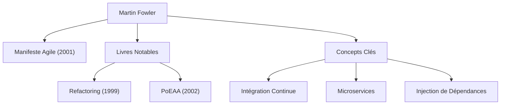

Dans le développement logiciel moderne, il ne se passe pas un jour sans que l'on entende des termes tels que « Agile », « Refactoring » et « Microservices ». La personne qui a popularisé ces concepts dans toute l'industrie et qui a fondamentalement transformé l'ingénierie logicielle est Martin Fowler. Dans cet article, nous plongeons au cœur de la vie, de la philosophie sous-jacente et de l'impact durable de ce programmeur, auteur et penseur.

## Jeunesse et l'Aube de sa Carrière

Martin Fowler est né en 1964 à Walsall, en Angleterre. Très tôt intéressé par la pensée logique et les systèmes, il étudie l'ingénierie électronique et l'informatique à l'University College London (UCL). Entrant dans le monde du développement logiciel à la fin des années 1980, Fowler est directement témoin de la rigidité de la méthode de développement en cascade alors dominante et des échecs de projets causés par la surconception.

Cette expérience définira la suite de sa carrière. Cherchant une réponse à la question « Comment pouvons-nous créer des logiciels de manière meilleure et plus flexible ? », il se tourne vers le potentiel de la programmation orientée objet, se plongeant dans l'étude de la modélisation des systèmes et des modèles de conception (design patterns). Dans les années 1990, il devient consultant indépendant, acquérant une expérience pratique dans de nombreux projets allant de petits systèmes à des systèmes d'entreprise complexes.

En 2000, il rejoint ThoughtWorks, une société mondiale de conseil en technologie, dont il devient le scientifique en chef (Chief Scientist). ThoughtWorks devient alors la plateforme idéale pour mettre ses idées en pratique et les partager avec le monde.

## La Philosophie et les Réalisations qui Façonnent le Développement Logiciel

Au cœur de la philosophie de Fowler se trouve la reconnaissance que « le logiciel est une entité vivante qui ne cesse de changer ». Convaincu qu'il est impossible de tout concevoir parfaitement à l'avance, il prône l'importance de méthodes de développement et d'architectures qui anticipent le changement.

### 1. La Systématisation du Refactoring
Publié en 1999, son livre « Refactoring » (Le Refactoring) est une œuvre monumentale du développement logiciel. Fowler définit le « refactoring » (remaniement) comme le processus d'amélioration de la structure interne du code existant sans altérer son comportement externe, et il en systématise les techniques spécifiques sous forme de catalogue. Cela a bouleversé la notion traditionnelle selon laquelle le code est bon « tant qu'il fonctionne », établissant le maintien continu d'une base de code saine comme une responsabilité professionnelle.

### 2. Les Modèles d'Architecture d'Entreprise
Dans « Patterns of Enterprise Application Architecture » (2002), il extrait les défis de conception récurrents rencontrés lors de la création de systèmes d'entreprise complexes et compile les meilleures pratiques sous forme de modèles. Des concepts tels que l'Active Record et le Data Mapper ont fortement influencé les frameworks web ultérieurs tels que Ruby on Rails.

### 3. Diriger le Développement Agile
En 2001, Fowler est l'un des 17 ingénieurs logiciels réunis à Snowbird, dans l'Utah, qui signent le « Manifeste Agile ». Donnant la priorité aux individus et à leurs interactions plutôt qu'aux processus et aux outils, et à des logiciels opérationnels plutôt qu'à une documentation exhaustive, ce manifeste sert de pierre angulaire aux processus de développement modernes. Il a également grandement contribué à la popularisation de pratiques telles que l'Intégration Continue (CI) et le Développement Piloté par les Tests (TDD).

### 4. Évolution de l'Architecture : Les Microservices
Dans les années 2010, avec son collègue James Lewis, il plaide pour le style architectural des « Microservices » et le définit. Cette approche, qui divise les applications monolithiques gigantesques et complexes en un ensemble de petits services déployables indépendamment, a été adoptée par des entreprises du monde entier comme architecture standard à l'ère du cloud natif.

## Impact sur la Postérité et Message aux Ingénieurs Modernes

La plus grande réalisation de Martin Fowler est d'avoir articulé des « principes d'ingénierie universels » indépendants de langages ou d'outils spécifiques et de les avoir partagés avec la communauté. Son blog (martinfowler.com) reste l'une des sources d'information les plus fiables pour les ingénieurs du monde entier, et bon nombre des concepts qu'il a introduits sont devenus une évidence dans le développement logiciel moderne.

« N'importe quel imbécile peut écrire du code qu'un ordinateur peut comprendre. Les bons programmeurs écrivent du code que les humains peuvent comprendre. »

Sa célèbre citation nous enseigne que le développement logiciel ne consiste pas seulement à donner des ordres aux machines, mais qu'il s'agit d'un acte de communication entre humains. Peu importe l'évolution des technologies ou si nous entrons dans une ère où l'IA écrit du code, la philosophie prêchée par Fowler — « lisibilité du code », « adaptabilité au changement » et « amélioration continue » — ne s'estompera jamais.

Le parcours de Martin Fowler représente le processus même d'élévation du domaine encore immature de l'ingénierie logicielle au rang de véritable « profession » caractérisée par la discipline et l'humanité. Apprendre ses idées et les refléter dans notre code quotidien servira sans aucun doute de repère fiable pour offrir de meilleurs logiciels au monde.
