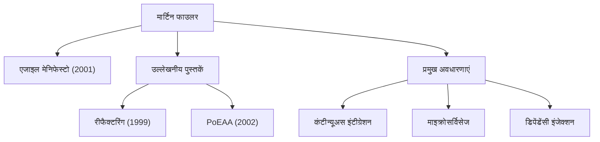

आधुनिक सॉफ्टवेयर विकास में, कोई भी दिन ऐसा नहीं जाता जब "एजाइल," "रीफैक्टरिंग," और "माइक्रोसर्विसेज" जैसे शब्द सुनने को न मिलें। जिस व्यक्ति ने इन अवधारणाओं को पूरे उद्योग में लोकप्रिय बनाया और सॉफ्टवेयर इंजीनियरिंग के तरीके को मौलिक रूप से बदल दिया, वह मार्टिन फाउलर हैं। इस लेख में, हम इस प्रोग्रामर, लेखक और विचारक के जीवन, दर्शन और आने वाली पीढ़ियों पर उनके प्रभाव में गहराई से उतरते हैं।

## प्रारंभिक जीवन और करियर की शुरुआत

मार्टिन फाउलर का जन्म 1964 में वॉलसॉल, इंग्लैंड में हुआ था। कम उम्र से ही तार्किक सोच और प्रणालियों में गहरी रुचि होने के कारण, उन्होंने यूनिवर्सिटी कॉलेज लंदन (UCL) में इलेक्ट्रॉनिक इंजीनियरिंग और कंप्यूटर विज्ञान का अध्ययन किया। 1980 के दशक के उत्तरार्ध में सॉफ्टवेयर विकास की दुनिया में कदम रखने के बाद, फाउलर ने तत्कालीन प्रमुख वाटरफॉल विकास पद्धति की कठोरता और अत्यधिक डिज़ाइनिंग के कारण होने वाली प्रोजेक्ट विफलताओं को प्रत्यक्ष रूप से देखा।

इस अनुभव ने उनके बाद के करियर को परिभाषित किया। "सॉफ्टवेयर को बेहतर और अधिक लचीले ढंग से कैसे बनाया जाए?" इस प्रश्न का उत्तर खोजते हुए, उन्होंने [ऑब्जेक्ट-ओरिएंटेड प्रोग्रामिंग](/hi/p/object-oriented-programming-oop-solid-principles/) की संभावनाओं पर ध्यान केंद्रित किया, और सिस्टम मॉडलिंग तथा डिज़ाइन पैटर्न के अध्ययन में डूब गए। 1990 के दशक में, वह एक स्वतंत्र सलाहकार बन गए, जिन्होंने छोटे पैमाने से लेकर एंटरप्राइज़-स्तर के सिस्टम तक कई परियोजनाओं में व्यावहारिक अनुभव प्राप्त किया।

2000 में, वह एक वैश्विक प्रौद्योगिकी परामर्श फर्म थॉटवर्क्स (ThoughtWorks) में शामिल हुए और इसके मुख्य वैज्ञानिक बने। थॉटवर्क्स उनके लिए अपने विचारों को व्यवहार में लाने और उन्हें दुनिया के साथ साझा करने का एक आदर्श मंच बन गया।

## सॉफ्टवेयर विकास को आकार देने वाला दर्शन और उपलब्धियां

फाउलर के दर्शन के मूल में यह मान्यता है कि "सॉफ्टवेयर एक जीवित इकाई है जो बदलती रहती है।" यह मानते हुए कि सब कुछ पहले से पूरी तरह से डिजाइन करना असंभव है, उन्होंने परिवर्तन को स्वीकार करने वाले विकास विधियों और आर्किटेक्चर के महत्व की वकालत की।

### 1. रीफैक्टरिंग का व्यवस्थितकरण
1999 में प्रकाशित उनकी पुस्तक "Refactoring" सॉफ्टवेयर विकास में एक स्मारकीय कार्य है। फाउलर ने "रीफैक्टरिंग" को मौजूदा कोड के बाहरी व्यवहार को बदले बिना उसकी आंतरिक संरचना में सुधार करने की प्रक्रिया के रूप में परिभाषित किया, और इसकी विशिष्ट तकनीकों (एक कैटलॉग) को व्यवस्थित किया। इसने इस पारंपरिक धारणा को उलट दिया कि "जब तक यह काम करता है" कोड ठीक है, और एक स्वस्थ कोडबेस को निरंतर बनाए रखने को एक पेशेवर जिम्मेदारी के रूप में स्थापित किया।

### 2. एंटरप्राइज आर्किटेक्चर के पैटर्न
2002 में, "Patterns of Enterprise Application Architecture" में, उन्होंने जटिल व्यावसायिक सिस्टम बनाने के दौरान बार-बार आने वाली डिज़ाइन चुनौतियों को निकाला और सर्वोत्तम प्रथाओं को पैटर्न के रूप में संकलित किया। एक्टिव रिकॉर्ड (Active Record) और डेटा मैपर (Data Mapper) जैसी अवधारणाओं ने बाद के वेब फ्रेमवर्क जैसे कि रूबी ऑन रेल्स (Ruby on Rails) को भारी रूप से प्रभावित किया।

### 3. एजाइल विकास का नेतृत्व
2001 में, फाउलर स्नोबर्ड, यूटा में एकत्र हुए 17 सॉफ्टवेयर इंजीनियरों में से एक थे, जिन्होंने "एजाइल मेनिफेस्टो (Agile Manifesto)" पर हस्ताक्षर किए। प्रक्रियाओं और उपकरणों के ऊपर व्यक्तियों और बातचीत को, तथा व्यापक प्रलेखन के ऊपर काम करने वाले सॉफ्टवेयर को प्राथमिकता देने वाला यह घोषणापत्र आधुनिक विकास प्रक्रियाओं की आधारशिला के रूप में कार्य करता है। उन्होंने कंटीन्यूअस इंटीग्रेशन (CI) और टेस्ट-ड्रिवेन डेवलपमेंट (TDD) जैसी प्रथाओं को लोकप्रिय बनाने में भी महत्वपूर्ण योगदान दिया।

### 4. आर्किटेक्चर का विकास: माइक्रोसर्विसेज
2010 के दशक में, उन्होंने अपने सहयोगी जेम्स लुईस के साथ मिलकर "माइक्रोसर्विसेज (Microservices)" की स्थापत्य शैली की वकालत और परिभाषा की। इस दृष्टिकोण ने, जो विशाल, जटिल मोनोलिथिक अनुप्रयोगों को छोटे, स्वतंत्र रूप से तैनात करने योग्य सेवाओं के संग्रह में विभाजित करता है, दुनिया भर की कंपनियों द्वारा क्लाउड-नेटिव युग में मानक आर्किटेक्चर के रूप में अपनाया गया है।

## भावी पीढ़ियों पर प्रभाव और आधुनिक इंजीनियरों के लिए संदेश

मार्टिन फाउलर की सबसे बड़ी उपलब्धि विशिष्ट भाषाओं या उपकरणों से स्वतंत्र "सार्वभौमिक इंजीनियरिंग सिद्धांतों" को स्पष्ट करना और उन्हें समुदाय के साथ साझा करना है। उनका ब्लॉग (martinfowler.com) विश्व स्तर पर इंजीनियरों के लिए सूचना के सबसे विश्वसनीय स्रोतों में से एक बना हुआ है, और उनके द्वारा पेश की गई कई अवधारणाएं आधुनिक सॉफ्टवेयर विकास में "सामान्य ज्ञान" के रूप में स्थापित हो गई हैं।

"कोई भी मूर्ख ऐसा कोड लिख सकता है जिसे कंप्यूटर समझ सके। अच्छे प्रोग्रामर ऐसा कोड लिखते हैं जिसे इंसान समझ सकें।"

उनका यह प्रसिद्ध उद्धरण हमें सिखाता है कि सॉफ्टवेयर विकास केवल मशीनों को आदेश देने के बारे में नहीं है, बल्कि इंसानों के बीच संचार का एक कार्य है। चाहे तकनीक कितनी भी विकसित हो जाए या हम एक ऐसे युग में प्रवेश करें जहां AI कोड लिखता है, फाउलर द्वारा प्रचारित दर्शन - "कोड की पठनीयता," "परिवर्तन के अनुकूलन," और "निरंतर सुधार" - कभी फीका नहीं पड़ेगा।

मार्टिन फाउलर के कदम सॉफ्टवेयर इंजीनियरिंग के अपरिपक्व क्षेत्र को अनुशासन और मानवता की विशेषता वाले एक "पेशे" में ऊपर उठाने की प्रक्रिया का प्रतिनिधित्व करते हैं। उनके विचारों को सीखना और उन्हें हमारे दैनिक कोड में प्रतिबिंबित करना निश्चित रूप से दुनिया को बेहतर सॉफ्टवेयर प्रदान करने के लिए एक विश्वसनीय मार्गदर्शक के रूप में कार्य करेगा।
