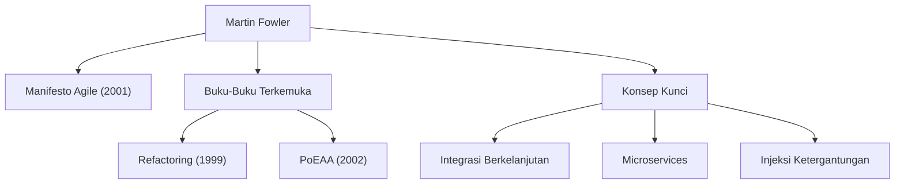

Dalam pengembangan perangkat lunak modern, tidak ada hari yang berlalu tanpa mendengar istilah seperti "Agile," "Refactoring," dan "Microservices." Orang yang mempopulerkan konsep-konsep ini di seluruh industri dan secara fundamental mengubah rekayasa perangkat lunak adalah Martin Fowler. Dalam artikel ini, kita menyelidiki lebih dalam tentang kehidupan, filosofi yang mendasari, dan dampak jangka panjang dari programmer, penulis, dan pemikir ini.

## Kehidupan Awal dan Fajar Kariernya

Martin Fowler lahir pada tahun 1964 di Walsall, Inggris. Memiliki minat yang kuat pada pemikiran logis dan sistem sejak usia muda, ia mempelajari teknik elektro dan ilmu komputer di University College London (UCL). Memasuki dunia pengembangan perangkat lunak pada akhir 1980-an, Fowler menyaksikan sendiri kaku-nya metode pengembangan waterfall yang saat itu dominan dan kegagalan proyek yang disebabkan oleh perancangan yang berlebihan (over-designing).

Pengalaman ini akan menentukan kariernya selanjutnya. Sambil mencari jawaban atas pertanyaan, "Bagaimana kita bisa membangun perangkat lunak dengan lebih baik dan lebih fleksibel?", ia mengalihkan perhatiannya pada potensi pemrograman berorientasi objek, membenamkan dirinya dalam studi pemodelan sistem dan pola desain. Pada 1990-an, ia menjadi konsultan independen, mendapatkan pengalaman praktis dalam berbagai proyek mulai dari skala kecil hingga sistem tingkat perusahaan.

Pada tahun 2000, ia bergabung dengan ThoughtWorks, sebuah perusahaan konsultan teknologi global, dan menjadi Ilmuwan Utama (Chief Scientist). ThoughtWorks menjadi platform yang ideal baginya untuk mempraktikkan ide-idenya dan membagikannya kepada dunia.

## Filosofi dan Pencapaian yang Membentuk Pengembangan Perangkat Lunak

Inti dari filosofi Fowler adalah pengakuan bahwa "perangkat lunak adalah entitas hidup yang terus berubah." Karena yakin bahwa tidak mungkin merancang semuanya dengan sempurna di awal, ia mengadvokasi pentingnya metode pengembangan dan arsitektur yang mengasumsikan adanya perubahan.

### 1. Sistematisasi Refactoring
Diterbitkan pada tahun 1999, bukunya "Refactoring" adalah karya monumental dalam pengembangan perangkat lunak. Fowler mendefinisikan "refactoring" sebagai proses meningkatkan struktur internal kode yang ada tanpa mengubah perilaku eksternalnya, dan ia menyistematisasikan teknik spesifiknya (sebuah katalog). Hal ini membalikkan gagasan tradisional bahwa kode tidak masalah "selama itu berfungsi," dan menetapkan pemeliharaan basis kode yang sehat secara terus-menerus sebagai tanggung jawab profesional.

### 2. Pola Arsitektur Perusahaan
Dalam "Patterns of Enterprise Application Architecture" (2002), ia mengekstraksi tantangan desain berulang yang dihadapi saat membangun sistem bisnis yang kompleks dan menyusun praktik terbaik sebagai pola (patterns). Konsep-konsep seperti Active Record dan Data Mapper sangat memengaruhi kerangka kerja web di kemudian hari seperti Ruby on Rails.

### 3. Memimpin Pengembangan Agile
Pada tahun 2001, Fowler adalah satu dari 17 insinyur perangkat lunak yang berkumpul di Snowbird, Utah, yang menandatangani "Manifesto Agile." Memprioritaskan individu dan interaksi di atas proses dan alat, dan perangkat lunak yang berfungsi di atas dokumentasi yang komprehensif, manifesto ini berfungsi sebagai landasan dari proses pengembangan modern. Ia juga memberikan kontribusi signifikan dalam mempopulerkan praktik-praktik seperti Integrasi Berkelanjutan (CI) dan Pengembangan Berbasis Pengujian (TDD).

### 4. Evolusi Arsitektur: Microservices
Pada tahun 2010-an, bersama rekannya James Lewis, ia mengadvokasi dan mendefinisikan gaya arsitektur "Microservices." Pendekatan ini, yang membagi aplikasi monolitik yang besar dan kompleks menjadi kumpulan layanan kecil yang dapat di-deploy secara independen, telah diadopsi oleh berbagai perusahaan di seluruh dunia sebagai arsitektur standar di era cloud-native.

## Dampak pada Generasi Penerus dan Pesan untuk Insinyur Modern

Pencapaian terbesar Martin Fowler adalah mengartikulasikan "prinsip rekayasa universal" yang independen dari bahasa atau alat tertentu dan membagikannya kepada komunitas. Blog-nya (martinfowler.com) tetap menjadi salah satu sumber informasi paling andal bagi para insinyur secara global, dan banyak konsep yang ia perkenalkan telah mapan sebagai "akal sehat" dalam pengembangan perangkat lunak modern.

"Orang bodoh mana pun bisa menulis kode yang bisa dipahami komputer. Programmer yang baik menulis kode yang bisa dipahami manusia."

Kutipannya yang terkenal mengajarkan kita bahwa pengembangan perangkat lunak tidak hanya sekadar memerintah mesin, tetapi merupakan tindakan komunikasi antarmanusia. Tidak peduli seberapa jauh teknologi berkembang atau jika kita memasuki era di mana AI menulis kode, filosofi yang diajarkan Fowler—"keterbacaan kode," "kemampuan beradaptasi dengan perubahan," dan "peningkatan berkelanjutan"—tidak akan pernah pudar.

Langkah kaki Martin Fowler mewakili proses itu sendiri dalam mengangkat bidang rekayasa perangkat lunak yang belum matang menjadi sebuah "profesi" yang dicirikan oleh kedisiplinan dan nilai kemanusiaan. Mempelajari ide-idenya dan mencerminkannya dalam kode kita sehari-hari tidak diragukan lagi akan berfungsi sebagai penunjuk jalan yang dapat diandalkan untuk menghadirkan perangkat lunak yang lebih baik kepada dunia.
