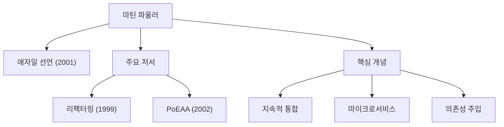

현대 소프트웨어 개발에서 '애자일', '리팩터링', '마이크로서비스'와 같은 용어를 듣지 않고 지나가는 날은 없습니다. 이러한 개념을 업계 전반에 널리 알리고 소프트웨어 엔지니어링의 방식을 근본적으로 혁신한 인물이 바로 마틴 파울러(Martin Fowler)입니다. 본 기사에서는 프로그래머이자 작가, 그리고 사상가이기도 한 그의 생애와 그 근저에 있는 철학, 그리고 후세에 미친 영향에 대해 깊이 파헤쳐 봅니다.

## 성장 과정과 커리어의 여명

마틴 파울러는 1964년 영국 월솔에서 태어났습니다. 어린 시절부터 논리적 사고와 시스템에 강한 관심을 가졌던 그는 유니버시티 칼리지 런던(UCL)에서 전자공학과 컴퓨터 과학을 공부했습니다. 1980년대 후반 소프트웨어 개발 세계에 발을 들인 파울러는 당시 주류였던 워터폴 방식 개발 기법이 안고 있는 경직성과 과도한 설계가 초래하는 프로젝트의 실패를 목격했습니다.

이 경험이 이후 그의 커리어를 결정짓게 됩니다. "어떻게 하면 소프트웨어를 더 낫고 더 유연하게 구축할 것인가". 이 질문에 대한 답을 모색하던 중 그는 객체 지향 프로그래밍의 가능성에 주목하고 시스템 모델링과 디자인 패턴 연구에 몰두하게 됩니다. 1990년대에는 컨설턴트로 독립하여 소규모 프로젝트부터 엔터프라이즈 규모의 시스템까지 수많은 현장에서 실무 경험을 쌓았습니다.

2000년, 그는 글로벌 기술 컨설팅 기업인 ThoughtWorks(소트웍스)에 입사하여 수석 과학자(Chief Scientist)로 취임합니다. ThoughtWorks는 그에게 자신의 아이디어를 실천하고 전 세계에 알릴 수 있는 이상적인 플랫폼이 되었습니다.

## 소프트웨어 개발을 형성하는 철학과 공적

파울러 철학의 중심에는 "소프트웨어는 살아있는 생명체이며 계속해서 변화하는 것이다"라는 인식이 있습니다. 그는 미리 모든 것을 완벽하게 설계하는 것은 불가능하다고 생각하고, 변화를 전제로 한 개발 방법론과 아키텍처의 중요성을 설파했습니다.

### 1. 리팩터링의 체계화
1999년에 출판된 저서 『리팩터링(Refactoring)』은 소프트웨어 개발의 금자탑이라고 할 수 있는 명저입니다. 파울러는 기존 코드의 외부적 동작을 바꾸지 않으면서 내부 구조를 개선하는 과정을 '리팩터링'으로 정의하고, 그 구체적인 기법(카탈로그)을 체계화했습니다. 이로써 "돌아가기만 하면 된다"는 기존의 코드에 대한 생각이 뒤집히고, 지속적으로 코드베이스를 건강하게 유지하는 것이 전문가의 의무로 인식되기 시작했습니다.

### 2. 엔터프라이즈 아키텍처의 패턴
2002년에 발표한 『엔터프라이즈 애플리케이션 아키텍처 패턴(PoEAA)』에서는 복잡한 업무 시스템을 구축할 때 반복해서 나타나는 설계상의 과제를 추출하고, 이에 대한 모범 사례를 패턴으로 정리했습니다. Active Record나 Data Mapper 등의 개념은 이후 Ruby on Rails 등 웹 프레임워크에 지대한 영향을 미쳤습니다.

### 3. 애자일 개발의 견인
2001년, 파울러는 미국 유타주 스노버드에 모인 17명의 소프트웨어 엔지니어 중 한 명으로서 '애자일 소프트웨어 개발 선언(Agile Manifesto)'에 서명했습니다. 프로세스와 도구보다 개인과 상호작용을 중시하고, 포괄적인 문서보다 작동하는 소프트웨어를 가치 있게 여기는 이 선언은 현대 개발 프로세스의 초석이 되었습니다. 또한 지속적 통합(CI)과 테스트 주도 개발(TDD)과 같은 프랙티스의 보급에도 큰 공헌을 했습니다.

### 4. 아키텍처의 진화: 마이크로서비스
2010년대에 들어서면서 그는 동료인 제임스 루이스와 함께 '마이크로서비스(Microservices)'라는 아키텍처 스타일을 제창하고 정의했습니다. 거대하고 복잡한 모놀리스(단일 덩어리) 애플리케이션을 독립적으로 배포 가능한 작은 서비스들의 집합체로 분할하는 이 접근 방식은 클라우드 네이티브 시대의 표준 아키텍처로서 전 세계 기업들에 채택되고 있습니다.

## 후세에 미친 영향과 현대 엔지니어를 향한 메시지

마틴 파울러의 가장 위대한 공적은 특정 언어나 도구에 의존하지 않는 '보편적인 엔지니어링의 원칙'을 언어화하고 커뮤니티와 공유한 것입니다. 그의 블로그(martinfowler.com)는 지금도 전 세계 엔지니어들에게 가장 신뢰할 수 있는 정보원 중 하나이며, 그가 제창한 개념의 대부분은 현대 소프트웨어 개발의 '상식'으로 자리 잡았습니다.

"어떤 바보라도 컴퓨터가 이해할 수 있는 코드는 작성할 수 있다. 훌륭한 프로그래머는 사람이 이해할 수 있는 코드를 작성한다."

그의 이 유명한 말은 소프트웨어 개발이 단순한 기계에 대한 명령이 아니라, 인간 사이의 커뮤니케이션 행위임을 우리에게 가르쳐 줍니다. 기술이 아무리 진화하고 AI가 코드를 작성하는 시대가 되더라도 파울러가 설파한 '코드의 가독성', '변화에 대한 적응력', '지속적인 개선'이라는 철학은 결코 퇴색하지 않을 것입니다.

마틴 파울러의 발자취는 소프트웨어 엔지니어링이라는 미성숙한 분야를 규율과 인간미를 겸비한 하나의 '전문직'으로 끌어올리는 과정 그 자체였습니다. 그의 사상을 배우고 매일의 코드에 반영하는 것은 우리가 더 나은 소프트웨어를 세상에 내놓기 위한 확실한 이정표가 될 것입니다.
