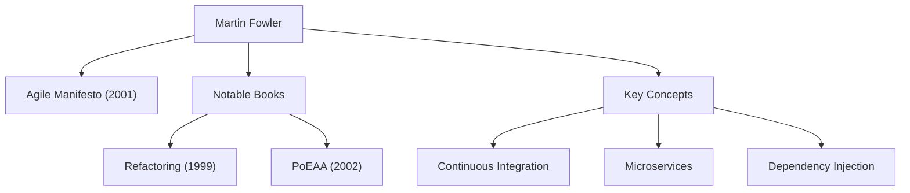

現代のソフトウェア開発において、「アジャイル」「リファクタリング」「マイクロサービス」といった言葉を耳にしない日はありません。これらの概念を広く業界に浸透させ、ソフトウェアエンジニアリングのあり方を根本から変革した人物こそ、マーティン・ファウラー（Martin Fowler）です。本記事では、プログラマーであり、作家であり、そして思想家でもある彼の生涯と、その根底にある哲学、そして後世への影響について深く掘り下げます。

## 生い立ちとキャリアの黎明

マーティン・ファウラーは1964年、イギリスのウォルソールで生まれました。幼少期から論理的な思考とシステムへの強い関心を抱いていた彼は、ユニヴァーシティ・カレッジ・ロンドン（UCL）で電子工学と計算機科学を学びます。1980年代後半、ソフトウェア開発の世界に足を踏み入れたファウラーは、当時の主流であったウォーターフォール型の開発手法が抱える硬直性や、過剰な設計がもたらすプロジェクトの失敗を目の当たりにしました。

この経験が、後の彼のキャリアを決定づけることになります。「いかにしてソフトウェアをより良く、より柔軟に構築するか」。この問いに対する答えを模索する中で、彼はオブジェクト指向プログラミングの可能性に着目し、システムのモデリングや設計パターンの研究に没頭していきました。1990年代にはコンサルタントとして独立し、小規模なプロジェクトからエンタープライズ規模のシステムまで、数多くの現場で実践的な経験を積みました。

2000年、彼はグローバルなテクノロジー・コンサルティング企業であるThoughtWorks（ソートワークス）に入社し、チーフ・サイエンティストに就任します。ThoughtWorksは彼にとって、自身のアイデアを実践し、世界中に発信するための理想的なプラットフォームとなりました。

## ソフトウェア開発を形作る哲学と功績

ファウラーの哲学の中心にあるのは、「ソフトウェアは生き物であり、変化し続けるものである」という認識です。彼は、あらかじめ全てを完璧に設計することは不可能であると考え、変化を前提とした開発手法とアーキテクチャの重要性を説きました。

### 1. リファクタリングの体系化
1999年に出版された著書『リファクタリング（Refactoring）』は、ソフトウェア開発における金字塔とも言える名著です。ファウラーは、既存のコードの外部的な振る舞いを変えずに内部構造を改善するプロセスを「リファクタリング」と定義し、その具体的な手法（カタログ）を体系化しました。これにより、「動けば良い」という従来のコードに対する考え方が覆され、継続的にコードベースを健全に保つことがプロフェッショナルの責務として認識されるようになりました。

### 2. エンタープライズ・アーキテクチャのパターン
2002年に発表した『エンタープライズ アプリケーションアーキテクチャパターン（Patterns of Enterprise Application Architecture）』では、複雑な業務システムを構築する際に繰り返し現れる設計上の課題を抽出し、それらに対するベストプラクティスをパターンとしてまとめました。Active RecordやData Mapperなどの概念は、後のRuby on RailsなどのWebフレームワークに多大な影響を与えました。

### 3. アジャイル開発の牽引
2001年、ファウラーはアメリカのユタ州スノーバードに集まった17名のソフトウェア技術者の一人として、「アジャイルソフトウェア開発宣言（Agile Manifesto）」に署名しました。プロセスやツールよりも個人と対話を重んじ、包括的なドキュメントよりも動くソフトウェアを価値とするこの宣言は、現代の開発プロセスの礎となっています。また、継続的インテグレーション（CI）やテスト駆動開発（TDD）といったプラクティスの普及にも多大な貢献を果たしました。

### 4. アーキテクチャの進化：マイクロサービス
2010年代に入ると、彼は同僚のジェームス・ルイスと共に「マイクロサービス（Microservices）」というアーキテクチャスタイルを提唱・定義しました。巨大で複雑なモノリス（一枚岩）のアプリケーションを、独立してデプロイ可能な小さなサービスの集合体として分割するこのアプローチは、クラウドネイティブ時代の標準的なアーキテクチャとして世界中の企業に採用されています。

## 後世への影響と現代のエンジニアへのメッセージ

マーティン・ファウラーの最も偉大な功績は、特定の言語やツールに依存しない「普遍的なエンジニアリングの原則」を言語化し、コミュニティに共有したことです。彼のブログ（martinfowler.com）は、現在でも世界中のエンジニアにとって最も信頼できる情報源の一つであり、彼が提唱した概念の多くは、現代のソフトウェア開発の「常識」として定着しています。

「良いプログラマは、人間が理解できるコードを書く。」

彼の有名なこの言葉は、ソフトウェア開発が単なる機械への命令ではなく、人間同士のコミュニケーションの営みであることを私たちに教えてくれます。技術がどれほど進化し、AIがコードを書く時代になったとしても、ファウラーが説いた「コードの可読性」「変化への適応力」「継続的な改善」という哲学は、決して色褪せることはありません。

マーティン・ファウラーの足跡は、ソフトウェアエンジニアリングという未成熟な分野を、規律と人間味を兼ね備えた一つの「専門職」へと引き上げるプロセスそのものでした。彼の思想を学び、日々のコードに反映させることは、私たちがより良いソフトウェアを世に送り出すための確実な道標となるでしょう。
