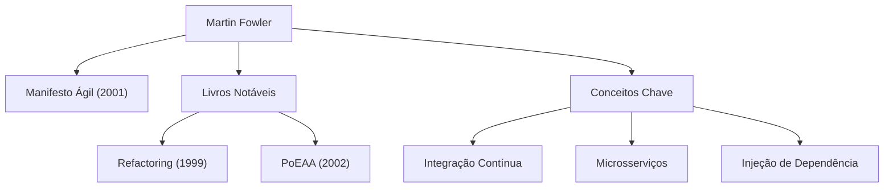

No desenvolvimento de software moderno, não passa um dia sem ouvirmos termos como "Agile", "Refatoração" e "Microsserviços". A pessoa que popularizou esses conceitos em toda a indústria e transformou fundamentalmente a engenharia de software é Martin Fowler. Neste artigo, mergulhamos fundo na vida, filosofia subjacente e impacto duradouro deste programador, autor e pensador.

## Início da Vida e o Amanhecer de sua Carreira

Martin Fowler nasceu em 1964 em Walsall, Inglaterra. Com um forte interesse em pensamento lógico e sistemas desde muito jovem, ele estudou engenharia eletrônica e ciência da computação na University College London (UCL). Entrando no mundo do desenvolvimento de software no final da década de 1980, Fowler testemunhou em primeira mão a rigidez do método de desenvolvimento em cascata, dominante na época, e as falhas de projetos causadas pelo excesso de design.

Esta experiência definiria a sua carreira subsequente. Ao procurar uma resposta para a pergunta: "Como podemos construir software melhor e com mais flexibilidade?", ele voltou sua atenção para o potencial da programação orientada a objetos, imergindo no estudo de modelagem de sistemas e padrões de projeto (design patterns). Na década de 1990, ele se tornou um consultor independente, ganhando experiência prática em vários projetos, desde pequenos sistemas até sistemas de nível corporativo.

No ano 2000, ele ingressou na ThoughtWorks, uma empresa global de consultoria em tecnologia, e tornou-se seu Cientista Chefe (Chief Scientist). A ThoughtWorks tornou-se a plataforma ideal para ele colocar suas ideias em prática e compartilhá-las com o mundo.

## A Filosofia e as Conquistas que Moldaram o Desenvolvimento de Software

No centro da filosofia de Fowler está o reconhecimento de que "o software é uma entidade viva que continua a mudar". Acreditando ser impossível projetar tudo perfeitamente com antecedência, ele defendeu a importância de métodos de desenvolvimento e arquiteturas que pressupõem a mudança.

### 1. Sistematização da Refatoração
Publicado em 1999, seu livro "Refactoring" (Refatoração) é uma obra monumental no desenvolvimento de software. Fowler definiu "refatoração" como o processo de melhorar a estrutura interna do código existente sem alterar seu comportamento externo, e sistematizou suas técnicas específicas (um catálogo). Isso derrubou a noção tradicional de que o código está bom "desde que funcione", estabelecendo a manutenção contínua de uma base de código saudável como uma responsabilidade profissional.

### 2. Padrões de Arquitetura Corporativa
Em "Patterns of Enterprise Application Architecture" (2002), ele extraiu os desafios de design recorrentes encontrados na construção de sistemas de negócios complexos e compilou as melhores práticas como padrões. Conceitos como Active Record e Data Mapper influenciaram fortemente frameworks web posteriores, como o Ruby on Rails.

### 3. Liderando o Desenvolvimento Ágil
Em 2001, Fowler foi um dos 17 engenheiros de software reunidos em Snowbird, Utah, que assinaram o "Manifesto Ágil". Priorizando indivíduos e interações sobre processos e ferramentas, e software funcionando sobre documentação abrangente, este manifesto serve como a pedra angular dos processos de desenvolvimento modernos. Ele também fez contribuições significativas para a popularização de práticas como a Integração Contínua (CI) e o Desenvolvimento Orientado a Testes (TDD).

### 4. Evolução da Arquitetura: Microsserviços
Na década de 2010, ele, juntamente com seu colega James Lewis, defendeu e definiu o estilo arquitetônico dos "Microsserviços". Essa abordagem, que divide aplicações monolíticas enormes e complexas em uma coleção de pequenos serviços que podem ser implantados de forma independente, foi adotada por empresas em todo o mundo como a arquitetura padrão na era nativa da nuvem (cloud-native).

## Impacto na Posteridade e Mensagem para os Engenheiros Modernos

A maior conquista de Martin Fowler é articular "princípios de engenharia universais" independentes de linguagens ou ferramentas específicas e compartilhá-los com a comunidade. Seu blog (martinfowler.com) continua sendo uma das fontes de informação mais confiáveis para engenheiros globalmente, e muitos dos conceitos que ele introduziu se estabeleceram como "senso comum" no desenvolvimento de software moderno.

"Qualquer tolo consegue escrever código que um computador entenda. Bons programadores escrevem código que humanos possam entender."

Sua famosa citação nos ensina que o desenvolvimento de software não se trata apenas de dar ordens às máquinas, mas é um ato de comunicação entre humanos. Não importa o quanto a tecnologia evolua ou se entrarmos em uma era onde a IA escreve código, a filosofia que Fowler pregou — "legibilidade do código", "adaptabilidade à mudança" e "melhoria contínua" — nunca desaparecerá.

Os passos de Martin Fowler representam o próprio processo de elevar o campo imaturo da engenharia de software a uma "profissão" caracterizada pela disciplina e humanidade. Aprender suas ideias e refleti-las em nosso código diário servirá, sem dúvida, como um marco confiável para entregar melhores softwares ao mundo.
