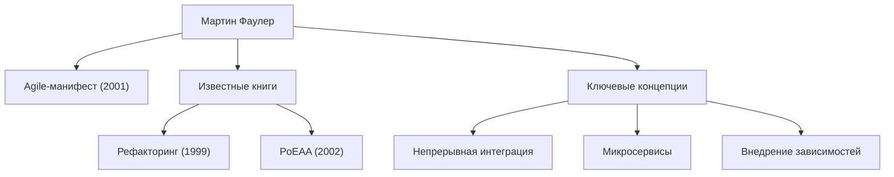

В современной разработке программного обеспечения ни дня не проходит без таких терминов, как «Agile», «Рефакторинг» и «Микросервисы». Человек, который популяризировал эти концепции во всей отрасли и фундаментально преобразовал программную инженерию, — это Мартин Фаулер. В этой статье мы глубоко погружаемся в жизнь, философию и долгосрочное влияние этого программиста, автора и мыслителя.

## Ранние годы и начало карьеры

Мартин Фаулер родился в 1964 году в Уолсолле, Англия. С юных лет проявляя сильный интерес к логическому мышлению и системам, он изучал электронную инженерию и информатику в Университетском колледже Лондона (UCL). Войдя в мир разработки программного обеспечения в конце 1980-х годов, Фаулер воочию убедился в жесткости доминирующей тогда каскадной (waterfall) методологии разработки и в провалах проектов, вызванных избыточным проектированием.

Этот опыт определил его дальнейшую карьеру. Ища ответ на вопрос: «Как мы можем создавать программное обеспечение лучше и гибче?», он обратил внимание на потенциал объектно-ориентированного программирования, погрузившись в изучение системного моделирования и паттернов проектирования. В 1990-х годах он стал независимым консультантом, получив практический опыт в многочисленных проектах, от небольших систем до корпоративного уровня.

В 2000 году он присоединился к ThoughtWorks, глобальной технологической консалтинговой фирме, и стал ее главным научным сотрудником. ThoughtWorks стала для него идеальной платформой для реализации своих идей и обмена ими со всем миром.

## Философия и достижения, формирующие разработку ПО

В основе философии Фаулера лежит понимание того, что «программное обеспечение — это живая сущность, которая постоянно меняется». Полагая, что невозможно идеально спроектировать всё заранее, он отстаивал важность методов разработки и архитектур, которые предполагают изменения.

### 1. Систематизация рефакторинга
Опубликованная в 1999 году, его книга «Рефакторинг» является монументальным трудом в области разработки ПО. Фаулер определил «рефакторинг» как процесс улучшения внутренней структуры существующего кода без изменения его внешнего поведения, и систематизировал его конкретные методы (каталог). Это перевернуло традиционное представление о том, что код в порядке, «пока он работает», установив непрерывное поддержание здоровой кодовой базы как профессиональную ответственность.

### 2. Шаблоны корпоративной архитектуры
В книге «Шаблоны архитектуры корпоративных приложений» (2002 г.) он выделил повторяющиеся проблемы проектирования, возникающие при создании сложных бизнес-систем, и собрал лучшие практики в виде шаблонов. Такие концепции, как Active Record и Data Mapper, оказали огромное влияние на более поздние веб-фреймворки, такие как Ruby on Rails.

### 3. Лидерство в гибкой разработке (Agile)
В 2001 году Фаулер был одним из 17 инженеров-программистов, собравшихся в Сноуберде, штат Юта, которые подписали «Agile-манифест». Отдавая приоритет людям и взаимодействиям над процессами и инструментами, а также работающему программному обеспечению над исчерпывающей документацией, этот манифест служит краеугольным камнем современных процессов разработки. Он также внес значительный вклад в популяризацию таких практик, как непрерывная интеграция (CI) и разработка через тестирование (TDD).

### 4. Эволюция архитектуры: Микросервисы
В 2010-х годах он вместе со своим коллегой Джеймсом Льюисом выступил в защиту и дал определение архитектурному стилю «Микросервисы». Этот подход, который делит огромные, сложные монолитные приложения на набор небольших, независимо развертываемых сервисов, был принят компаниями по всему миру в качестве стандартной архитектуры в эпоху cloud-native.

## Влияние на потомков и послание современным инженерам

Величайшее достижение Мартина Фаулера — формулирование «универсальных инженерных принципов», независимых от конкретных языков или инструментов, и их передача сообществу. Его блог (martinfowler.com) остается одним из самых надежных источников информации [для инженеров](/ru/p/prompt-engineering-for-engineers/) во всем мире, и многие введенные им концепции стали «здравым смыслом» в современной разработке ПО.

«Любой дурак может написать код, который поймет компьютер. Хорошие программисты пишут код, который могут понять люди.»

Его знаменитая цитата учит нас тому, что разработка программного обеспечения — это не просто отдача команд машинам, но и акт общения между людьми. Независимо от того, насколько развиваются технологии или наступит ли эра, когда ИИ будет писать код, философия, которую проповедовал Фаулер — «читаемость кода», «адаптивность к изменениям» и «непрерывное улучшение» — никогда не угаснет.

Путь Мартина Фаулера представляет собой сам процесс возвышения незрелой области программной инженерии до «профессии», характеризующейся дисциплиной и человечностью. Изучение его идей и их отражение в нашем повседневном коде, несомненно, послужит надежным ориентиром для предоставления миру лучшего программного обеспечения.
