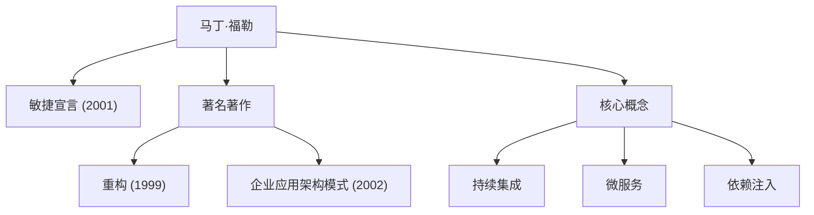

在现代软件开发中，我们每天都会听到“敏捷”、“重构”和“微服务”等词汇。正是马丁·福勒（Martin Fowler）将这些概念广泛推广到整个行业，并从根本上改变了软件工程的运作方式。本文将深入探讨这位程序员、作家和思想家的一生，他根深蒂固的哲学，以及他对后世的深远影响。

## 早年生活与职业生涯的黎明

马丁·福勒于1964年出生在英国沃尔索尔。他从小就对逻辑思维和系统抱有浓厚兴趣，并在伦敦大学学院（UCL）学习了电子工程和计算机科学。在20世纪80年代末进入软件开发世界后，福勒亲眼目睹了当时占主导地位的瀑布开发方法的僵化，以及过度设计导致的项目失败。

这段经历决定了他随后的职业生涯。在寻找“如何更好、更灵活地构建软件”这一问题的答案时，他将注意力转向了面向对象编程的潜力，沉浸在系统建模和设计模式的研究中。在90年代，他成为了一名独立顾问，在从小型项目到企业级系统的众多实践中积累了丰富的经验。

2000年，他加入了全球技术咨询公司ThoughtWorks，并担任首席科学家。ThoughtWorks成为了他将自己的想法付诸实践并与世界分享的理想平台。

## 塑造软件开发的哲学与成就

福勒哲学的核心在于认识到“软件是一个不断变化的生命体”。他认为不可能预先完美地设计一切，因此倡导采用以变化为前提的开发方法和架构的重要性。

### 1. 重构的系统化
1999年出版的《重构》是软件开发领域的一部丰碑之作。福勒将“重构”定义为在不改变现有代码外部行为的前提下，改善其内部结构的过程，并系统化了其具体手法（目录）。这颠覆了“只要能运行就行”的传统代码观念，确立了持续保持代码库健康是专业人员的责任。

### 2. 企业应用架构模式
在2002年出版的《企业应用架构模式》中，他提取了构建复杂业务系统时反复出现的设计挑战，并将最佳实践总结为模式。Active Record和Data Mapper等概念对后来的Ruby on Rails等Web框架产生了深远影响。

### 3. 引领敏捷开发
2001年，福勒作为聚集在犹他州雪鸟城的17位软件工程师之一，签署了“敏捷宣言”。该宣言将个体和互动置于流程和工具之上，将可工作的软件置于详尽的文档之上，构成了现代开发流程的基石。他还为持续集成（CI）和测试驱动开发（TDD）等实践的普及做出了巨大贡献。

### 4. 架构的演进：微服务
进入2010年代，他与同事詹姆斯·刘易斯（James Lewis）共同提倡并定义了“微服务”架构风格。这种将庞大复杂的单体应用拆分为一组可独立部署的小型服务集合的方法，已被全球企业采纳为云原生时代的标准架构。

## 对后世的影响与给现代工程师的信息

马丁·福勒最伟大的成就在于阐明了不依赖于特定语言或工具的“普遍工程原则”，并将其与社区分享。他的博客（martinfowler.com）至今仍是全球工程师最可靠的信息源之一，他提出的许多概念已成为现代软件开发的“常识”。

“任何傻瓜都能写出计算机能理解的代码。优秀的程序员写出的是人类能理解的代码。”

他的这句名言告诉我们，软件开发不仅仅是对机器下达命令，而是人与人之间交流的行为。无论技术如何演进，即使进入了AI编写代码的时代，福勒所倡导的“代码可读性”、“适应变化的能力”和“持续改进”的哲学也永远不会褪色。

马丁·福勒的足迹代表了将曾经不成熟的软件工程领域提升为兼具纪律性和人情味的“专业”的过程本身。学习他的思想并将其反映在日常代码中，必将成为我们为世界带来更好软件的可靠指路明灯。
