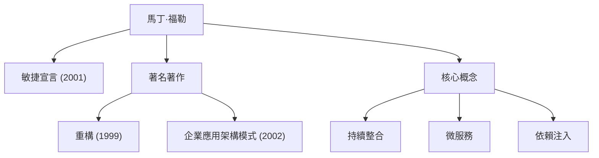

在現代軟體開發中，我們每天都會聽到「敏捷」、「重構」和「微服務」等詞彙。正是馬丁·福勒（Martin Fowler）將這些概念廣泛推廣到整個行業，並從根本上改變了軟體工程的運作方式。本文將深入探討這位程式設計師、作家和思想家的一生，他根深蒂固的哲學，以及他對後世的深遠影響。

## 早年生活與職業生涯的黎明

馬丁·福勒於1964年出生在英國沃爾索爾。他從小就對邏輯思維和系統抱有濃厚興趣，並在倫敦大學學院（UCL）學習了電子工程和計算機科學。在20世紀80年代末進入軟體開發世界後，福勒親眼目睹了當時佔主導地位的瀑布開發方法的僵化，以及過度設計導致的專案失敗。

這段經歷決定了他隨後的職業生涯。在尋找「如何更好、更靈活地構建軟體」這一問題的答案時，他將注意力轉向了[物件導向程式設計](/zh-tw/p/object-oriented-programming-oop-solid-principles/)的潛力，沉浸在系統建模和設計模式的研究中。在90年代，他成為了一名獨立顧問，在從小型專案到企業級系統的眾多實踐中累積了豐富的經驗。

2000年，他加入了全球技術顧問公司ThoughtWorks，並擔任首席科學家。ThoughtWorks成為了他將自己的想法付諸實踐並與世界分享的理想平台。

## 塑造軟體開發的哲學與成就

福勒哲學的核心在於認識到「軟體是一個不斷變化的生命體」。他認為不可能預先完美地設計一切，因此倡導採用以變化為前提的開發方法和架構的重要性。

### 1. 重構的系統化
1999年出版的《重構》是軟體開發領域的一部豐碑之作。福勒將「重構」定義為在不改變現有程式碼外部行為的前提下，改善其內部結構的過程，並系統化了其具體手法（目錄）。這顛覆了「只要能運作就行」的傳統程式碼觀念，確立了持續保持程式碼庫健康是專業人員的責任。

### 2. 企業應用架構模式
在2002年出版的《企業應用架構模式》中，他提取了構建複雜業務系統時反覆出現的設計挑戰，並將最佳實踐總結為模式。Active Record和Data Mapper等概念對後來的Ruby on Rails等Web框架產生了深遠影響。

### 3. 引領敏捷開發
2001年，福勒作為聚集在猶他州雪鳥城的17位軟體工程師之一，簽署了「敏捷宣言」。該宣言將個體和互動置於流程和工具之上，將可運作的軟體置於詳盡的文件之上，構成了現代開發流程的基石。他還為持續整合（CI）和測試驅動開發（TDD）等實踐的普及做出了巨大貢獻。

### 4. 架構的演進：微服務
進入2010年代，他與同事詹姆斯·路易斯（James Lewis）共同提倡並定義了「微服務」架構風格。這種將龐大複雜的單體應用拆分為一組可獨立部署的小型服務集合的方法，已被全球企業採納為雲原生時代的標準架構。

## 對後世的影響與給現代工程師的訊息

馬丁·福勒最偉大的成就在於闡明了不依賴於特定語言或工具的「普遍工程原則」，並將其與社群分享。他的部落格（martinfowler.com）至今仍是全球工程師最可靠的資訊源之一，他提出的許多概念已成為現代軟體開發的「常識」。

「任何傻瓜都能寫出電腦能理解的程式碼。優秀的程式設計師寫出的是人類能理解的程式碼。」

他的這句名言告訴我們，軟體開發不僅僅是對機器下達命令，而是人與人之間交流的行為。無論技術如何演進，即使進入了AI編寫程式碼的時代，福勒所倡導的「程式碼可讀性」、「適應變化的能力」和「持續改進」的哲學也永遠不會褪色。

馬丁·福勒的足跡代表了將曾經不成熟的軟體工程領域提升為兼具紀律性和人情味的「專業」的過程本身。學習他的思想並將其反映在日常程式碼中，必將成為我們為世界帶來更好軟體的可靠指路明燈。
