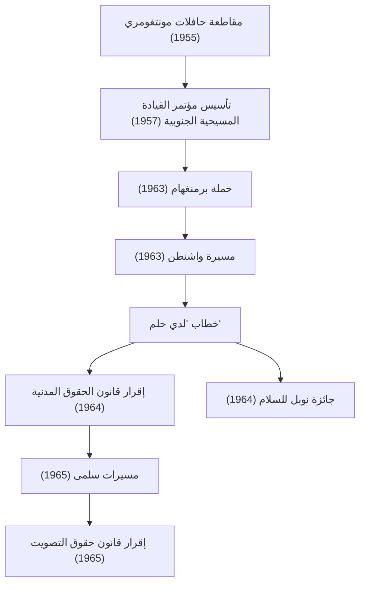

كان مارتن لوثر كينغ جونيور (15 يناير 1929 - 4 أبريل 1968) قساً أمريكياً معمدانياً وأبرز قادة حركة الحقوق المدنية للأمريكيين الأفارقة. شكلت فلسفته المتمثلة في "العمل المباشر اللاعنفي" القوة الدافعة لكسر سياسات الفصل العنصري في المجتمع الأمريكي، ولا تزال تؤثر بشكل عميق على العديد من حركات حقوق الإنسان اليوم.

## رحلة حياته: صوت ضد التمييز غير المبرر

وُلد الدكتور كينغ في أتلانتا بولاية جورجيا، وعانى منذ صغره من التمييز غير المبرر الذي فرضته قوانين جيم كرو (قوانين الفصل العنصري) في الجنوب. درس في كلية مورهاوس، ومدرسة كروزر اللاهوتية، وجامعة بوسطن حيث حصل على درجة الدكتوراه في اللاهوت. خلال هذه الرحلة، استلهم الكثير من مبدأ المقاومة اللاعنفية للمهاتما غاندي وفلسفة العصيان المدني لهنري ديفيد ثورو.

بدأت مسيرته كعالم وناشط سياسي فعلياً مع "مقاطعة حافلات مونتغومري" عام 1955. بعد اعتقال روزا باركس، وهي امرأة سوداء رفضت التخلي عن مقعدها في القسم المخصص للبيض في الحافلة، قاد الدكتور كينغ حركة المقاطعة. أدى الاحتجاج الذي استمر 381 يومًا إلى انتصار تاريخي عندما قضت المحكمة العليا بعدم دستورية الفصل العنصري في الحافلات، مما جعله شخصية وطنية بارزة كقائد لحركة الحقوق المدنية.

## الفلسفة والعمل: "لدي حلم"

في صميم حركة الدكتور كينغ كانت هناك فلسفة راسخة دمجت بين المحبة المسيحية ولاعنف غاندي. لقد كان يعظ بأن الانتقام العنيف لا يولد سوى دائرة من الكراهية، وأن العدالة الحقيقية والمصالحة ("المجتمع المحبوب") لا يمكن بناؤها إلا من خلال المحبة والوسائل السلمية.

في 28 أغسطس 1963، تجمع حوالي 250 ألف شخص في "مسيرة واشنطن" في العاصمة واشنطن. لا يزال خطاب "لدي حلم" الذي ألقاه الدكتور كينغ أمام النصب التذكاري للينكولن يُذكر كواحد من أعظم الخطابات في التاريخ الأمريكي. "أحلم بأن أطفالي الأربعة سيعيشون يومًا في أمة لا يُحكم عليهم فيها بلون بشرتهم بل بجوهر شخصيتهم" - لقد تجاوزت هذه الكلمات القوية الحواجز العرقية، ولمست القلوب في جميع أنحاء العالم، وكانت بمثابة قوة دافعة حاسمة وراء إقرار قانون الحقوق المدنية لعام 1964 وقانون حقوق التصويت لعام 1965.

في عام 1964، وتقديراً لإنجازاته في الحملات السلمية واللاعنفية، أصبح أصغر شخص في ذلك الوقت يحصل على جائزة نوبل للسلام وهو في سن الخامسة والثلاثين.

## مسار الإنجازات (مخطط Mermaid)

يوضح المخطط التالي [مسار](/ar/p/windows-%E3%81%A7%D9%85%D8%B3%D8%A7%D8%B1%E3%81%AE%E9%80%9A%E3%81%A3%E3%81%9F%D9%85%D9%84%D9%81-%D8%AA%D9%86%D9%81%D9%8A%D8%B0%D9%8A%E3%81%AE%E5%A0%B4%E6%89%80%E3%82%92%E8%A6%8B%E3%81%A4%E3%81%91%E3%82%8B%E6%96%B9%E6%B3%95/) وتأثير جهود الحقوق المدنية الرئيسية التي قام بها الدكتور كينغ.

## الإرث: الاستمرار في حلم لم يكتمل

حتى بعد الانتصارات القانونية لحركة الحقوق المدنية، لم ينتهِ كفاح الدكتور كينغ. بالإضافة إلى التمييز العنصري، رفع صوته ضد الفقر وضد حرب فيتنام، ساعياً للحصول على حقوق إنسان وعدالة اقتصادية أوسع. ومع ذلك، في 4 أبريل 1968، تم اغتياله في ممفيس، تينيسي، وتوفي في سن مبكرة تبلغ 39 عاماً.

أحدثت وفاته صدمة كبيرة وحزناً عميقاً في العالم، لكن روحه لم تمت. واليوم، يعتبر يوم الاثنين الثالث من شهر يناير عطلة وطنية في الولايات المتحدة تُعرف باسم "يوم مارتن لوثر كينغ جونيور"، وقد تم تخصيصه كيوم خدمة لتكريم إرثه.

إن رسالة "المحبة واللاعنف" التي سعى الدكتور كينغ لنشرها طوال حياته لا تزال حية في حركات العدالة الاجتماعية الحديثة، بما في ذلك حركة "حياة السود مهمة". إن [مسار](/ar/p/windows-%E3%81%A7%D9%85%D8%B3%D8%A7%D8%B1%E3%81%AE%E9%80%9A%E3%81%A3%E3%81%9F%D9%85%D9%84%D9%81-%D8%AA%D9%86%D9%81%D9%8A%D8%B0%D9%8A%E3%81%AE%E5%A0%B4%E6%89%80%E3%82%92%E8%A6%8B%E3%81%A4%E3%81%91%E3%82%8B%E6%96%B9%E6%B3%95/) أقواله وأفعاله يُظهر لنا دائماً، نحن الذين نبحث عن بصيص أمل في الظلام، الشجاعة للوقوف من أجل ما هو صحيح، وإمكانية التحول من خلال الحوار والفهم.
