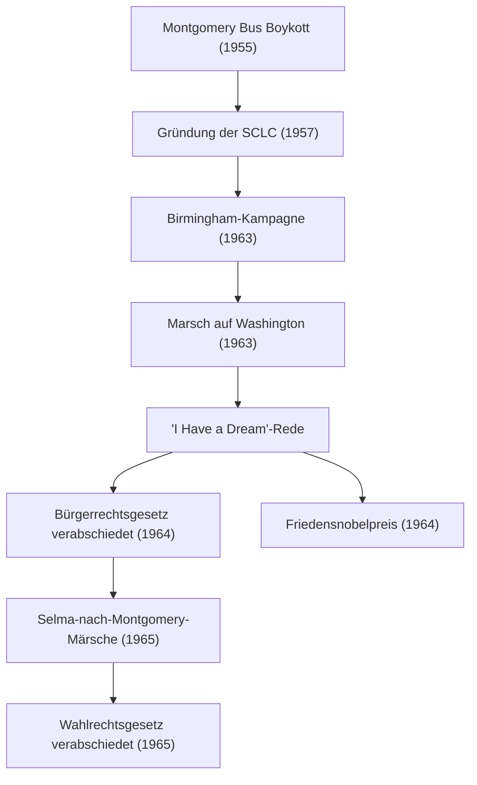

Martin Luther King Jr. (15. Januar 1929 – 4. April 1968) war ein US-amerikanischer baptistischer Geistlicher und der prominenteste Führer der Bürgerrechtsbewegung der Afroamerikaner. Seine Philosophie der „gewaltfreien direkten Aktion“ war die treibende Kraft bei der Überwindung der Rassentrennung in der amerikanischen Gesellschaft und beeinflusst auch heute noch zahlreiche Menschenrechtsbewegungen zutiefst.

## Lebensweg: Eine Stimme gegen unvernünftige Diskriminierung

Als Dr. King in Atlanta, Georgia, geboren wurde, erlebte er von klein auf die unvernünftige Diskriminierung durch die Jim-Crow-Gesetze (Rassentrennungsgesetze) in den Südstaaten. Er studierte am Morehouse College, am Crozer Theological Seminary und an der Boston University, wo er in Theologie promovierte. Dabei wurde er tief von Mahatma Gandhis Prinzip des gewaltfreien Widerstands und Henry David Thoreaus Philosophie des zivilen Ungehorsams inspiriert.

Seine Karriere als Aktivist begann erst richtig mit dem „Montgomery Bus Boycott“ im Jahr 1955. Ausgelöst durch die Verhaftung von Rosa Parks, einer schwarzen Frau, die sich weigerte, ihren Platz im Bus für Weiße aufzugeben, leitete Dr. King die Boykottbewegung. Der 381 Tage dauernde Protest führte zu einem historischen Sieg, als der Oberste Gerichtshof die Rassentrennung in Bussen für verfassungswidrig erklärte, was ihm nationale Bekanntheit als Anführer der Bürgerrechtsbewegung einbrachte.

## Philosophie und Aktion: „I Have a Dream“

Im Zentrum von Dr. Kings Bewegung stand eine unerschütterliche Philosophie, die christliche Nächstenliebe mit Gandhis Gewaltlosigkeit verschmolz. Er predigte, dass gewaltsame Vergeltung nur einen Kreislauf des Hasses erzeugt und dass wahre Gerechtigkeit und Versöhnung (die „Geliebte Gemeinschaft“) nur durch Liebe und friedliche Mittel aufgebaut werden können.

Am 28. August 1963 versammelten sich rund 250.000 Menschen zum „Marsch auf Washington“ in Washington, D.C. Die Rede „I Have a Dream“ (Ich habe einen Traum), die Dr. King vor dem Lincoln Memorial hielt, ist als eine der größten Reden der amerikanischen Geschichte in Erinnerung geblieben. „Ich träume davon, dass meine vier kleinen Kinder eines Tages in einer Nation leben werden, in der sie nicht nach ihrer Hautfarbe, sondern nach ihrem Charakter beurteilt werden“ – diese kraftvollen Worte überwanden Rassenbarrieren, berührten Herzen weltweit und dienten als entscheidende Triebkraft für die Verabschiedung des Civil Rights Act (Bürgerrechtsgesetz) von 1964 und des Voting Rights Act (Wahlrechtsgesetz) von 1965.

1964 wurde er für seine Verdienste um friedliche, gewaltfreie Kampagnen als damals jüngste Person im Alter von 35 Jahren mit dem Friedensnobelpreis ausgezeichnet.

## Errungenschaften (Mermaid-Diagramm)

Das folgende Diagramm veranschaulicht den Verlauf und die Auswirkungen von Dr. Kings wichtigsten Bürgerrechtsbemühungen.

## Vermächtnis: Fortführung eines unvollendeten Traums

Auch nach den rechtlichen Siegen der Bürgerrechtsbewegung war Dr. Kings Kampf nicht zu Ende. Neben der Rassendiskriminierung erhob er auch seine Stimme gegen Armut und den Vietnamkrieg und forderte umfassendere Menschenrechte und wirtschaftliche Gerechtigkeit. Am 4. April 1968 wurde er jedoch in Memphis, Tennessee, ermordet und verstarb im jungen Alter von 39 Jahren.

Sein Tod löste weltweit enormen Schock und tiefe Trauer aus, aber sein Geist starb nicht. Heute ist der dritte Montag im Januar ein nationaler Feiertag in den Vereinigten Staaten, der „Martin Luther King Jr. Day“, der als Tag des Dienstes (Day of Service) zur Ehrung seines Vermächtnisses eingeführt wurde.

Die Botschaft von „Liebe und Gewaltlosigkeit“, die Dr. King mit seinem Leben verfolgte, lebt in modernen Bewegungen für soziale Gerechtigkeit, einschließlich der Black-Lives-Matter-Bewegung, weiter. Die Richtung seiner Worte und Taten zeigt uns, die wir in der Dunkelheit nach einem Hoffnungsschimmer suchen, für immer den Mut, für das Richtige einzutreten, und die Möglichkeit der Veränderung durch Dialog und Verständnis.
