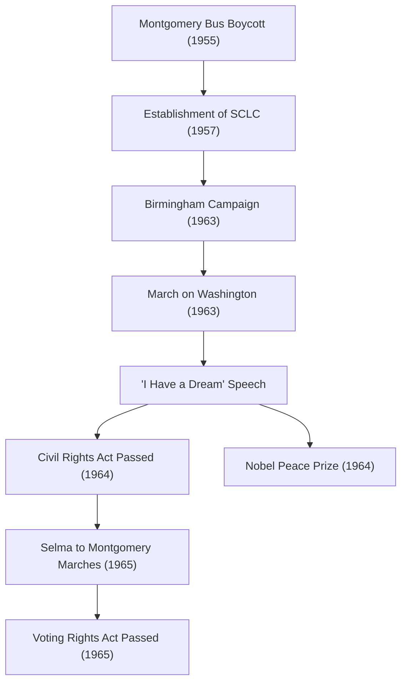

Martin Luther King Jr. (January 15, 1929 - April 4, 1968) was an American Protestant Baptist minister and the most prominent leader of the African American civil rights movement. His philosophy of "nonviolent direct action" served as the driving force to break down racial segregation policies in American society, continuing to profoundly influence numerous human rights movements today.

## Journey of Life: A Voice Against Unreasonable Discrimination

Born in Atlanta, Georgia, Dr. King experienced the unreasonable discrimination of the South's Jim Crow laws (racial segregation laws) from a young age. He studied at Morehouse College, Crozer Theological Seminary, and Boston University, where he earned a doctorate in theology. Along the way, he was deeply inspired by Mahatma Gandhi's principle of nonviolent resistance and Henry David Thoreau's philosophy of civil disobedience.

His career as an activist truly began with the "Montgomery Bus Boycott" in 1955. Sparked by the arrest of Rosa Parks, a black woman who refused to give up her seat in the white section of a bus, Dr. King led the boycott movement. The 381-day protest resulted in a historic victory when the Supreme Court ruled bus segregation unconstitutional, propelling him to national prominence as a leader of the civil rights movement.

## Philosophy and Action: "I Have a Dream"

At the core of Dr. King's movement was an unwavering philosophy that fused Christian love with Gandhi's nonviolence. He preached that violent retaliation only breeds a cycle of hatred, and that true justice and reconciliation (the "Beloved Community") can only be built through love and peaceful means.

On August 28, 1963, approximately 250,000 people gathered for the "March on Washington" in Washington, D.C. The "I Have a Dream" speech Dr. King delivered in front of the Lincoln Memorial is remembered as one of the greatest speeches in American history. "My four little children will one day live in a nation where they will not be judged by the color of their skin but by the content of their character" — these powerful words transcended racial barriers, touching hearts worldwide and serving as the decisive driving force behind the passage of the Civil Rights Act of 1964 and the Voting Rights Act of 1965.

In 1964, recognized for his achievements in peaceful, nonviolent campaigning, he became the youngest person at the time to receive the Nobel Peace Prize at age 35.

## Trajectory of Achievements (Mermaid Diagram)

The following diagram illustrates the trajectory and impact of Dr. King's major civil rights efforts.

## Legacy: Carrying on an Unfinished Dream

Even after the legal victories of the civil rights movement, Dr. King's struggle did not end. In addition to racial discrimination, he raised his voice against poverty and the Vietnam War, seeking broader human rights and economic justice. However, on April 4, 1968, he was assassinated in Memphis, Tennessee, passing away at the young age of 39.

His death brought tremendous shock and deep sorrow to the world, but his spirit did not die. Today, the third Monday of January is a national holiday in the United States known as "Martin Luther King Jr. Day," established as a day of service to honor his legacy.

The message of "love and nonviolence" that Dr. King sought with his life continues to live on in modern movements for social justice, including the Black Lives Matter movement. The trajectory of his words and actions forever shows us, searching for a ray of hope in the darkness, the courage to stand up for what is right and the possibility of transformation through dialogue and understanding.
