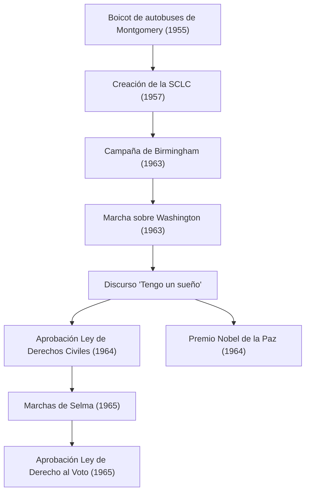

Martin Luther King Jr. (15 de enero de 1929 - 4 de abril de 1968) fue un ministro bautista protestante estadounidense y el líder más destacado del movimiento de derechos civiles afroamericano. Su filosofía de "acción directa no violenta" sirvió como motor para derribar las políticas de segregación racial en la sociedad estadounidense, y continúa influyendo profundamente en numerosos movimientos de derechos humanos en la actualidad.

## El camino de su vida: Una voz contra la discriminación irracional

Nacido en Atlanta, Georgia, el Dr. King experimentó desde joven la discriminación irracional de las leyes Jim Crow (leyes de segregación racial) del Sur de los Estados Unidos. Estudió en el Morehouse College, el Seminario Teológico Crozer y la Universidad de Boston, donde obtuvo un doctorado en teología. En este proceso, se sintió profundamente inspirado por el principio de resistencia no violenta de Mahatma Gandhi y la filosofía de desobediencia civil de Henry David Thoreau.

Su carrera como activista cobró impulso en 1955 con el "Boicot a los autobuses de Montgomery". A raíz del arresto de Rosa Parks, una mujer negra que se negó a ceder su asiento en la sección exclusiva para blancos de un autobús, el Dr. King lideró el movimiento de boicot. La protesta de 381 días resultó en una victoria histórica cuando la Corte Suprema dictaminó que la segregación en los autobuses era inconstitucional, impulsándolo a la fama nacional como líder del movimiento de derechos civiles.

## Filosofía y acción: "Tengo un sueño"

En la base del movimiento del Dr. King había una filosofía inquebrantable que fusionaba el amor cristiano con el pacifismo de Gandhi. Predicó que las represalias violentas solo generan un ciclo de odio, y que la verdadera justicia y reconciliación (la "Comunidad Amada") solo pueden construirse a través del amor y medios pacíficos.

El 28 de agosto de 1963, aproximadamente 250.000 personas se reunieron en Washington, D.C. para la "Marcha sobre Washington". El discurso "Tengo un sueño" que el Dr. King pronunció frente al Monumento a Lincoln es recordado como uno de los más grandes en la historia de Estados Unidos. "Sueño que mis cuatro hijos vivirán un día en una nación donde no serán juzgados por el color de su piel, sino por el contenido de su carácter": estas poderosas palabras trascendieron las barreras raciales, conmovieron los corazones en todo el mundo y sirvieron como fuerza impulsora decisiva para la aprobación de la Ley de Derechos Civiles de 1964 y la Ley de Derecho al Voto de 1965.

En 1964, reconocido por sus logros pacíficos y no violentos, se convirtió en la persona más joven en ese momento (35 años) en recibir el Premio Nobel de la Paz.

## Trayectoria de logros (Diagrama Mermaid)

El siguiente diagrama ilustra la trayectoria de los principales esfuerzos de derechos civiles del Dr. King y su impacto.

## Legado: Continuando un sueño inconcluso

Incluso después de las victorias legales del movimiento por los derechos civiles, la lucha del Dr. King no terminó. Además de la discriminación racial, alzó su voz contra la pobreza y el movimiento contra la Guerra de Vietnam, buscando derechos humanos y justicia económica más amplios. Sin embargo, el 4 de abril de 1968, fue asesinado en Memphis, Tennessee, falleciendo a la temprana edad de 39 años.

Su muerte causó gran conmoción y profunda tristeza en el mundo, pero su espíritu nunca murió. Hoy, el tercer lunes de enero es fiesta nacional en los Estados Unidos, el "Día de Martin Luther King Jr.", establecido como un día para honrar sus logros y realizar actividades de servicio.

El mensaje de "amor y no violencia" que el Dr. King persiguió con su vida sigue vivo en los movimientos modernos que buscan la justicia social, como el movimiento Black Lives Matter. La trayectoria de sus palabras y acciones nos muestra eternamente a quienes buscamos un rayo de esperanza en la oscuridad el valor de defender lo correcto y la posibilidad de transformación a través del diálogo y la comprensión.
