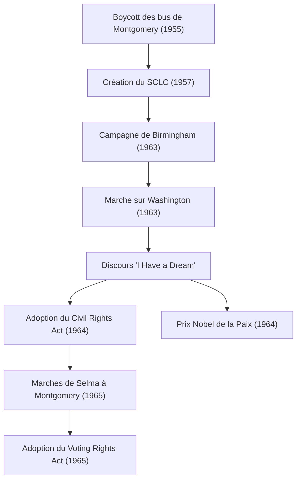

Martin Luther King Jr. (15 janvier 1929 - 4 avril 1968) était un pasteur baptiste protestant américain et le leader le plus éminent du mouvement des droits civiques des Afro-Américains. Sa philosophie d'"action directe non violente" a servi de moteur pour briser les politiques de ségrégation raciale dans la société américaine, continuant d'influencer profondément de nombreux mouvements pour les droits de l'homme aujourd'hui.

## Le parcours de sa vie : Une voix contre la discrimination déraisonnable

Né à Atlanta, en Géorgie, le Dr King a connu dès son plus jeune âge la discrimination déraisonnable des lois Jim Crow (lois sur la ségrégation raciale) du Sud. Il a étudié au Morehouse College, au Crozer Theological Seminary et à l'Université de Boston, où il a obtenu un doctorat en théologie. Au cours de ce processus, il a été profondément inspiré par le principe de résistance non violente du Mahatma Gandhi et la philosophie de désobéissance civile de Henry David Thoreau.

Sa carrière de militant a véritablement commencé avec le "Boycott des bus de Montgomery" en 1955. Déclenché par l'arrestation de Rosa Parks, une femme noire qui a refusé de céder sa place dans la section réservée aux blancs d'un bus, le Dr King a dirigé le mouvement de boycott. Cette manifestation de 381 jours s'est soldée par une victoire historique lorsque la Cour suprême a déclaré inconstitutionnelle la ségrégation dans les bus, le propulsant au premier plan national en tant que leader du mouvement des droits civiques.

## Philosophie et action : "I Have a Dream" (J'ai un rêve)

Au cœur du mouvement du Dr King se trouvait une philosophie inébranlable qui fusionnait l'amour chrétien et la non-violence de Gandhi. Il prêchait que les représailles violentes ne font qu'engendrer un cycle de haine, et que la véritable justice et la réconciliation (la "Communauté bien-aimée") ne peuvent être bâties que par l'amour et des moyens pacifiques.

Le 28 août 1963, environ 250 000 personnes se sont rassemblées pour la "Marche sur Washington" à Washington, D.C. Le discours "I Have a Dream" que le Dr King a prononcé devant le Lincoln Memorial est resté dans les mémoires comme l'un des plus grands discours de l'histoire américaine. "Je rêve que mes quatre petits-enfants vivront un jour dans une nation où ils ne seront pas jugés sur la couleur de leur peau, mais sur la valeur de leur caractère" — ces mots puissants ont transcendé les barrières raciales, touché les cœurs du monde entier et servi de force motrice décisive pour l'adoption du Civil Rights Act de 1964 et du Voting Rights Act de 1965.

En 1964, reconnu pour ses réalisations dans le cadre de campagnes pacifiques et non violentes, il est devenu la plus jeune personne de l'époque à recevoir le prix Nobel de la paix, à l'âge de 35 ans.

## Trajectoire des réalisations (Diagramme Mermaid)

Le diagramme suivant illustre la trajectoire et l'impact des principaux efforts du Dr King en matière de droits civiques.

## Héritage : Poursuivre un rêve inachevé

Même après les victoires juridiques du mouvement des droits civiques, le combat du Dr King n'était pas terminé. Outre la discrimination raciale, il a élevé la voix contre la pauvreté et la guerre du Vietnam, en quête de droits humains plus larges et de justice économique. Cependant, le 4 avril 1968, il a été assassiné à Memphis, dans le Tennessee, s'éteignant à l'âge de 39 ans.

Sa mort a provoqué un choc immense et une profonde tristesse dans le monde, mais son esprit n'est pas mort. Aujourd'hui, le troisième lundi de janvier est une fête nationale aux États-Unis, connue sous le nom de "Martin Luther King Jr. Day", instaurée comme journée de service pour honorer son héritage.

Le message d'"amour et de non-violence" que le Dr King a poursuivi toute sa vie continue de vivre dans les mouvements modernes pour la justice sociale, notamment le mouvement Black Lives Matter. La trajectoire de ses mots et de ses actes montre à jamais, à nous qui cherchons une lueur d'espoir dans les ténèbres, le courage de défendre ce qui est juste et la possibilité d'une transformation par le dialogue et la compréhension.
