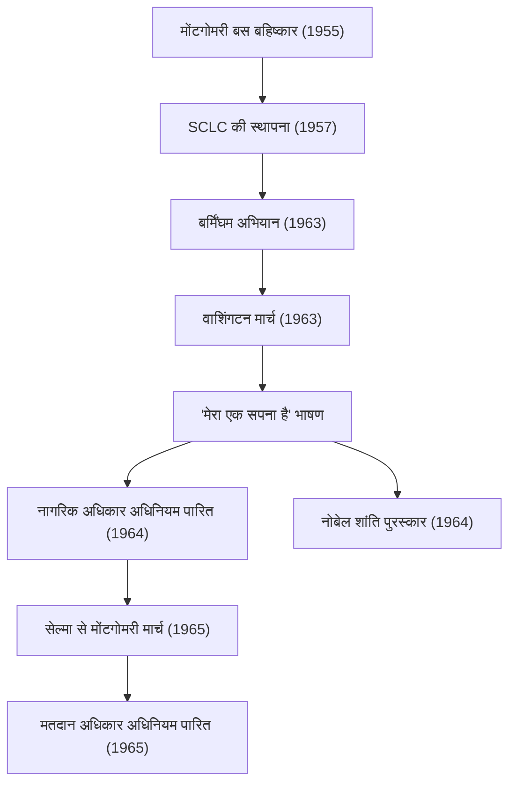

मार्टिन लूथर किंग जूनियर (15 जनवरी, 1929 - 4 अप्रैल, 1968) एक अमेरिकी प्रोटेस्टेंट बैपटिस्ट पादरी और अफ्रीकी अमेरिकी नागरिक अधिकार आंदोलन के सबसे प्रमुख नेता थे। उनके "अहिंसक प्रत्यक्ष कार्रवाई" के दर्शन ने अमेरिकी समाज की नस्लीय अलगाव नीतियों को तोड़ने में प्रेरक शक्ति के रूप में काम किया और यह आज भी कई मानवाधिकार आंदोलनों को गहराई से प्रभावित कर रहा है।

## जीवन का सफर: अनुचित भेदभाव के खिलाफ एक आवाज

अटलांटा, जॉर्जिया में जन्मे, डॉ. किंग ने कम उम्र से ही दक्षिण के जिम क्रो कानूनों (नस्लीय अलगाव कानूनों) के अनुचित भेदभाव का अनुभव किया। उन्होंने मोरहाउस कॉलेज, क्रोज़र थियोलॉजिकल सेमिनरी और बोस्टन विश्वविद्यालय में अध्ययन किया, जहां उन्होंने धर्मशास्त्र में डॉक्टरेट की उपाधि प्राप्त की। इस प्रक्रिया में, वे महात्मा गांधी के अहिंसक प्रतिरोध के सिद्धांत और हेनरी डेविड थोरो के सविनय अवज्ञा के दर्शन से गहराई से प्रेरित हुए।

एक कार्यकर्ता के रूप में उनका करियर वास्तव में 1955 में "मोंटगोमरी बस बहिष्कार" के साथ शुरू हुआ। रोजा पार्क्स नामक एक अश्वेत महिला की गिरफ्तारी, जिसने बस में श्वेत लोगों के लिए आरक्षित सीट छोड़ने से इनकार कर दिया था, इस घटना से प्रेरित होकर डॉ. किंग ने बहिष्कार आंदोलन का नेतृत्व किया। 381 दिनों के इस विरोध प्रदर्शन के परिणामस्वरूप ऐतिहासिक जीत हुई जब सर्वोच्च न्यायालय ने बसों में अलगाव को असंवैधानिक घोषित किया, जिससे वे नागरिक अधिकार आंदोलन के नेता के रूप में राष्ट्रीय स्तर पर प्रसिद्ध हो गए।

## दर्शन और कार्य: "मेरा एक सपना है" (I Have a Dream)

डॉ. किंग के आंदोलन के मूल में ईसाई प्रेम और गांधी के अहिंसावाद को मिलाने वाला एक अटूट दर्शन था। उन्होंने उपदेश दिया कि हिंसक प्रतिशोध केवल घृणा का चक्र पैदा करता है, और सच्चा न्याय और सुलह ("प्रिय समुदाय") केवल प्रेम और शांतिपूर्ण तरीकों से ही बनाया जा सकता है।

28 अगस्त, 1963 को लगभग 250,000 लोग वाशिंगटन, डी.सी. में "वाशिंगटन मार्च" के लिए एकत्र हुए। लिंकन मेमोरियल के सामने डॉ. किंग द्वारा दिया गया "मेरा एक सपना है" भाषण अमेरिकी इतिहास के सबसे महान भाषणों में से एक के रूप में याद किया जाता है। "मेरा सपना है कि मेरे चार छोटे बच्चे एक दिन ऐसे राष्ट्र में रहेंगे जहां उन्हें उनकी त्वचा के रंग से नहीं बल्कि उनके चरित्र से आंका जाएगा" — इन शक्तिशाली शब्दों ने नस्लीय बाधाओं को पार किया, दुनिया भर के लोगों के दिलों को छुआ, और 1964 के नागरिक अधिकार अधिनियम और 1965 के मतदान अधिकार अधिनियम को पारित करने में निर्णायक प्रेरक शक्ति के रूप में कार्य किया।

1964 में, शांतिपूर्ण, अहिंसक अभियानों में उनकी उपलब्धियों को मान्यता देते हुए, उन्हें 35 वर्ष की कम उम्र में नोबेल शांति पुरस्कार से सम्मानित किया गया, जो उस समय के सबसे कम उम्र के प्राप्तकर्ता थे।

## उपलब्धियों का प्रक्षेपवक्र (Mermaid आरेख)

निम्नलिखित आरेख डॉ. किंग के प्रमुख नागरिक अधिकार प्रयासों के प्रक्षेपवक्र और उनके प्रभाव को दर्शाता है।

## विरासत: एक अधूरे सपने को आगे बढ़ाना

नागरिक अधिकार आंदोलन की कानूनी जीत के बाद भी, डॉ. किंग का संघर्ष समाप्त नहीं हुआ। नस्लीय भेदभाव के अलावा, उन्होंने गरीबी और वियतनाम युद्ध के खिलाफ भी अपनी आवाज उठाई, और व्यापक मानवाधिकारों और आर्थिक न्याय की मांग की। हालांकि, 4 अप्रैल, 1968 को टेनेसी के मेम्फिस में उनकी हत्या कर दी गई, और 39 वर्ष की कम उम्र में उनका निधन हो गया।

उनकी मृत्यु ने दुनिया में भारी सदमा और गहरा दुख पहुंचाया, लेकिन उनकी भावना कभी नहीं मरी। आज, जनवरी का तीसरा सोमवार संयुक्त राज्य अमेरिका में "मार्टिन लूथर किंग जूनियर दिवस" के रूप में एक राष्ट्रीय अवकाश है, जिसे उनकी विरासत का सम्मान करने और सेवा करने के दिन के रूप में स्थापित किया गया है।

"प्रेम और अहिंसा" का संदेश जिसे डॉ. किंग ने अपने जीवन के साथ आगे बढ़ाया, वह ब्लैक लाइव्स मैटर (Black Lives Matter) आंदोलन सहित आधुनिक सामाजिक न्याय आंदोलनों में जीवित है। उनके शब्दों और कार्यों का प्रक्षेपवक्र हमेशा हमें अंधकार में आशा की किरण खोजने, जो सही है उसके लिए खड़े होने का साहस और बातचीत तथा समझ के माध्यम से परिवर्तन की संभावना दिखाता है।
