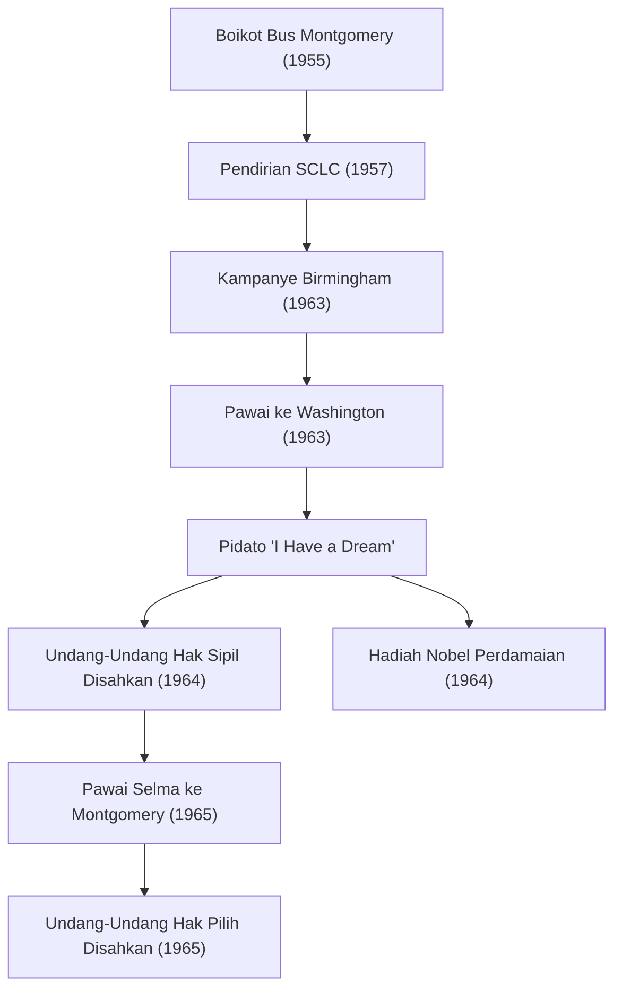

Martin Luther King Jr. (15 Januari 1929 - 4 April 1968) adalah seorang pendeta Baptis Protestan Amerika dan pemimpin paling menonjol dari gerakan hak-hak sipil Afrika-Amerika. Filosofinya tentang "tindakan langsung nir-kekerasan" berfungsi sebagai kekuatan pendorong untuk mendobrak kebijakan segregasi rasial dalam masyarakat Amerika, dan terus sangat memengaruhi banyak gerakan hak asasi manusia saat ini.

## Perjalanan Hidup: Suara Menentang Diskriminasi yang Tidak Masuk Akal

Lahir di Atlanta, Georgia, Dr. King mengalami diskriminasi yang tidak masuk akal dari undang-undang Jim Crow (undang-undang segregasi rasial) di Selatan sejak usia muda. Ia belajar di Morehouse College, Crozer Theological Seminary, dan Boston University, tempat ia memperoleh gelar doktor dalam bidang teologi. Dalam proses ini, ia sangat terinspirasi oleh prinsip perlawanan nir-kekerasan Mahatma Gandhi dan filosofi pembangkangan sipil Henry David Thoreau.

Kariernya sebagai aktivis benar-benar dimulai dengan "Boikot Bus Montgomery" pada tahun 1955. Dipicu oleh penangkapan Rosa Parks, seorang wanita kulit hitam yang menolak menyerahkan tempat duduknya di bagian bus khusus orang kulit putih, Dr. King memimpin gerakan boikot. Protes selama 381 hari tersebut menghasilkan kemenangan bersejarah ketika Mahkamah Agung memutuskan segregasi bus tidak konstitusional, yang mendorongnya menjadi tokoh nasional sebagai pemimpin gerakan hak-hak sipil.

## Filosofi dan Tindakan: "Saya Memiliki Impian" (I Have a Dream)

Inti dari gerakan Dr. King adalah filosofi tak tergoyahkan yang memadukan cinta kasih Kristen dengan prinsip nir-kekerasan Gandhi. Ia berkhotbah bahwa pembalasan kekerasan hanya melahirkan siklus kebencian, dan bahwa keadilan sejati dan rekonsiliasi ("Komunitas yang Dicintai") hanya dapat dibangun melalui cinta kasih dan cara-cara damai.

Pada 28 Agustus 1963, sekitar 250.000 orang berkumpul untuk "Pawai ke Washington" di Washington, D.C. Pidato "I Have a Dream" yang disampaikan Dr. King di depan Lincoln Memorial dikenang sebagai salah satu pidato terhebat dalam sejarah Amerika. "Saya bermimpi bahwa keempat anak saya suatu hari nanti akan hidup di sebuah negara di mana mereka tidak akan dinilai dari warna kulit mereka, melainkan dari karakter mereka" — kata-kata yang kuat ini melampaui batasan ras, menyentuh hati di seluruh dunia, dan berfungsi sebagai kekuatan pendorong yang menentukan di balik pengesahan Undang-Undang Hak Sipil 1964 dan Undang-Undang Hak Pilih 1965.

Pada tahun 1964, sebagai pengakuan atas pencapaiannya dalam kampanye damai tanpa kekerasan, ia menjadi orang termuda saat itu yang menerima Hadiah Nobel Perdamaian pada usia 35 tahun.

## Jejak Pencapaian (Diagram Mermaid)

Diagram berikut mengilustrasikan lintasan dan dampak upaya hak-hak sipil utama Dr. King.

## Warisan: Melanjutkan Impian yang Belum Selesai

Bahkan setelah kemenangan hukum dari gerakan hak-hak sipil, perjuangan Dr. King belum berakhir. Selain diskriminasi rasial, ia juga menyuarakan penentangannya terhadap kemiskinan dan Perang Vietnam, berupaya memperjuangkan hak asasi manusia dan keadilan ekonomi yang lebih luas. Namun, pada 4 April 1968, ia dibunuh di Memphis, Tennessee, dan meninggal pada usia muda, 39 tahun.

Kematiannya membawa kejutan yang luar biasa dan kesedihan yang mendalam bagi dunia, tetapi semangatnya tidak mati. Hari ini, Senin ketiga bulan Januari adalah hari libur nasional di Amerika Serikat yang dikenal sebagai "Hari Martin Luther King Jr.", ditetapkan sebagai hari pelayanan untuk menghormati warisannya.

Pesan "cinta dan nir-kekerasan" yang diperjuangkan Dr. King dalam hidupnya terus hidup dalam gerakan modern untuk keadilan sosial, termasuk gerakan Black Lives Matter. Lintasan kata-kata dan tindakannya selamanya menunjukkan kepada kita, yang mencari secercah harapan dalam kegelapan, keberanian untuk membela apa yang benar dan kemungkinan transformasi melalui dialog dan pengertian.
