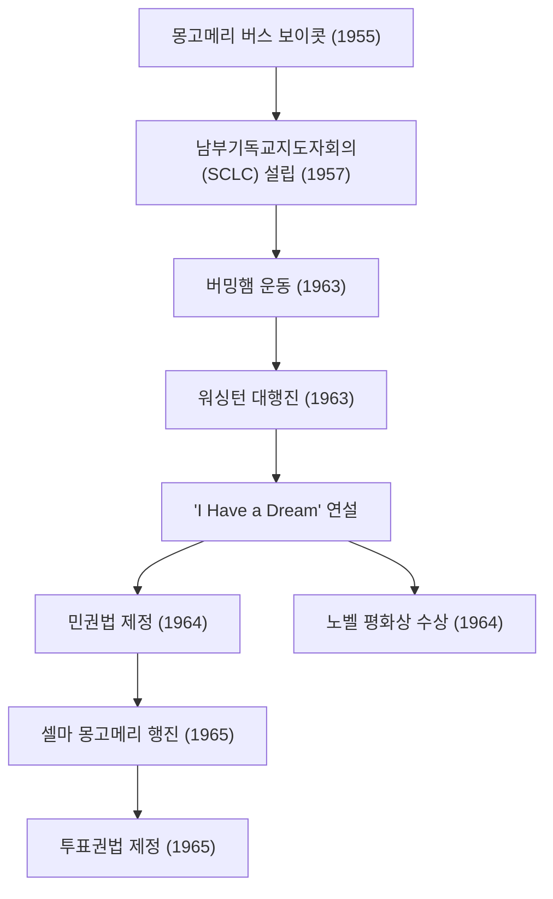

마틴 루터 킹 주니어(Martin Luther King Jr., 1929년 1월 15일 - 1968년 4월 4일)는 미국의 개신교 침례교 목사이자 아프리카계 미국인 민권 운동의 가장 저명한 지도자입니다. 그의 "비폭력 직접 행동"이라는 철학은 미국 사회의 인종 차별 정책을 타파하는 원동력이 되었으며, 오늘날 수많은 인권 운동에 계속해서 지대한 영향을 미치고 있습니다.

## 생애의 발자취: 불합리한 차별에 저항하는 목소리

조지아주 애틀랜타에서 태어난 킹 목사는 어린 시절부터 남부 특유의 짐 크로우법(인종 분리법)으로 인한 불합리한 차별을 경험했습니다. 모어하우스 대학, 크로저 신학교, 그리고 보스턴 대학에서 공부하며 신학 박사 학위를 받았습니다. 그 과정에서 마하트마 간디의 비폭력 저항주의와 헨리 데이비드 소로의 시민 불복종 사상에 깊은 감명을 받게 됩니다.

그의 운동가로서의 경력은 1955년 '몽고메리 버스 보이콧 사건'부터 본격화됩니다. 로자 파크스라는 한 흑인 여성이 버스의 백인 전용 좌석을 양보하기를 거부하여 체포된 사건을 계기로 킹 목사는 보이콧 운동을 이끌었습니다. 381일간 이어진 이 항의 활동은 대법원의 버스 내 분리 위헌 판결이라는 역사적 승리를 가져왔고, 그를 전 미에 알려진 민권 운동의 지도자로 부상시켰습니다.

## 철학과 행동: "나에게는 꿈이 있습니다"

킹 목사의 운동 기저에는 기독교적 사랑과 간디의 비폭력주의를 융합한 확고한 철학이 있었습니다. 그는 폭력적인 보복은 증오의 악순환을 낳을 뿐이며, 사랑과 평화적인 방법을 통해서만 진정한 정의와 화해('사랑의 공동체', Beloved Community)를 구축할 수 있다고 설교했습니다.

1963년 8월 28일, 수도 워싱턴 D.C.에서 열린 '워싱턴 대행진'에는 약 25만 명의 참가자가 집결했습니다. 링컨 기념관 앞에서 킹 목사가 행한 "I Have a Dream(나에게는 꿈이 있습니다)"이라는 연설은 미국 역사상 남을 명연설로 구전되고 있습니다. "나의 네 명의 어린 자녀들이 피부색이 아니라 인격의 내용에 의해 평가받는 나라에 살게 되는 꿈" —— 이 강력한 메시지는 인종의 장벽을 넘어 전 세계 사람들의 마음을 울렸고, 이듬해 1964년의 민권법(Civil Rights Act of 1964) 제정, 나아가 1965년의 투표권법(Voting Rights Act of 1965) 제정으로 이어지는 결정적인 추진력이 되었습니다.

1964년, 그는 그 비폭력적인 평화 운동의 공로를 인정받아 당시 사상 최연소인 35세에 노벨 평화상을 수상합니다.

## 업적의 궤적 (Mermaid 도해)

아래 그림은 킹 목사의 주요 민권 운동의 궤적과 그 영향을 보여줍니다.

## 후세에 미친 영향: 미완의 꿈을 이어가다

민권 운동에 있어서 법적인 승리 이후에도 킹 목사의 투쟁은 끝나지 않았습니다. 그는 인종 차별 외에도 빈곤 문제나 베트남 전쟁 반전 운동에도 목소리를 높이며, 보다 광범위한 인권과 경제적 정의를 요구하게 되었습니다. 하지만 1968년 4월 4일, 유세지인 테네시주 멤피스에서 암살당하며 39세의 젊은 나이로 세상을 떠납니다.

그의 죽음은 세계에 큰 충격과 깊은 슬픔을 가져왔지만, 그의 정신이 죽은 것은 아니었습니다. 오늘날 미국에서는 매년 1월 세 번째 월요일이 '마틴 루터 킹 주니어의 날'로서 국가 공휴일로 지정되어 있으며, 그의 업적을 기리고 봉사 활동을 하는 날로 정착해 있습니다.

킹 목사가 목숨을 걸고 추구했던 '사랑과 비폭력'의 메시지는 흑인의 생명도 소중하다(Black Lives Matter) 운동을 비롯한 현대의 사회 정의를 요구하는 운동 속에서도 면면히 숨 쉬고 있습니다. 그가 남긴 말과 행동의 궤적은 어둠 속에서 희망의 빛을 찾는 우리들에게 옳은 일을 위해 일어설 용기와, 대화와 이해를 통한 변혁의 가능성을 영원히 보여주고 있습니다.
